# **Pico 24 in 1 Sensor Kit(Raspberry Pi MicroPython tutorial)**


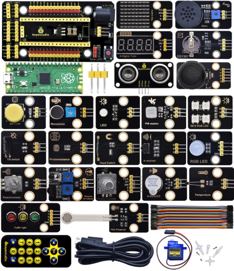


## 1.Introduction

The Raspberry Pi is used in this tutorial. Raspberry Pi is a series of small single-board computers whose official systems are Raspberry Pi OS. You can also install other systems to the Raspberry Pi, such as ubuntu, Windows IoT. We can use the Raspberry Pi to make a personal server, router and so on. This kit mainly contains 24 commonly used sensors/modules, the Raspberry Pi Pico board, the Raspberry Pi Pico expansion board and Dupont wires. The 24 sensors and modules are fully compatible with the Raspberry Pi Pico shield. You only need to stack the Raspberry Pi Pico board onto the Raspberry Pi Pico shield, and hook up them with Dupont wires, which is simple and convenient.

To make you master the electronic knowledge, detailed tutorials (MicroPython), schematic diagrams, wiring methods and test code are included. Through these projects, you will have a better understanding about programming, logic and electronics.

## 2.Kit List

When getting this kit, you will see a beautiful packaging box. And each component is safely packed inside a small bag in order.

|                           Picture                            |                      Name                       | QTY  |
| :----------------------------------------------------------: | :---------------------------------------------: | :--: |
| 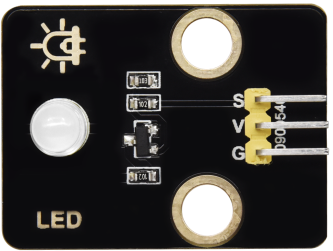 |           Keyestudio White LED Module           |  1   |
|  |      Keyestudio Common Cathode RGB Module       |  1   |
|  |        Keyestudio Traffic Lights Module         |  1   |
| 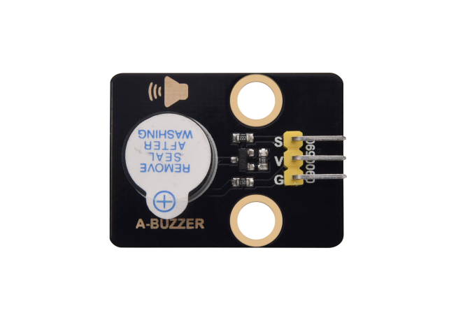 |            Keyestudio Active Buzzer             |  1   |
| 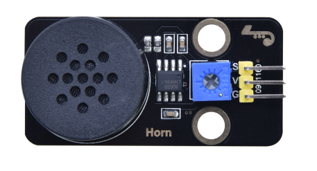 |            Keyestudio Speaker Module            |  1   |
| 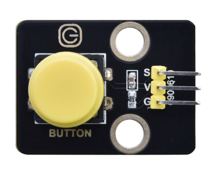 |            Keyestudio Button Module             |  1   |
| 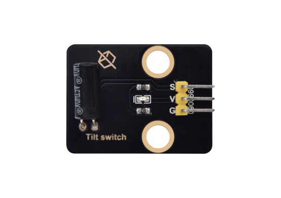 |             Keyestudio Tilt Sensor              |  1   |
| 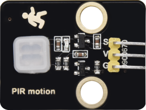 |          Keyestudio PIR Motion Sensor           |  1   |
|  |      Keyestudio Obstacle Avoidance Sensor       |  1   |
| 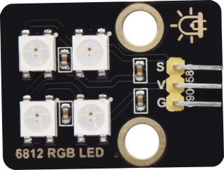 |           Keyestudio 6812 RGB Module            |  1   |
| 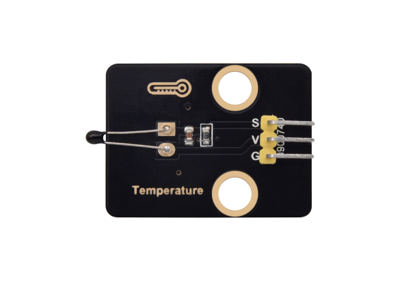 |            Keyestudio Analog Temperature Sensor |  1   |
| 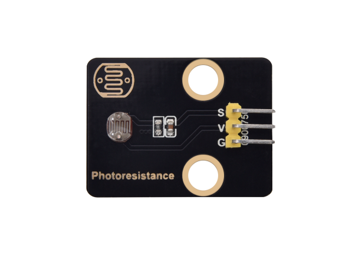 |            Keyestudio Photoresistor             |  1   |
|  |             Keyestudio Sound Sensor             |  1   |
| 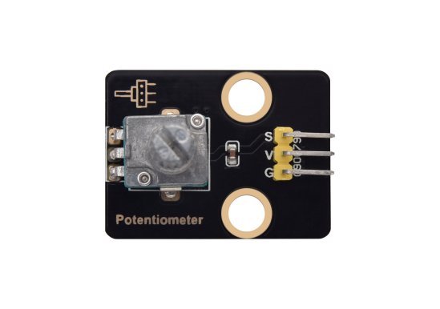 |         Keyestudio Rotary Potentiometer         |  1   |
|  |             Keyestudio IR Receiver              |  1   |
| 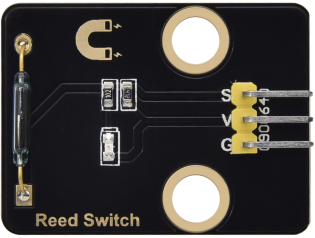 |          Keyestudio Reed Switch Sensor          |  1   |
| 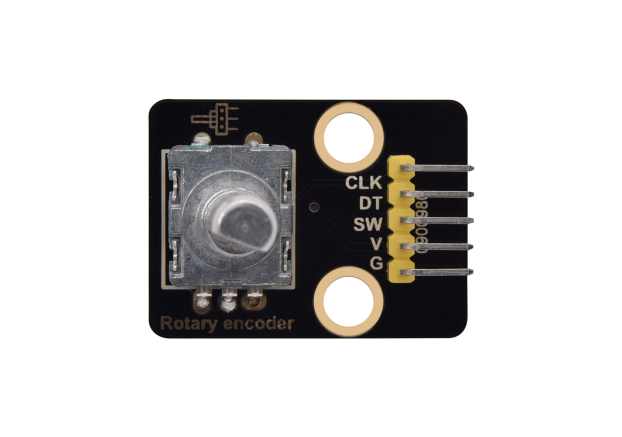 |        Keyestudio Rotary Encoder Module         |  1   |
| 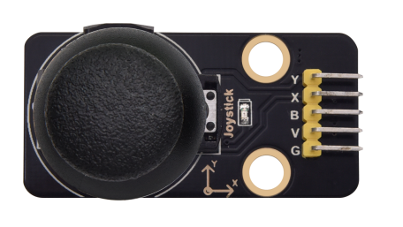 |           Keyestudio Joystick Module            |  1   |
| 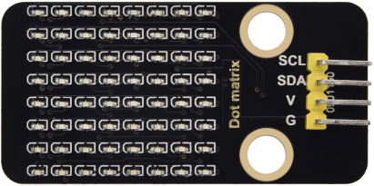 |    Keyestudio HT16K33 8X8 Dot Matrix Module     |  1   |
| 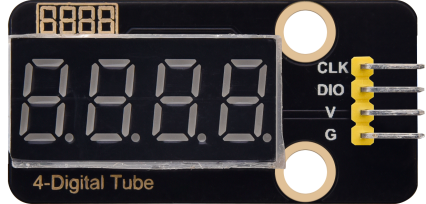 |     Keyestudio TM1650 4-Digit Tube Display      |  1   |
|  |      Keyestudio Thin-film Pressure Sensor       |  1   |
|  |         Keyestudio DS1307 Clock Sensor          |  1   |
|  |        Keyestudio SR01 Ultrasonic Sensor        |  1   |
|  |                  9G 90° Servo                   |  1   |
| 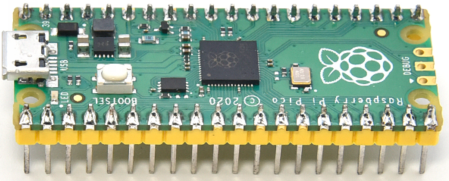 |             Raspberry Pi Pico Board             |  1   |
| 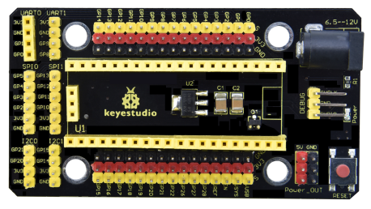 |       Keyestudio Raspberry Pico IO Shield       |  1   |
|  |     Keyestudio JMFP-4 17-Key Remote Control     |  1   |
| 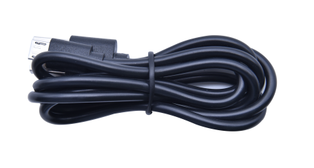 |                    USB Cable                    |  1   |
|  |                 F-F Dupont Wire                 |  1   |

## 3.Preparations

### **3.1 Tools needed for the Raspberry Pi system**

**Hardware Tool:**

-   Raspberry Pi 4B/3B/2B

-   Above 16G TFT Memory Card

-   Card Reader

-   Computer and other parts

#### **3.1.1 Install Software Tools**

**Windows System:**

##### **(1) Putty**

Download link:
[https://www.chiark.greenend.org.uk/\~sgtatham/putty/](https://www.chiark.greenend.org.uk/~sgtatham/putty/)


After downloading the package file , double-click it and tap “Next”.

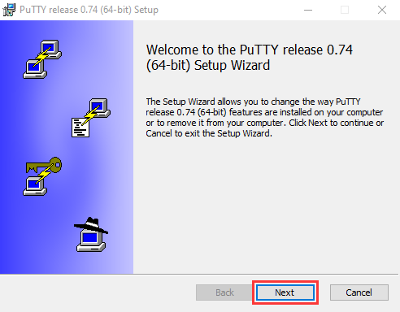

Click “Next”.


Choose“Install PuTTY files”and click“Install”.


After a few seconds, click "Finish".


##### **(2) SSH Remote Login software -WinSCP**

Link: <https://winscp.net/eng/download.php>

After downloading the package file, click  and .


Click“Accept”.


Follow the below steps to finish the installation.


##### (3) **SD Card Formatter**

Download link:

http://www.canadiancontent.net/tech/download/SD_Card_Formatter.html


Unzip the SDCardFormatterv5_WinEN package, double-click  to run it.


Click“Next”and choose , then tap“Next”.

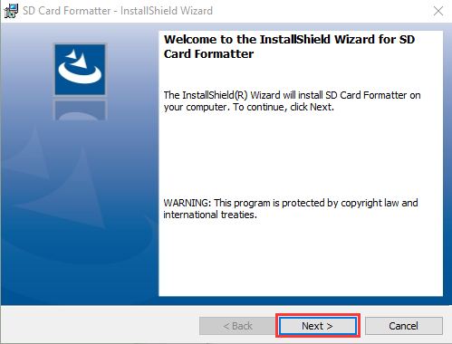


Click“Next”and“Install”.


After a few seconds, click "Finish".


##### **(4) Win32DiskImager**

Download link: <https://sourceforge.net/projects/win32diskimager/>

a. After the download, double-click and tap “Run”.


b. Select  and click“Next”.


c. Click“Browse...”and find out the folder where the Win32DiskImager is located, tap“Next”.


d. Tick  and click“Next”and“Install”.

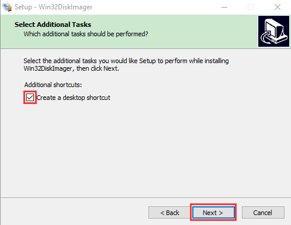


e. Click “Finish”after the installation is complete.


##### **(5) WNetWatcher**

Download link: http://www.nirsoft.net/utils/wnetwatcher.zip

#### **3.1.2 Raspberry Pi Imager**

Download link for the latest version:

<https://www.raspberrypi.org/downloads/raspberry-pi-os/>

Old version：

-   Raspbian：https://downloads.raspberrypi.org/raspbian/images/
-   Raspbian full：<https://downloads.raspberrypi.org/raspbian_full/images/>
-   Raspbian lite：<https://downloads.raspberrypi.org/raspbian_lite/images/>

We use the 2020.08.20 version in the tutorial and recommend you to use this version

(Please download this version as shown in the picture below.)


### **3.2 Install Raspberry Pi OS on Raspberry Pi**

Interface the TFT memory card with a card reader, then plug the card reader into a computer’s USB port.

Use the SD Card Formatter to format a TFT memory card, as illustrated below.


#### **(1) Burn system**

Burn the Raspberry Pi OS to the TFT memory card using Win32DiskImager software.


Don’t eject card reader after burning mirror system, build a file named SSH, then delete .txt.

The SSH login function can be activated by copying SSH file to boot category, as shown below.

Eject card reader.

#### **(2) Log in system**

(Raspberry and PC should be in the same local area network.)

Insert TFT memory card into Raspberry Pi, connect internet cable and plug in
power. If you have screen and HDMI cable of Raspberry Pi, you could view
Raspberry Pi OS activating. If not, you can enter the desktop of Raspberry Pi
via SSH remote login software---WinSCP and xrdp.

#### **(3) Remote login**

**Enter default user name, password and host name on WinSCP to log in. Only a Raspberry Pi is connected in same network.**


#### **(4) Check IP and mac address**


Click to open terminal and input the password: raspberry, and press“Enter” on keyboard.


Logging in successfully, open the terminal, input **ip a** and tap“Enter”to check IP and mac address.

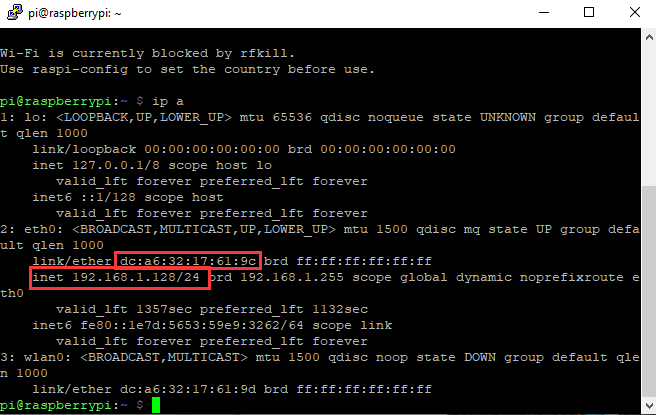

From the above figure, mac address of this Raspberry Pi is a6:32:17:61:9c, and IP address is 192.168.1.128(use IP address to finish xrdp remote login).

Since mac address never changes, you could confirm IP via mac address when not sure which IP it is.

#### **(5) Fix IP address of Raspberry Pi**

IP address is changeable, therefore, we need to make IP address fixed for convenient use.

Follow the below steps:

Switch to root user

If without root user’s password

① Set root password

Input password in the terminal: sudo passwd root to set password.

② Switch to root user

su root

③ Fix the configuration file of IP address

Firstly change IP address of the following configuration file.

(\#New IP address: address 192.168.1.99)

Copy the above new address to terminal and press“Enter”.

Configuration File**:**

echo -e '

auto eth0

iface eth0 inet static

\#Change IP address

address 192.168.1.99

netmask 255.255.255.0

gateway 192.168.1.1

network 192.168.1.0

broadcast 192.168.1.255

dns-domain 119.29.29.29

dns-nameservers 119.29.29.29

metric 0

mtu 1492

'\>/etc/network/interfaces.d/eth0

As shown below:


④ Reboot the system to activate the configuration file.

Input the restart command in the terminal: sudo reboot

You could log in via fixed IP afterwards.

⑤ Check IP and insure IP address fixed well.


(6) Log in desktop on Raspberry Pi wirelessly

In fact, we can log in desktop on Raspberry Pi wirelessly even without screen and HDMI cable.

VNC and Xrdp are commonly used to log in desktop of Raspberry Pi wirelessly. Let’s take example of Xrdp.

Install Xrdp Service in the terminal

Installation commands:

Switch to Root User: su root

Installation: apt-get install xrdp

Enter y and press“Enter”.

As shown below:


Open the remote desktop connection on Windows

Press WIN+R on keyboard and enter mstsc.exe.

As shown below:


Input IP address of Raspberry Pi, as shown below.

Click“Connect”and tap“Connect”.

192.168.1.99 is IP address we use, you could change into your IP address.


Click“Yes”.


Input user name: pi, default password: raspberry, as shown below.

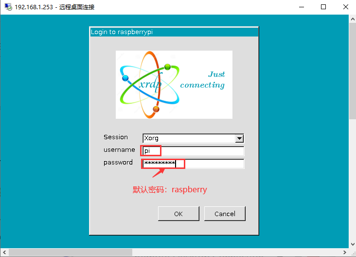

Click“OK”or“Enter”, you will view the desktop of Raspberry Pi OS, as shown below.


Now, we finish the basic configuration of Raspberry Pi OS.

### **3.3 Raspberry Pi Pico**


At the end of January 2021, the Raspberry Pi Foundation launched the Raspberry Pi Pico, which received a lot of attention due to its high-performance and low-cost.

The size of Pico is 21mm × 51mm, which is similar to Arduino Nano’s.


Raspberry Pi Pico is a low-cost, high-performance microcontroller board with flexible digital interfaces. It integrates RP2040 microcontroller chip designed by Raspberry Pi, with dual-core Arm Cortex M0+ processor running up to 133 MHz, embedded 264KB of SRAM and 2MB of on-board Flash memory, as well as 26 multi-function GPIO pins. For software development, either Raspberry Pi's C/C++ SDK, or the MicroPython is available. In this tutorial, we will use MicroPython.


The bare board does not come with pins and you need to solder them yourself. This is a well-made board that can also be used as an SMD component and soldered directly to a printed circuit board.


The most predominant feature on the board is the microUSB connector at one end. This is used both for communication and to supply power to the Pico. An on-board LED is mounted next to the microUSB connector, it is internally connected to GPIO pin 25. It’s worthwhile to note that this is the only LED on the entire Pico board. 

The BOOTSEL pushbutton switch is mounted a bit down from the LED, it allows you to change the boot mode of the Pico so that you can load MicroPython onto it and perform drag-and-drop programming.

At the bottom of the board, you’ll see three connections, these are for a serial Debug option that we won’t be exploring here.

In the center of the board is the brains of the whole thing, the RP2040 MCU, which is capable of supporting up to 16MB of off-chip Flash memory, although in the Pico there is only 4MB.

-   Dual-core 32-bit Arm Cortex M0+ processor

-   Runs at 48MHz, but can be overclocked to 133MHz

-   30 GPIO pins(26 exposed)

-   Can support USB Host or Device mode

-   8 Programmable I/O(PIO) state machines

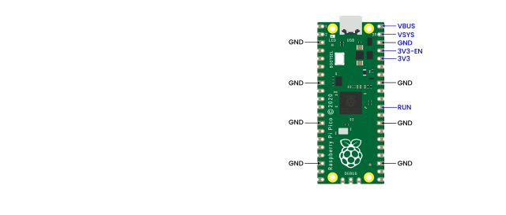

The Pico is a 3.3V logic device, however, it can be powered with a range of power supplies thanks to a built-in voltage converter and regulator.

**GND:** Ground connection. 8 grounding wires plus an additional one on the 3-pin Debug connector. They are square as opposed to rounded like the other connections.

**VBUS:** This is the power from the microUSB bus, 5V. If the Pico is not being powered by the microUSB connector then there will be no output here.

**VSYS:** This is the input voltage, which can range from 2 to 5V. The on-board voltage converter will change it to 3.3V for the Pico.

**3V3:** This is a 3.3V output from the Pico’s internal regulator. It can be used to power additional components, providing you keep the load under 300ma.

**3V3_EN:** You can use this input to disable the Pico’s internal voltage regulator, which will shut off the Pico and any components powered by it.

**RUN:** It can enable or disable the RP2040 microcontroller, it can also reset it.

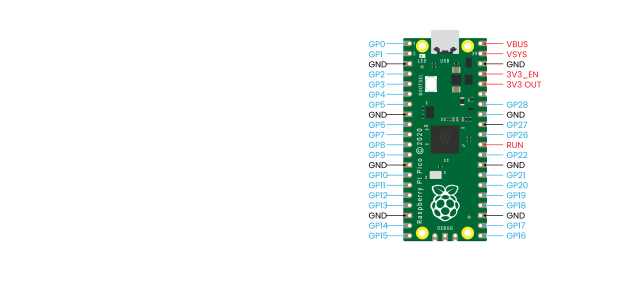

There are 26 exposed GPIO connections on the Raspberry Pi Pico board. They are laid out pretty-well in order, with a “gap” between GP22 and GP26 (those“missing”pins are used internally). All these pins have multiple functions, and you can configure up to 16 of them for PWM. There are two I2C buses, two UARTs, and two SPI buses, these can be configured to use a wide variety of GPIO pins. 

The Pico has three Analog-to-Digital Converters, they are ADC0-GP26, ADC1-GP27, ADC2-GP28, and plus ADC-VREF converter used internally for an on-board temperature sensor. Note: The ADCs have a 12-bit resolution. However, the MicroPython has scaled the 12-bit resolution into a 16-bit resolution, which means that we will receive ADC values from 0 to 65535. The microcontroller’s working voltage is 3.3V, indicating that 0 corresponds to 0V and 65535 corresponds to 3.3V.

You can also provide an external precision voltage-reference on the ADC_VREF pin. One of the grounds, the ADC_GND on pin 33 is used as a ground point for that reference.

| **Raspberry Pi Pico Configuration**                                     |
|-------------------------------------------------------------------------|
| Dual-core Arm Cortex-M0 + @ 133MHz                                      |
| 2 × SPI, 2 × I2C, 2 × UART                                              |
| 264KB of SRAM, and 2MB of on-board Flash memory                         |
| 16 PWM channels                                                         |
| QSPI bus controller, supporting up to 16 MB of external Flash memory    |
| USB 1.1 with host and device support                                    |
| DMA controller                                                          |
| 8 × Programmable I/O (PIO) state machines for custom peripheral support |
| 30 GPIO pins, of which 4 can optionally be used as analog inputs        |
| Drag-and-drop programming using mass storage over USB                   |

**Pinout Diagram:**

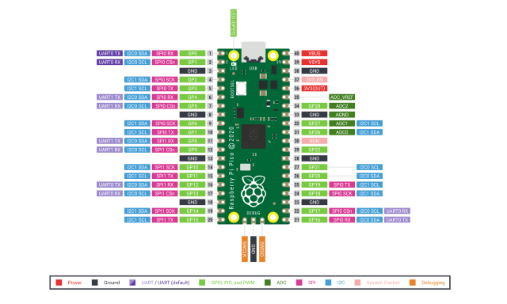

Raspberry Pi did release a ton of technical documentation, plus a great guide called **Get Started with MicroPython on Raspberry Pi Pico**. It’s available in softcover, and as a PDF download as well. 

For more information, please refer to:

https://www.raspberrypi.com/products/raspberry-pi-pico/

### **3.4 Using MicroPython**

MicroPython is a lean and efficient implementation of the Python 3 programming language that includes a small subset of the Python standard library and is optimised to run on microcontrollers and in constrained environments. MicroPython is packed full of advanced features such as an interactive prompt, arbitrary precision integers, closures, list comprehension, generators, exception handling and more. Yet it is compact enough to fit and run within just 256k of code space and 16k of RAM. MicroPython aims to be as compatible with normal Python as possible to allow you to transfer code with ease from the desktop to a microcontroller or embedded system. 

For more information, please go to the official website:

<https://micropython.org/>

#### **Programming the Pico:** 

You could use C/C++ or MicroPython. MicroPython is an interpreted language that is made specifically for microcontrollers. Many microcontroller users have familiarity with C/C++ as they are used on the Arduino and ESP32 boards. In this tutorial, we will use Thonny recommended by Raspberry Pi. Thonny bills itself as a“Python IDE for Beginners”, and it is available for Windows, Mac OSX and Linux. It was also part of the Raspberry Pi operating system(formerly Raspbian).

#### **Boot and Install MicroPython:** 

The first thing that we need to do is to get MicroPython installed onto the Pico.

#### **Download and burn firmware**

Go to the official website to download the UF2 file:

[https://www.raspberrypi.com/documentation/microcontrollers/\#getting-started-with-micropython](https://www.raspberrypi.com/documentation/microcontrollers/#getting-started-with-micropython，)

What I downloaded is. Once the download is complete, we proceed to burn the firmware.

With BOOTSEL held down, then plug the Pico into Raspberry Pi or your computer’s USB port.

Release it after the connection was finished. You should see a drive appearing on your computer with the name“RPI-RP2”.

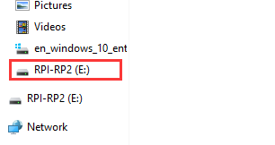

Move the UF2 file into“RPI-RP2”, and the Raspberry Pi Pico will automatically restart. At this point, the burning is complete.


#### **Connect the Pico from a Raspberry Pi over USB**

The MicroPython firmware is equipped with a virtual USB serial port which is accessed through the micro USB connector on Raspberry Pi Pico. Your computer should notice this serial port and list it as a character device, most likely /dev/ttyACM0.

You can run ls /dev/tty* to list your serial ports. There may be quite a few, but MicroPython’s USB serial will start with /dev/ttyACM. If in doubt, unplug the micro USB connector and see which one disappears. If you don’t see anything, you can try rebooting your Raspberry Pi.

Enter the following command to install minicom:

sudo apt install minicom

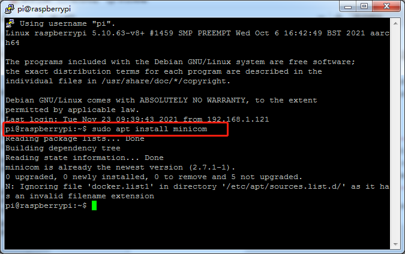

open it as such:

minicom -o -D /dev/ttyACM0

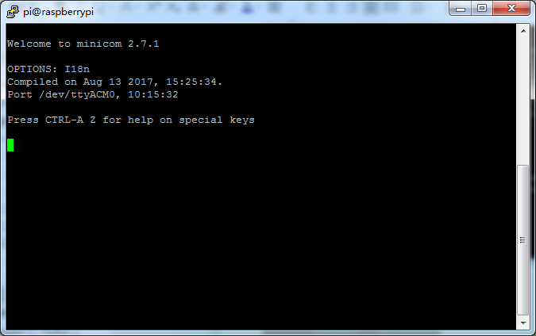

Press Ctrl + B.


Enter print("hello world"), it will show“hello world”.


The on-board LED on Raspberry Pi Pico is connected to GPIO pin 25. The machine module is used to control on-chip hardware. This is standard on all MicroPython ports. Here we are using it to take control of a GPIO, so we can drive it high and low. If you type this in to light up the LED.

from machine import Pin

led = Pin(25, Pin.OUT)

led.value(1)

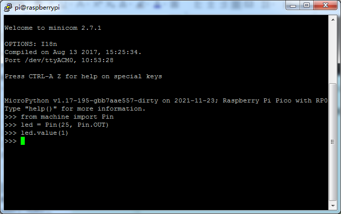

You can turn the LED off with:

led.value(0)

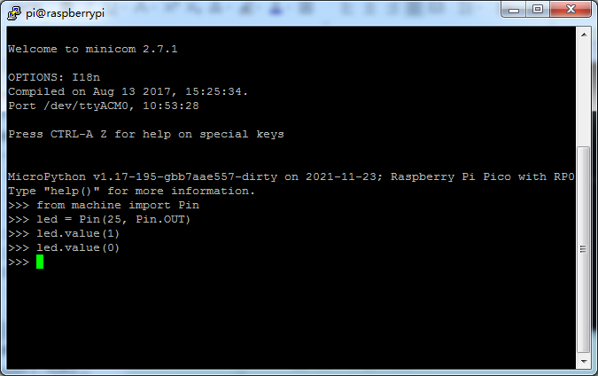

Now we have successfully connected the Pico from a Raspberry Pi over USB.

#### **Install Thonny**

The Raspberry Pi Imager that we downloaded comes with some commonly used software, and Thonny is among them.


If the Raspberry Pi Imager does not have Thonny, you need to manually download it yourself. Enter the following command in the terminal to download and install Thonny.

sudo apt install thonny

When opening Thonny for the first time select "Standard Mode" in the top right of the window. Open Thonny again, the interface is shown in the figure below.

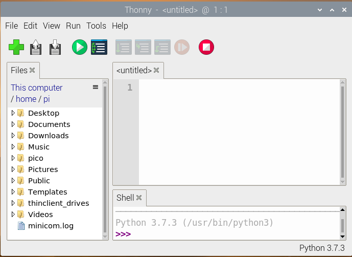

Select "MicroPython (Raspberry Pi Pico)" from the list, as shown below.


Click“Tools”and“Options”.

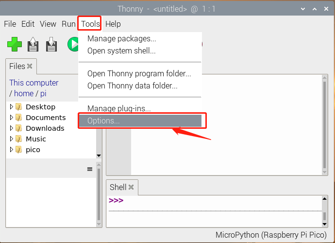

Select MicroPython(Raspberry Pi Pico) and the port as shown below.

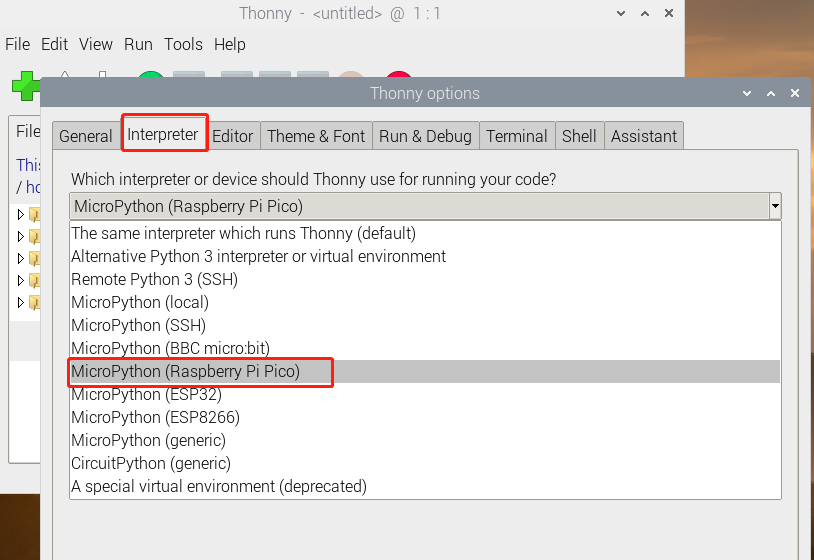

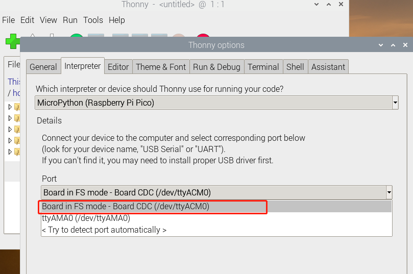

Or select MicroPython (generic)：

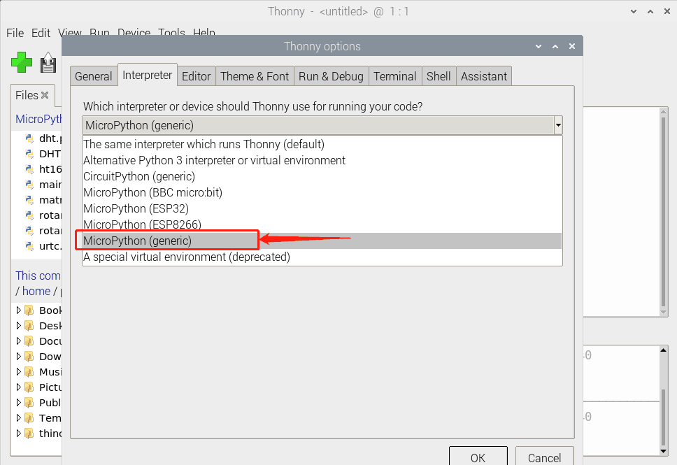

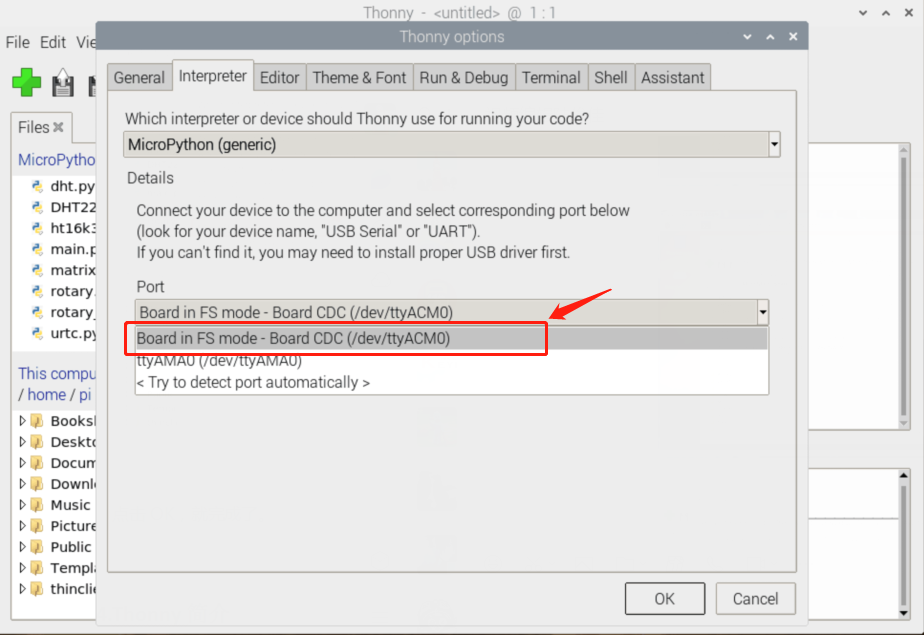

Click“Ok”.

**Thonny User Interface**

Now we will introduce Thonny user interface. At the top is the main menu, there are“File”,“Edit”,“View”,“Run”,“Tools”and“Help”.


Click“File”, it shows some operations related to files.

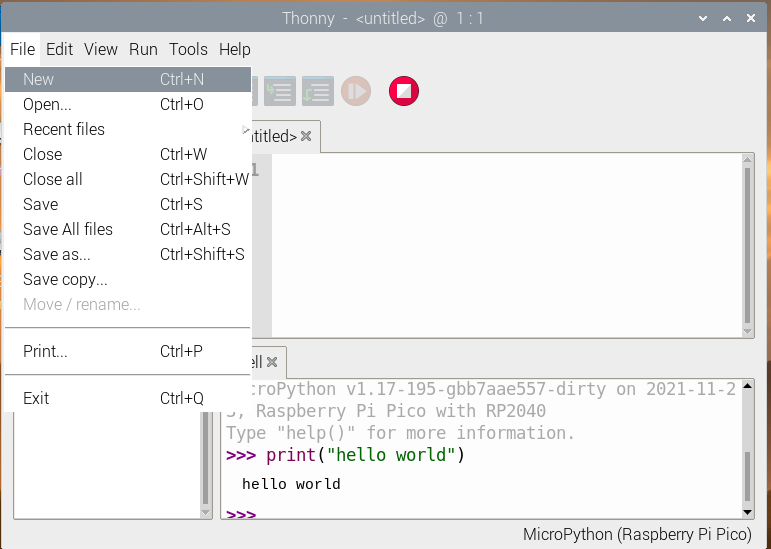

Click“Edit”, these are some options about code, such as copying, cutting, pasting.

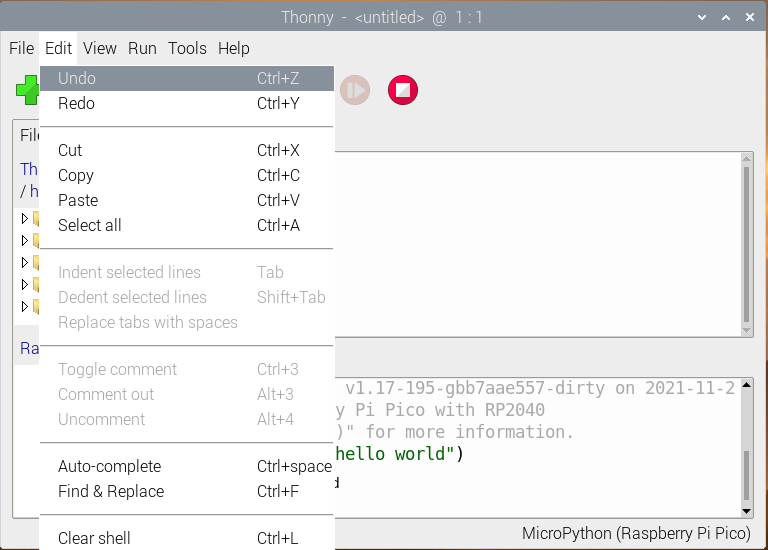

In the View drop-down menu, these are tools to assist you. For example, if we do not tick Shell (the Shell is the“command line”of the Pico, and you can execute code directly here.), the result won’t be displayed. Click “Files”, the files we saved will be shown on the left.

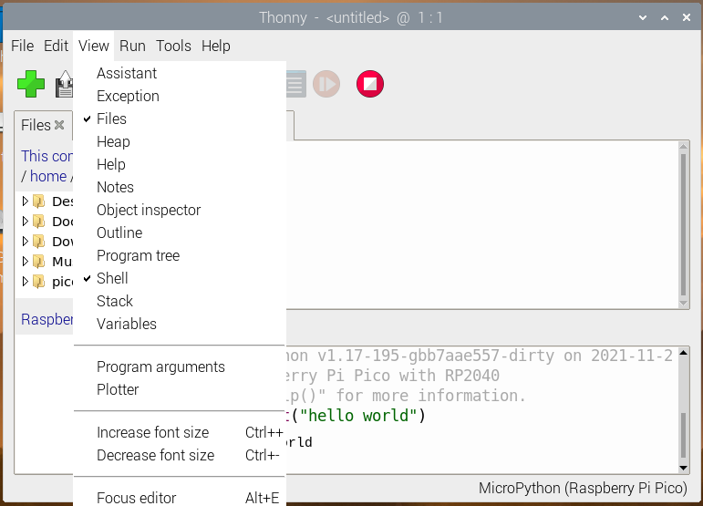

We can select interpreter in the Run drop-down menu, there are also some shortcuts used in programming.

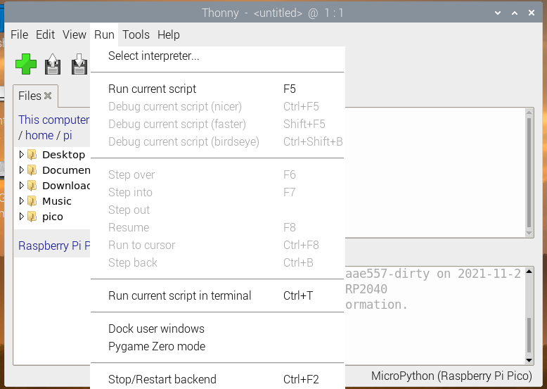

In Tools menu, we can select interpreter, font and import modules, etc.


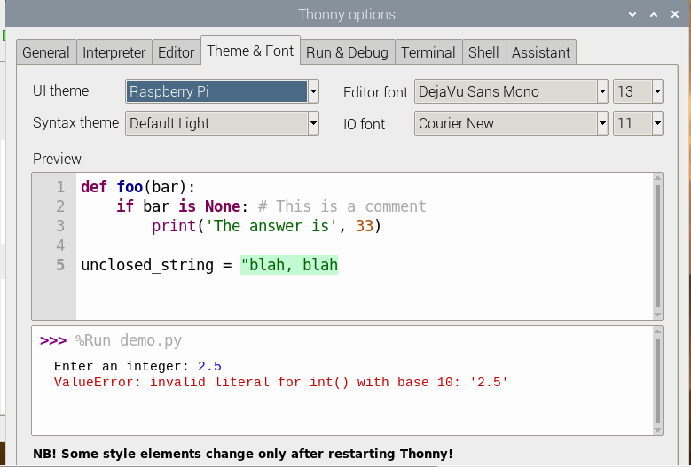

In Help menu, we will see“Help contents”,“Version history”and more.

The icons below the main menu are our commonly used tool shortcuts.

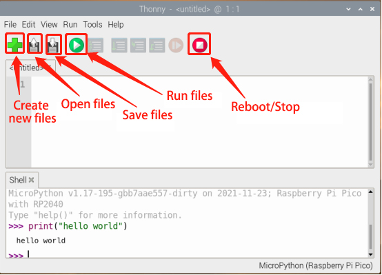

When we open or save files, it will shows the following contents.


Note: if we select“MicroPython(generic)”, then“MicroPython Device”will be displayed.

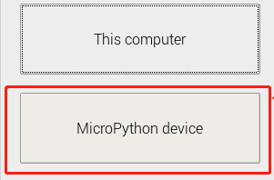

We can open programs saved on the Raspberry Pi or the Pico, or save them on This computer or Raspberry Pi Pico.

Copy the code below to the Thonny and save it to the Pico as test.py.

from machine import Pin, Timer

led = Pin(25, Pin.OUT)

tim = Timer()

def tick(timer):

global led

led.toggle()

tim.init(freq=2.5, mode=Timer.PERIODIC, callback=tick)


Click  to run the code, the on-board LED will blink, then click  to stop, the LED won’t blink. If we unplug the MicroUSB cable and plug it in again, the LED won’t blink after powering up. 

This is because we did not name the file main.py and save it to the Pico. Click“File”, then click“Save as...”to choose Raspberry Pi Pico. After that, enter main.py as the file name (don’t forget to enter the .py file extension) and click“OK”. Run the code again, the LED will continue to blink.


When we unplug the cable again, then plug it in and power on, the LED will blink. This is because the Raspberry Pi Pico starts running the program saved on main.py after powering up.

#### **Add Modules**

Python is a powerful language due to its modules. Python scripting language with the most rich and powerful class library, enough to support the vast majority of day-to-day applications. By importing modules, this makes it easier for us when using some complex sensors.

The method is simple, just save the module that we need to the Pico, or open the file saved on our computer, click“File” to choose “Save as”, then save it to the Pico board (right click the mouse, you can delete files). For instance, I saved some library files required for these courses on my Pico. Click“View”to choose“Files”, they will be displayed on the left of the interface.

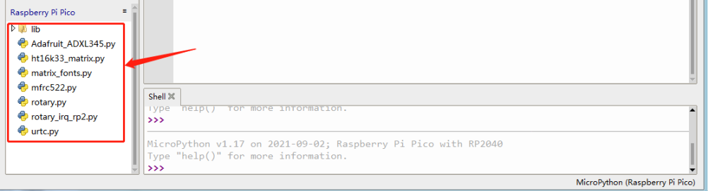

When using sensors, we can import the corresponding modules directly.


We save all the code in this tutorial to the Raspberry Pi. Open the terminal and create a folder in /home/pi.


Copy the code to the folder and enter ls, it will show the following content.

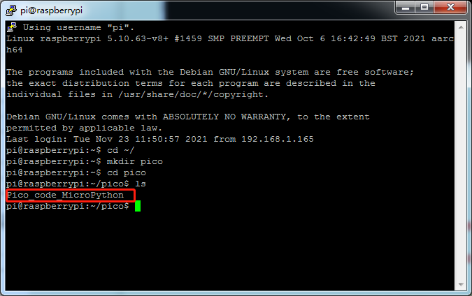

When using Thonny, we open this path to find the code we saved directly.

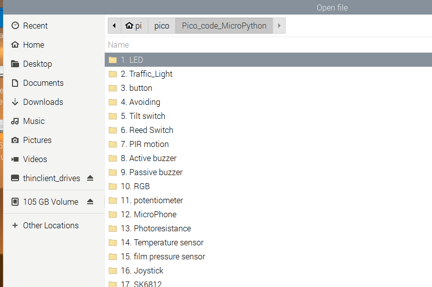

### **3.5 Keyestudio Raspberry Pico IO Shield**

#### **(1) Overview**

The Keyestudio Raspberry Pico IO shield is designed for Raspberry Pi Pico. No soldering required. To make the connection easier, the interfaces on the shield have silkscreen labels.The silkscreen labels of the 3pin interface generally are G, V, S. On the shield, G represents GND, V represents the VCC interface (3.3V), and S represents digital ports or analog ports. The pitch of the pin header on the shield is 2.54 mm. The sequence of the pin header is the same as the Pico board’s when wiring. The shield also comes with a reset button, a PWR power indicator and four holes.

The shield offers a variety of communication interfaces including I2C, UART, SPI, analog IO and digital IO, and provides an interface of power supply ranging from 6.5V to 12V.

#### **(2) Specifications:**

- Output current: ≦500mA

- DC input voltage: 6.5 - 12V

- Output voltage: DC 3.3V/5V

- Ambient temperature(recommended): -10°C \~ 50°C

- Dimensions: 45.339MM \*83.617MM

- Pin pitch: 2.54mm


#### (3) **Schematic diagram**


#### (4) **Pinout**


#### (5) **Connection**

As shown below, stack the Raspberry Pi Pico board onto the Raspberry Pi Pico shield.

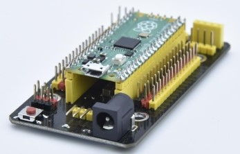

## 4.Projects

There are 24 sensors and modules in this kit. Next, we will analyze and introduce how they work step by step. Interface sensors with the Raspberry Pi Pico board and Pico shield, run test codes then observe experimental phenomenon.

**Note: please wire up components according to the given connection diagrams.**

### Project 1: Lighting up LED


#### **Overview**

In this project, we will make an experiment to light up the white LED module. The high and low levels can be controlled by programming, then the state of the LED can be controlled.

#### **Working Principle**

The two circuit diagrams are given. The left one is wrong wiring-up diagram. Why? Theoretically, when the S terminal outputs high levels, LED will receive the voltage and light up. 

Due to limitation of IO ports of Pico board, weak current can’t make LED brighten.

The right one is correct wiring-up diagram. GND and VCC are powered up. When the S terminal is a high level, the triode Q1 will be connected and LED will light up(note: current passes through LED and R3 to reach GND by VCC not IO ports). Conversely, when the S terminal is a low level, the triode Q1 will be disconnected and LED will go off.

The triode Q1 is equal to a switch and R1 and R3 stand for limited resistors which can curb the size of current to prevent from burning out components.

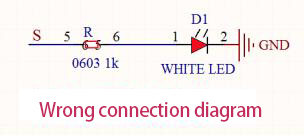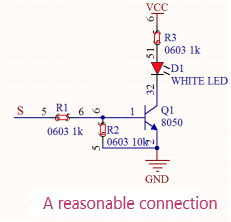

#### **Components**

| 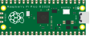 |  | 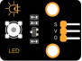 |
| ------------------------------------------------------------ | ------------------------------------------------------------ | ------------------------------------------------------------ |
| Raspberry Pi Pico Board*1                                    | Raspberry Pi Pico Shield*1                                   | Keyestudio White LED Module*1                                |
|  |  |                                                              |
| 3P Dupont Wire*1                                             | MicroUSB Cable*1                                             |                                                              |

(Note: in all experiments, the microUSB cable is connected to the pico via a Raspberry Pi, and the 3p Dupont wire is torn from a 40P Dupont wire.) 

#### **Wiring Diagram**

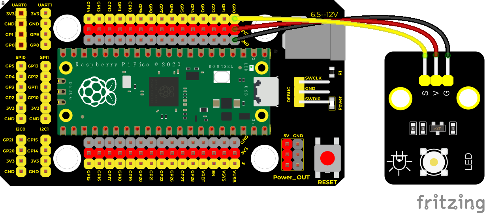

#### **Run the test code**

After opening Thonny and connecting to the Pico, click“View” and “Files”, then the code saved on the Raspberry Pi and the Pico will be shown on the left side.

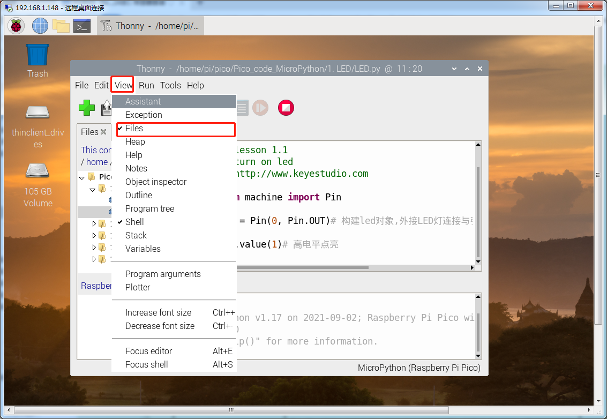

We have saved the code on the Raspberry Pi earlier. Find and click LED.py and Bink.py. Next, click  to run the code. If it did not work, try clicking to stop running, then run the code again. You also can press the reset button on the Pico shield and click  to run it again.

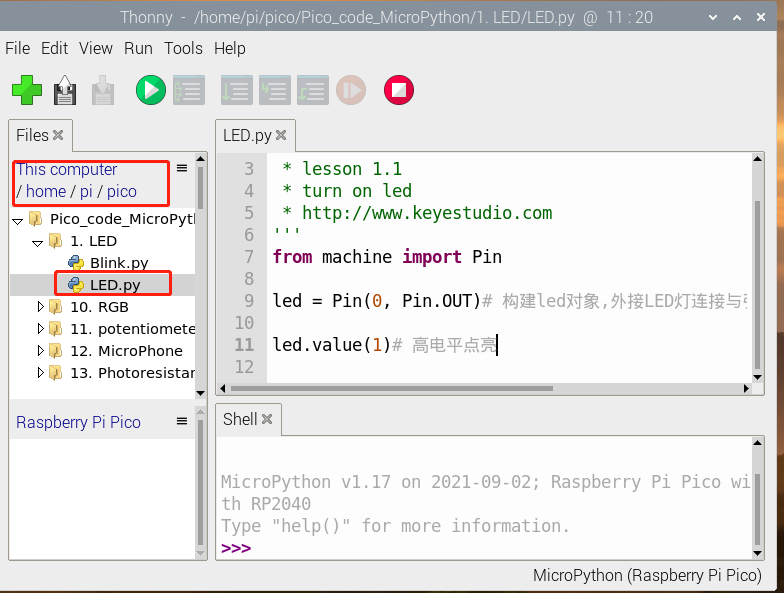

#### **Code Explanation**

**Machine** module is indispensable, we will use **import machine** or **from machine import...** to program pico with microPython.

**time.sleep()** function is used to set delayed time, as **time.sleep(0.01)**, which means, the delayed time is 10ms.

**led = Pin(0, Pin.OUT)**, created a pin example and we name **led**.

**0** is indicative of connected pin GP0, **Pin.OUT** represents output mode, can use **.value()** to output high levels (3.3V) **led.value(1)** or low levels (0V) **led.value(0)**.

**import machine** is used to import modules. When creating pins examples, it will change into **led = machine.Pin(0, machine.Pin.OUT)**.

**while True** is loop function, it means that sentences under this function will loop unless **True** changes into **False.** For the function **while**, **led.value(1)**, outputs high levels to the pin 0; then LED lights up. Then the delayed function **time.sleep(1)** will wait for 1s. When **led.value(0)** output low levels to the pin 0, the LED will go off，and the function **time.sleep(1)** will wait for 1s, cyclically, and LED will flash.

#### **Test Result**

Code 1: run the code, the white LED lights up.

Code 2: run the code, the white LED flashes with the interval of 1s.

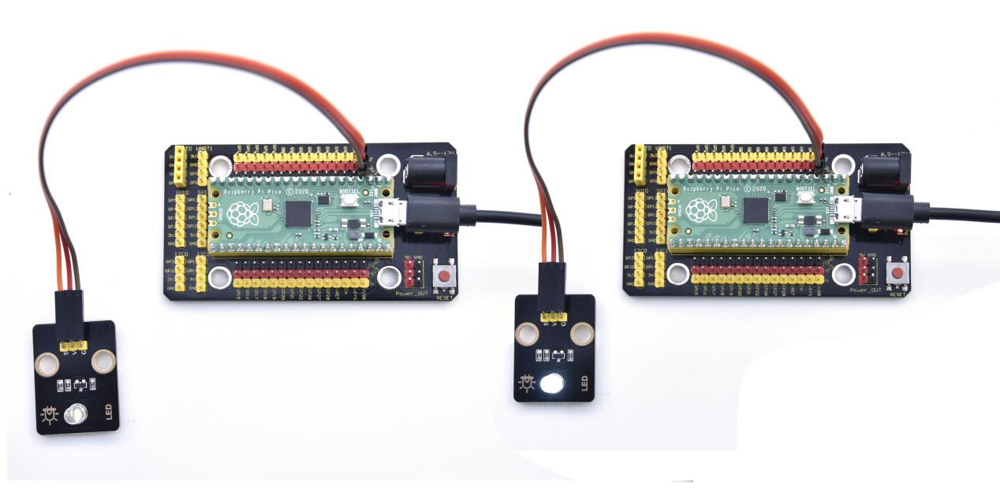

Note: press  to stop running.

#### **Test Code**

```python
'''
 * Keyestudio 24 in 1 Starter Kit for Raspberry Pi Pico
 * lesson 1.1
 * turn on led
 * http://www.Keyestudio.com
'''
from machine import Pin
led = Pin(0, Pin.OUT)# create led, connect LED to pin 0，and set pin0 to OUTPUT
led.value(1)# high levels
```

```python
'''
 * Keyestudio 24 in 1 Starter Kit for Raspberry Pi Pico
 * lesson 1.2
 * Blink
 * http://www.Keyestudio.com
'''
from machine import Pin
import time

led = Pin(0, Pin.OUT)# create led, connect LED to pin 0，and set pin0 to OUTPUT
while True:
    led.value(1)# led lights up
    time.sleep(1)# wait for 1s
    led.value(0)# led goes off
    time.sleep(1)# wait for 1s
```


### Project 2: Traffic Lights Module


#### **Overview**

In this lesson, we will learn how to control multiple LED lights and simulate the operation of traffic lights.

Traffic lights are signal devices positioned at road intersections, pedestrian crossings, and other locations to control flows of traffic.

In this kit, we will use the traffic lights module to simulate the traffic lights.

#### **Working Principle**

In previous lesson, we already know how to control an LED. In this part, we only need to control three separated LEDs. Output high levels to the signal R(3.3V), then the red LED will be on.


#### **Components**

| 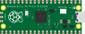 |  |  |
| ------------------------------------------------------------ | ------------------------------------------------------------ | ------------------------------------------------------------ |
| Raspberry Pi Pico Board*1                                    | Raspberry Pi Pico Shield*1                                   | Keyestudio Traffic Lights Module*1                           |
|  |  |                                                              |
| 5P Dupont Wire*1                                             | Micro USB Cable*1                                            |                                                              |


#### **Wiring Diagram**

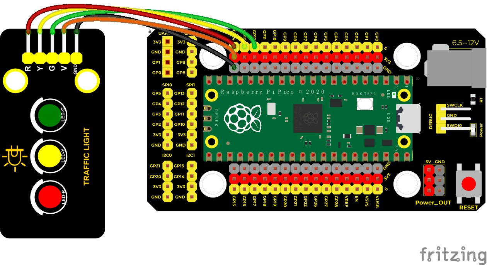

#### **Run the test code**

Find and double-click **Traffic_Light.py** to open it, then click  to run the code.

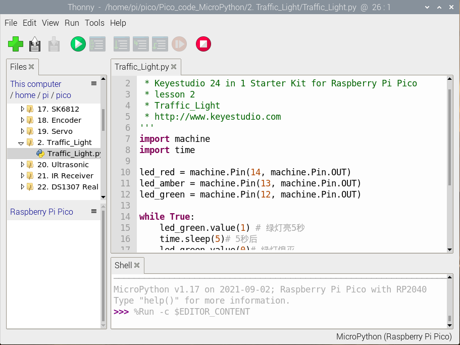

#### **Code Explanation**

Create pins, set pins mode and delayed functions.

We use the **for** loop.

The simplest form is **for i in range()**.

In the code, we used range(3), which means the variable i starts from 0, increase 1 for each time, to 2.

#### **Test Result**

Run the code, the green LED will be on for 5s then off, the yellow LED will flash for 3s then go off and the red one will be on for 5s then off.

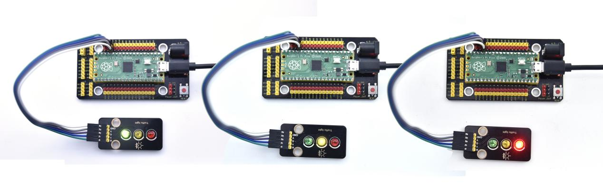

#### **Test Code**

```python
'''
 * Keyestudio 24 in 1 Starter Kit for Raspberry Pi Pico
 * lesson 2
 * Traffic_Light
 * http://www.Keyestudio.com
'''
import machine
import time

led_red = machine.Pin(14, machine.Pin.OUT)
led_amber = machine.Pin(13, machine.Pin.OUT)
led_green = machine.Pin(12, machine.Pin.OUT)

while True:
    led_green.value(1) # the green LED lights up for 5s
    time.sleep(5)# after 5s
    led_green.value(0)# the green LED will go off
    for i in range(3):# the yellow LED flashes for three times 
        led_amber.value(1)
        time.sleep(0.5)
        led_amber.value(0)
        time.sleep(0.5)
    led_red.value(1) # the red LED lights up for 5s
    time.sleep(5)
    led_red.value(0)
```


### Project 3: Button Sensor


#### **Overview**

In this kit, there is a Keyestudio single-channel button module, which mainly uses a tact switch and comes with a yellow button cap.

In previous lessons, we learned how to make the pins of our single-chip microcomputer output a high level or low level. In this experiment, we will read the high level (3.3V) and low level (0V).

We can determine whether the button on the sensor is pressed by reading the high and low level of the S terminal on the sensor.

#### **Working Principle**

The button module has four pins. The pin 1 is connected to the pin 3 and the pin 2 is linked with the pin 4. When the button is not pressed, they are disconnected. Yet, when the button is pressed, they are connected. If the button is released, the signal end is high level.


#### **Components**

|  |  |  |
| ------------------------------------------------------------ | ------------------------------------------------------------ | ------------------------------------------------------------ |
| Raspberry Pi Pico Board*1                                    | Raspberry Pi Pico Shield*1                                   | Keyestudio Button Sensor*1                                   |
|  |  |                                                              |
| 3P Dupont Wire*1                                             | Micro USB Cable*1                                            |                                                              |


#### **Wiring Diagram**

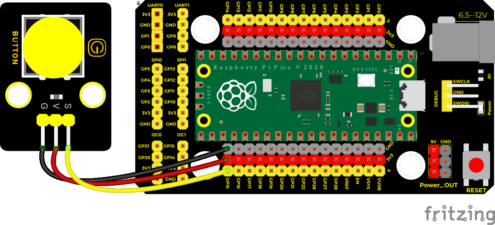

#### **Run the test code**

Find and double-click **button.py** to open it, then click  to run the code.

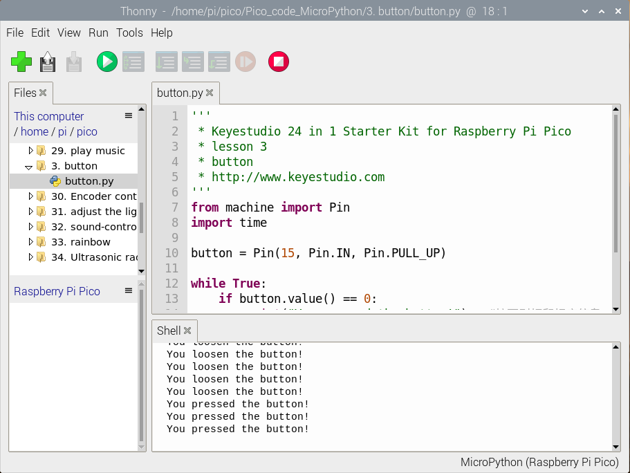

**Code Explanation**

**button = Pin(15, Pin.IN, Pin.PULL_UP)**, we define the pin of the button as GP15 and set to PULL-UP mode.

We can use **button = Pin(15, Pin.IN) to** set INPUT mode, at this time, the pins are in high resistance state.

**button.value()** reads levels of buttons. Function returns High or Low.

**if..else.. sentence**, when the logic judge is TRUE, the code under the if will be activated; otherwise, the code udder the else will be activated.

When pico detects the button pressed, the signal end is low level (GP 15 is low level). **button.value()** is 0. If pico detects the button unpressed, **button.value()** is 1 and else sentence will be activated.

#### **Test Result**

Run the code, and look at the Shell. When the button is pressed, “You pressed the button!”will be displayed; if released,“You loosen the button!”will appear, as shown below.

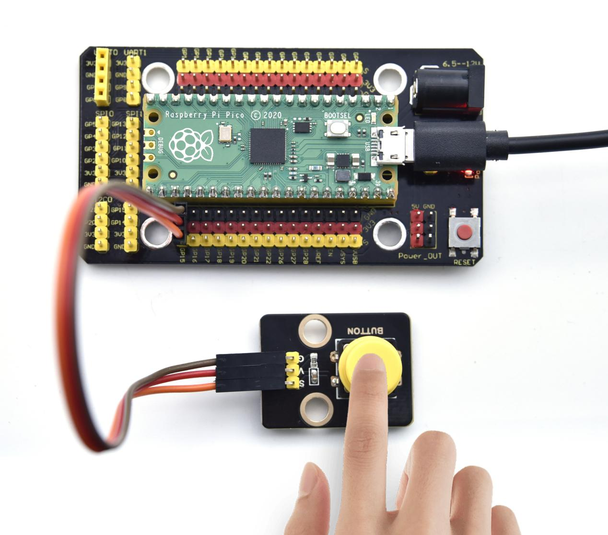

#### **Test Code**

```python
'''
 * Keyestudio 24 in 1 Starter Kit for Raspberry Pi Pico
 * lesson 3
 * button
 * http://www.Keyestudio.com
'''
from machine import Pin
import time

button = Pin(15, Pin.IN, Pin.PULL_UP)

while True:
    if button.value() == 0:
        print("You pressed the button!")   #press to print the information
    else:
        print("You loosen the button!")
    time.sleep(0.1) # delay in 0.1s
```


### Project 4: Obstacle Avoidance Sensor


#### **Overview**

In this kit, there is a Keyestudio obstacle avoidance sensor, which mainly uses an infrared emitting and a receiving tube. In the experiment, we will determine whether there is an obstacle by reading the high and low level of the S terminal on the sensor.

#### **Working Principle**

NE555 circuit provides IR signals with frequency to the emitter TX, then the IR signals will fade with the increase of transmission distance. If encountering the obstacle, it will be reflected back.

When the receiver RX meets the weak signals reflected back, the receiving pin will output high levels, which indicates the obstacle is far away. On the contrary, it the reflected signals are stronger, low levels will be output, which represents the obstacle is close. There are two potentiometers on the module, and one is for adjusting emission power, another one is for receiving frequency.


#### **Components**

|  |  | 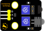 |
| ------------------------------------------------------------ | ------------------------------------------------------------ | ------------------------------------------------------------ |
| Raspberry Pi Pico Board*1                                    | Raspberry Pi Pico Shield*1                                   | Keyestudio Obstacle Avoidance Sensor*1                       |
|  |  |                                                              |
| 3P Dupont Wire*1                                             | Micro USB Cable*1                                            |                                                              |


#### **Wiring Diagram**

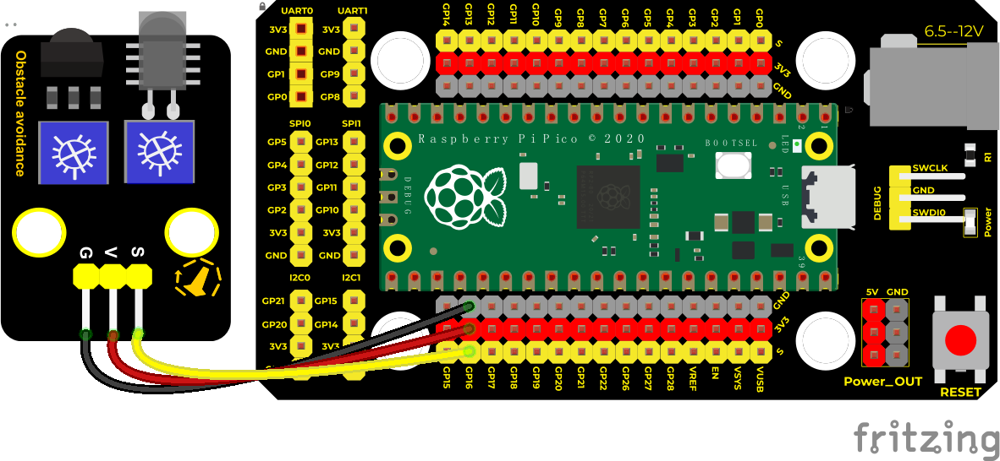

#### **Run the test code**

Find and double-click **Avoid.py** to open it, then click  to run the code.

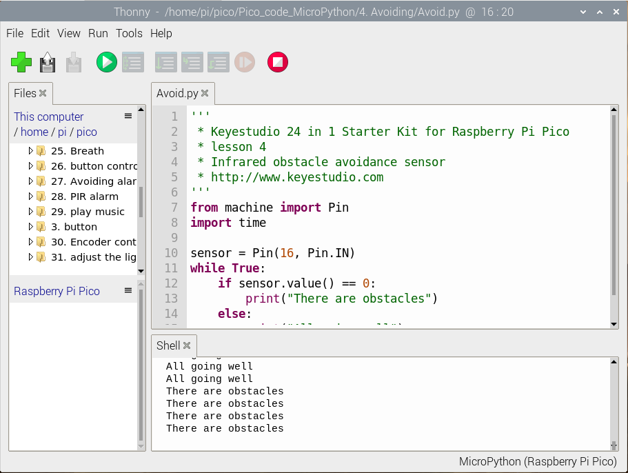

#### **Code Explanation**

Run the code, we start to adjust the two potentiometers to sense distance. 

1. Adjust the potentiometer transmitting power. Make the P LED at the critical point of ON and OFF states.

2. Adjust the potentiometer receiving frequency. Rotate it clockwise, the frequency will increase. Make the S LED at the critical point of ON and OFF states, then the 38KHz square wave can be produced.

#### **Test Result**

Run the code, when the sensor detects the obstacle, the Shell will show “There are obstacles”; if the obstacle is not detected, “All going well” will be shown.


#### **Test Code**

```python
'''
 * Keyestudio 24 in 1 Starter Kit for Raspberry Pi Pico
 * lesson 4
 * Infrared obstacle avoidance sensor
 * http://www.Keyestudio.com
'''
from machine import Pin
import time

sensor = Pin(16, Pin.IN)
while True:
    if sensor.value() == 0:
        print("There are obstacles")
    else:
        print("All going well")
    time.sleep(0.1)
```


### Project 5: Tilt Module


#### **Overview**

In this kit, there is a Keyestudio tilt sensor. The tilt switch can output signals of different levels according to whether the module is tilted. There is a ball inside. When the switch is higher than the horizontal level, the switch is turned on, and when it is lower than the horizontal level, the switch is turned off. This tilt module can be used for tilt detection, alarm or other detection. 

#### **Working Principle**

The working principle is pretty simple. When pin 1 and 2 of the ball switch P1 are connected, the signal S is low level and the red LED will light up; when they are disconnected, the pin will be pulled up by the 4.7K R1 and make S a high level, then LED will be off.


#### **Components**

|  |  |  |
| ------------------------------------------------------------ | ------------------------------------------------------------ | ------------------------------------------------------------ |
| Raspberry Pi Pico Board*1                                    | Raspberry Pi Pico Shield*1                                   | Keyestudio Tilt Sensor*1                                     |
|  |  |                                                              |
| 3P Dupont Wire*1                                             | Micro USB Cable*1                                            |                                                              |


#### **Wiring Diagram**

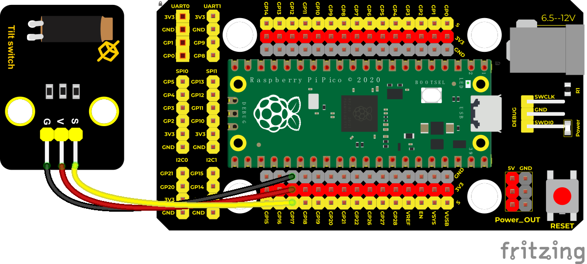

#### **Run the Test Code**

Find and double-click **Tilt switch.py** to open it, then click  to run the code.

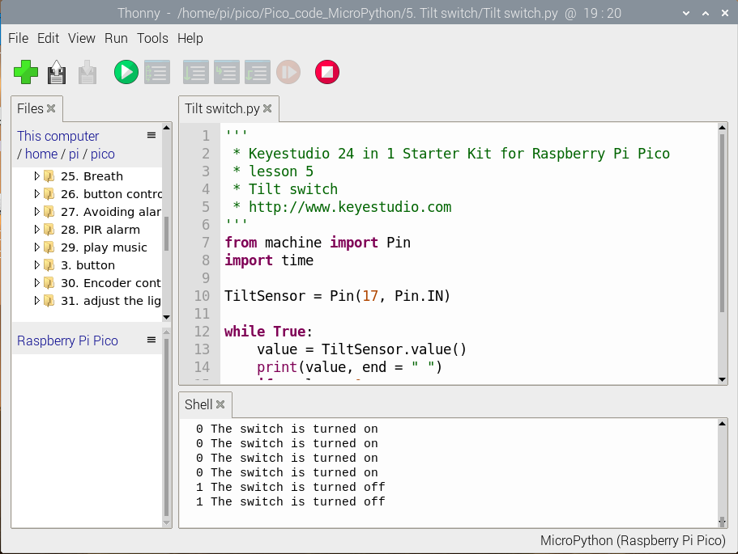

#### **Code Explanation**

Code explanation is as same as the project 3.

#### **Test Result**

Upload the code successfully, and observe the Shell.

Make the tilt module incline to one side, the red LED on the module will be off and the Shell page will display“1 The switch is turned off”; by contrast, if you make it incline the other side, the red LED will light up and“0 The switch is turned on”will be shown.

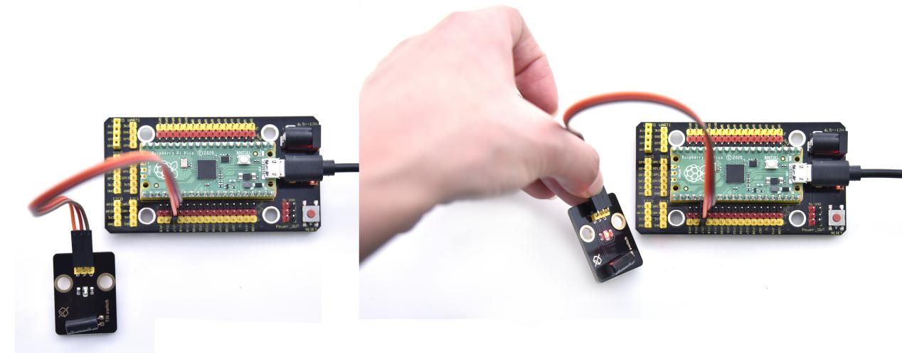

#### **Test Code**

```python
'''
 * Keyestudio 24 in 1 Starter Kit for Raspberry Pi Pico
 * lesson 5
 * Tilt switch
 * http://www.Keyestudio.com
'''
from machine import Pin
import time

TiltSensor = Pin(17, Pin.IN)

while True:
    value = TiltSensor.value()
    print(value, end = " ")
    if  value== 0:
        print("The switch is turned on")
    else:
        print("The switch is turned off")
    time.sleep(0.1)
```


### Project 6: Reed Switch Module


#### **Overview**

In this kit, there is a Keyestudio reed switch module, which mainly uses a MKA10110 green reed component. 

The reed switch is the abbreviation of the dry reed switch. It is a passive electronic switch element with contacts.  

It has the advantages of simple structure, small size and easy control.

Its shell is a sealed glass tube with two iron elastic reed electric plates.

In the experiment, we will determine whether there is a magnetic field near the module by reading the high and low level of the S terminal on the module; and, we display the test result in the shell.

#### **Working Principle**

Reed switch is an abbreviation of the dry reed contacts a passive electronic switching elements, and has the advantages of simple structure, small size and ease of control, its shell is a sealed glass tube, the tubes are installed two iron elastic reed plate, but also filling called rhodium metal inert gas. In peacetime, the glass tube in the two reeds made of special materials are separated. When a magnetic substance close to the glass tube, in the role of the magnetic field lines, the pipe within the two reeds are magnetized to attract each other in contact, the reed will suck together, so that the junction point of the connected circuit communication. After the disappearance of the outer magnetic reed because of their flexibility and separate, the line is disconnected. Therefore, as a use of the magnetic field signals to control the line switching device, reed tube can be used as a sensor for counting the number, spacing, etc., and also are widely used in a variety of communication devices.


#### **Components**

|  | 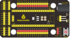 |  |
| ------------------------------------------------------------ | ------------------------------------------------------------ | ------------------------------------------------------------ |
| Raspberry Pi Pico Board*1                                    | Raspberry Pi Pico Shield*1                                   | Keyestudio Reed Switch Module*1                              |
|  |  |                                                              |
| 3P Dupont Wire*1                                             | Micro USB Cable*1                                            |                                                              |


#### **Wiring Diagram**


#### **Run the test code**

Find and double-click **Reed Switch.py** to open it, then click  to run the code.

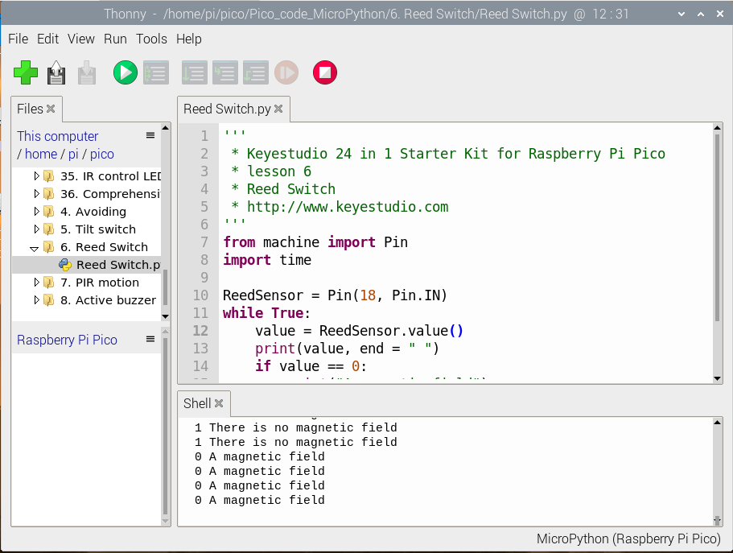

#### **Code Explanation**

The setting method is the same as the previous experiment. Note that it detects magnetic field.

#### **Test Result**

Upload the code. When the sensor detects a magnetic field, val is 0 and the red LED of the module lights up, "0 A magnetic field" will be displayed; when no magnetic field is detected, val is 1, and the LED on the module goes out, "1 There is no magnetic field" will be shown.


#### **Test Code**

```python
'''
 * Keyestudio 24 in 1 Starter Kit for Raspberry Pi Pico
 * lesson 6
 * Reed Switch
 * http://www.Keyestudio.com
'''
from machine import Pin
import time

ReedSensor = Pin(18, Pin.IN)
while True:
    value = ReedSensor.value()
    print(value, end = " ")
    if value == 0:
        print("A magnetic field")
    else:
        print("There is no magnetic field")
    time.sleep(0.1)
```


### Project 7: PIR Motion Sensor


#### **Overview**

In this kit, there is a Keyestudio PIR motion sensor, which mainly uses an RE200B-P sensor elements. It is a human body pyroelectric motion sensor based on pyroelectric effect, which can detect infrared rays emitted by humans or animals, and the Fresnel lens can make the sensor's detection range farther and wider.

In the experiment, we determine if there is someone moving nearby by reading the high and low levels of the S terminal on the module. The detected results will be displayed on the Shell.

#### **Working Principle**

The upper left part is voltage conversion(VCC to 3.3V). The working voltage of sensors we use is 3.3V, therefore we can’t use 5V directly. The voltage conversion circuit is needed.

When no person is detected or no infrared signal is received, and pin 1 of the sensor outputs low level. At this time, the LED on the module will light up and the MOS tube Q1 will be connected and the signal terminal S will detect Low levels. 

When one is detected or an infrared signal is received, and pin 1 of the sensor outputs a high level. Then LED on the module will go off, the MOS tube Q1 is disconnected and the signal terminal S will detect high levels.


#### **Components**

|  |  |  |
| ------------------------------------------------------------ | ------------------------------------------------------------ | ------------------------------------------------------------ |
| Raspberry Pi Pico Board*1                                    | Raspberry Pi Pico Shield*1                                   | Keyestudio PIR Motion Sensor*1                               |
|  |  |                                                              |
| 3P Dupont Wire*1                                             | Micro USB Cable*1                                            |                                                              |


#### **Wiring Diagram**

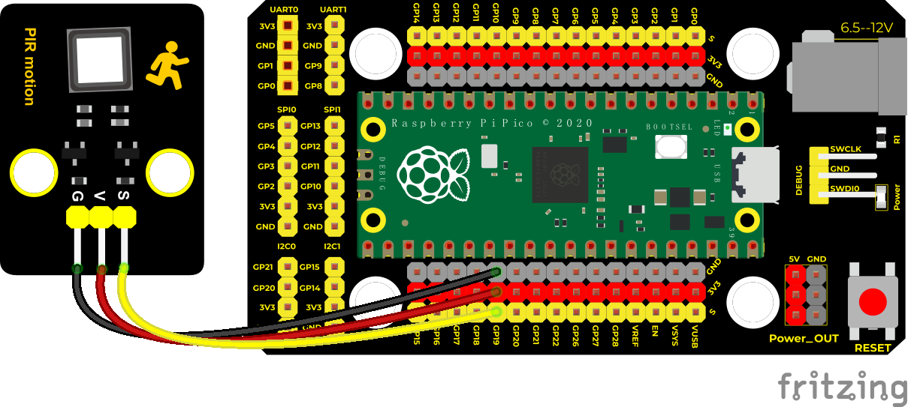

#### **Run the Test Code**

Find and double-click **PIR motion.py** to open it, click  to run the code.

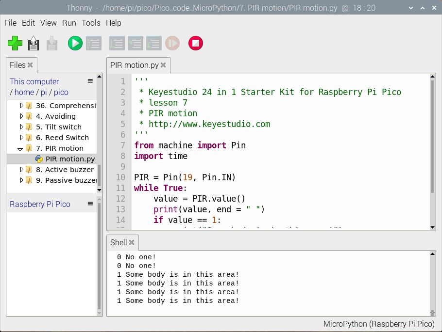

#### **Code Explanation**

The setting method is the same as project 3.

#### **Test Result**

Upload the code, when the sensor detects someone nearby, value is 1, the LED will go off and the Shell page will show“1 Somebody is in this area!”. In contrast, the value is 0, the LED will go up and“0 No one!”will be shown.


#### **Test Code**

```python
'''
 * Keyestudio 24 in 1 Starter Kit for Raspberry Pi Pico
 * lesson 7
 * PIR motion
 * http://www.Keyestudio.com
'''
from machine import Pin
import time

PIR = Pin(19, Pin.IN)
while True:
    value = PIR.value()
    print(value, end = " ")
    if value == 1:
        print("Some body is in this area!")
    else:
        print("No one!")
    time.sleep(0.1)
```


### Project 8: Active Buzzer


#### **Overview**

In this kit, it contains an active buzzer module and a power amplifier module (the principle is equivalent to a passive buzzer). In this experiment, we control the active buzzer to emit sounds. Since it has its own oscillating circuit, the buzzer will automatically sound if given large voltage.

#### **Working Principle**

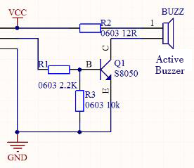

From the schematic diagram, the pin of buzzer is connected to a resistor R2 and another port is linked with a NPN triode Q1. So, if this triode Q1 is powered, the buzzer will sound.

If the base electrode of the triode connected to the R1 resistor is a high level, the triode Q1 will be connected.If the base electrode is pulled down by the resistor R3, the triode is disconnected. 

When we output a high level from the IO port to the triode, the buzzer will emit sounds; if outputting low levels, the buzzer won’t emit sounds.

#### **Components**

|  |  |  |
| ------------------------------------------------------------ | ------------------------------------------------------------ | ------------------------------------------------------------ |
| Raspberry Pi Pico Board*1                                    | Raspberry Pi Pico Shield*1                                   | Keyestudio Active Buzzer*1                                   |
| 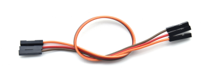                       | 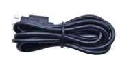                       |                                                              |
| 3P Dupont Wire*1                                             | MicroUSB Cable*1                                             |                                                              |


#### **Wiring Diagram**


#### **Run the Test Code**

Find and double-click **A-buzzer.py** to open it, then click  to run the code.

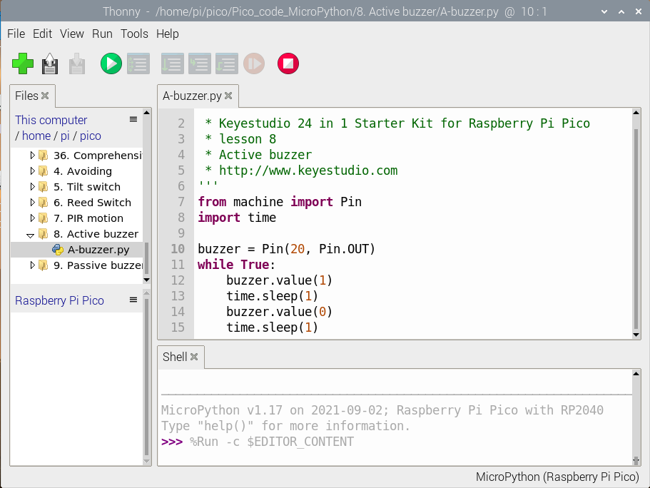

#### **Code Explanation**

In the experiment, the pin is set to 20. When setting HIGH, the active buzzer on the module will emit sounds; when setting LOW, the buzzer

won’t chime.

**Test Result**

Upload the code and power on. The buzzer chimes.

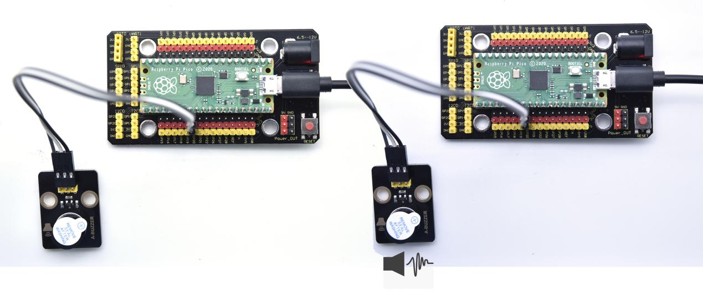

#### **Test Code**

```python
'''
 * Keyestudio 24 in 1 Starter Kit for Raspberry Pi Pico
 * lesson 8
 * Active buzzer
 * http://www.keyestudio.com
'''
from machine import Pin
import time

buzzer = Pin(20, Pin.OUT)
while True:
    buzzer.value(1)
    time.sleep(1)
    buzzer.value(0)
    time.sleep(1)
```


### Project 9: 8002b Audio Power Amplifier


#### **Overview**

In this kit, there is a Keyestudio 8002b audio power amplifier. The main components of this module are an adjustable potentiometer, a speaker, and an audio amplifier chip;

The main function of this module is: it can amplify the output audio signal, with a magnification of 8.5 times, and play sound or music through the built-in low-power speaker, as an external amplifying device for some music playing equipment.

In the experiment, we used the 8002b power amplifier speaker module to emit sounds of various frequencies. 

#### **Working Principle**

In fact, it is similar to a passive buzzer. The active buzzer has its own oscillation source. Yet, the passive buzzer does not have internal oscillation. When controlling the circuit, we need to input square waves of different frequencies to the positive pole of the component and ground the negative pole to control the buzzer to chime sounds of different frequencies.


#### **Components**

|  |  |  |
| ------------------------------------------------------------ | ------------------------------------------------------------ | ------------------------------------------------------------ |
| Raspberry Pi Pico Board*1                                    | Raspberry Pi Pico Shield*1                                   | Keyestudio 8002b Audio Power Amplifier*1                     |
|  |  |                                                              |
| 3P Dupont Wire*1                                             | Micro USB Cable*1                                            |                                                              |


#### **Wiring Diagram**


#### **Run the test code**

Find and double-click **Horn.py** to open it, then click to run the code.

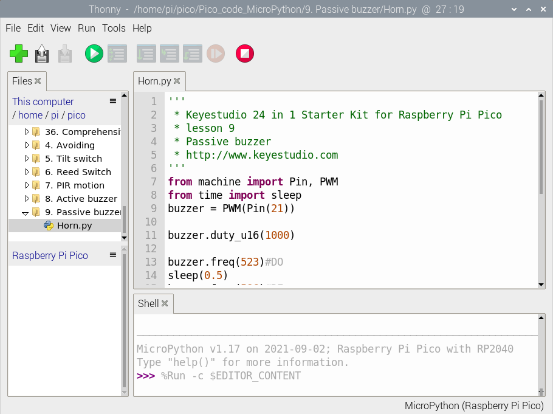

#### **Code Explanation**

We use PWM of the machine,

**buzzer = PWM(Pin(21))** is a **PWM** example and the pin of the buzzer is connected to GP21.

**buzzer.duty_u16(1000)** is used to set duty cycle(1000/65535) and the larger this value, the louder the buzzer. When you set to 0, the buzzer doesn’t emit sounds.

**buzzer.freq()** is frequency setting.

PWM is also called pulse width modulation. Pulse width modulation (PWM) refers to the use of the digital output of the microprocessor to control the analog circuit, and is a method of digitally encoding the analog signal level. It uses a digital pin to send a square wave of a certain frequency, that is, a high level and a low level are alternately output for a period of time. The total time of each group of high level and low level is usually fixed, which is called cycle. The time of high level output is generally called pulse width, and the percentage of pulse width is called duty cycle. The longer the duration of the high level, the greater the duty cycle of the analog signal, and the greater the corresponding voltage. The pulse width in the figure below accounts for 50%, then the output voltage is 3.3 * 50% = 1.65V. 

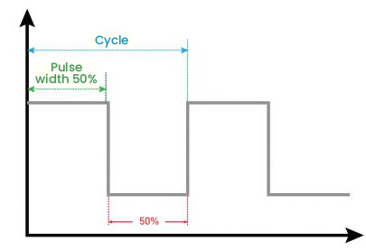

Firstly, we set duty cycle to 1000/65535, and frequency of DO, RE, MI, FA, SO, LA and SI and emit DO, RE, MI, FA ,SO, LA and SI for 0.5s and turn off the buzzer.

#### **Test Result**

Upload the code and power on. Then the audio power amplifier will emit DO，Re，Mi，Fa，So，La，Si.

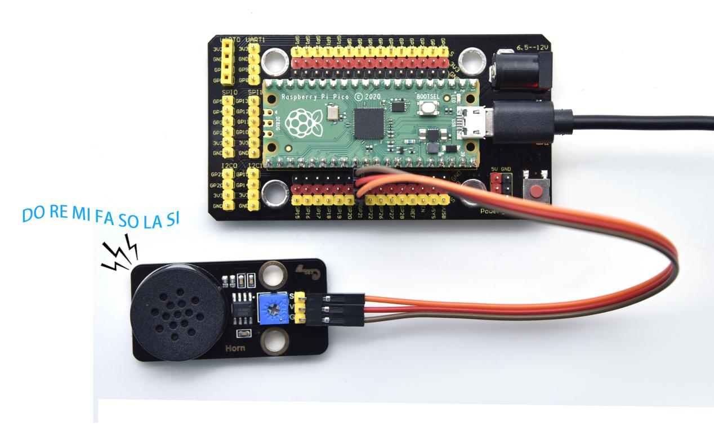

#### **Test Code**

```python
'''
 * Keyestudio 24 in 1 Starter Kit for Raspberry Pi Pico
 * lesson 9
 * Passive buzzer
 * http://www.keyestudio.com
'''
from machine import Pin, PWM
from time import sleep
buzzer = PWM(Pin(21))

buzzer.duty_u16(1000)

buzzer.freq(523)#DO
sleep(0.5)
buzzer.freq(586)#RE
sleep(0.5)
buzzer.freq(658)#MI
sleep(0.5)
buzzer.freq(697)#FA
sleep(0.5)
buzzer.freq(783)#SO
sleep(0.5)
buzzer.freq(879)#LA
sleep(0.5)
buzzer.freq(987)#SI
sleep(0.5)
buzzer.duty_u16(0)
```


### Project 10: RGB Module


#### **Overview**

Among these modules is a RGB module. It adopts a F10-full color RGB foggy common cathode LED. We connect the RGB module to the PWM port of MCU and the other pin to GND(for common anode RGB, the rest pin will be connected to VCC). So what is PWM?

PWM is a means of controlling the analog output via digital means. Digital control is used to generate square waves with different duty cycles (a signal that constantly switches between high and low levels) to control the analog output.In general, the input voltages of ports are 0V and 5V. What if the 3V is required? Or a switch among 1V, 3V and 3.5V? We cannot change resistors constantly. For this reason, we resort to PWM. 


For Arduino digital port voltage outputs, there are only LOW and HIGH levels, which correspond to the voltage outputs of 0V and 5V respectively. You can define LOW as“0”and HIGH as“1’, and let the Arduino output five hundred‘0’or“1”within 1 second. If output five hundred‘1’, that is 5V; if all of which is‘0’,that is 0V; if output 250 01 pattern, that is 2.5V. 

This process can be likened to showing a movie. The movie we watch are not completely continuous. Actually, it generates 25 pictures per second, which cannot be told by human eyes. Therefore, we mistake it as a continuous process. PWM works in the same way. To output different voltages, we need to control the ratio of 0 and 1. The more‘0’or‘1’ output per unit time, the more accurate the control.

#### **Working Principle**

For our experiment, we will control the RGB module to display different colors through three PWM values.


#### **Components**

|  | 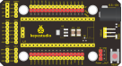 |  |
| ------------------------------------------------------------ | ------------------------------------------------------------ | ------------------------------------------------------------ |
| Raspberry Pi Pico Board*1                                    | Raspberry Pi Pico Shield*1                                   | Keyestudio Common Cathode RGB Module*1                       |
| 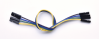 |  |                                                              |
| 4P Dupont Wire*1                                             | Micro USB Cable*1                                            |                                                              |


#### **Wiring Diagram**

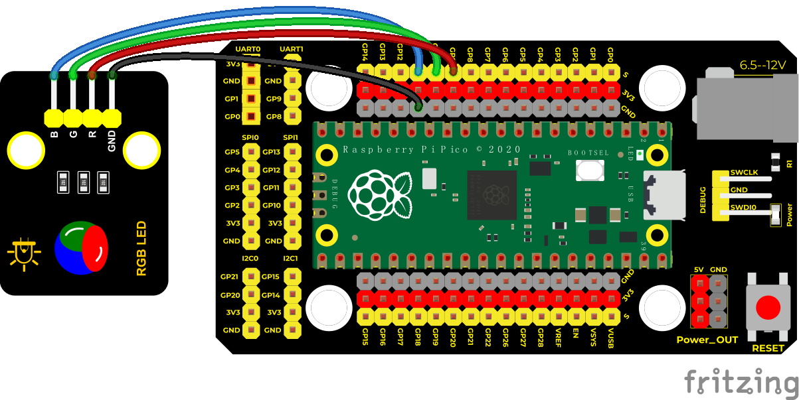

#### **Run the Test Code**

Find **rgb1.py** and **rgb2.py**, double-click to open them, then click  to run the code.

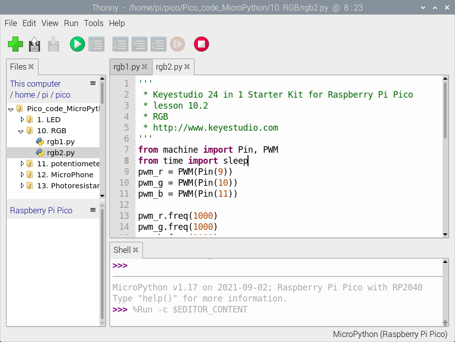

#### **Code Explanation**

Code 1:

**red**, **green** and **blue** represent ports of red, green and blue color. Connect them to GP9 GP10 GP11 and set to 9, 10 and 11. The RGB will show red color, green color and blue color with an interval of one second.

Code 2:

In the code 2, we use PWM output, the frequency we set is **freq(1000)**. **.duty_u16().** The data stands for the proportion of color red, green and blue. The larger the data of the duty cycle, the larger the proportion of the color;

In the experiment, we can adjust the proportion of red, green and blue of RGB LED by setting corresponding values. Thus, the RGB can display the corresponding color.

Note: The duty ratio we set above is at most .duty_u16(65535). 65535 is equal to 256\*256-1(0\~65535). When we compare the color table below, we only need to multiply the following value by 256.

**RGB Color Chart**

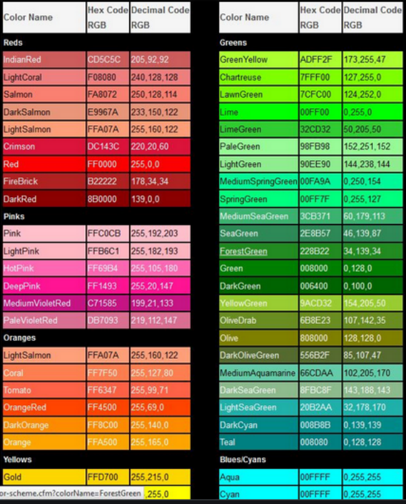


#### **Test Result**

Upload the code 1, the RGB on the module will show red, green and blue color with an interval of 1s.

Upload the code 2, the RGB on the module will show red, orange, yellow, green, cyan-blue, blue, purple and white color with an interval of 1s.


#### **Test Code**

```python
'''
 * Keyestudio 24 in 1 Starter Kit for Raspberry Pi Pico
 * lesson 10.1
 * RGB
 * http://www.keyestudio.com
'''
from machine import Pin
from time import sleep

red = Pin(9, Pin.OUT)
green = Pin(10, Pin.OUT)
blue = Pin(11, Pin.OUT)

while 1:
    red.value(1)
    green.value(0)
    blue.value(0)
    sleep(1)
    red.value(0)
    green.value(1)
    blue.value(0)
    sleep(1)
    red.value(0)
    green.value(0)
    blue.value(1)
    sleep(1)
```

```python
'''
 * Keyestudio 24 in 1 Starter Kit for Raspberry Pi Pico
 * lesson 10.2
 * RGB
 * http://www.keyestudio.com
'''
from machine import Pin, PWM
from time import sleep
pwm_r = PWM(Pin(9))
pwm_g = PWM(Pin(10))
pwm_b = PWM(Pin(11))

pwm_r.freq(1000)
pwm_g.freq(1000)
pwm_b.freq(1000)

def light(red, green, blue):
    pwm_r.duty_u16(red)
    pwm_g.duty_u16(green)
    pwm_b.duty_u16(blue)

while 1:
    light(65535, 0, 0)#red
    sleep(1)
    light(65535, 25088, 0)#orange
    sleep(1)
    light(65535, 65535, 0)#yellow
    sleep(1)
    light(0, 65535, 0)#green
    sleep(1)
    light(0, 0, 65535)#blue
    sleep(1)
    light(0, 65535, 65535)#cyan-blue
    sleep(1)
    light(41216, 8448, 61696)#purple
    sleep(1)
```


### Project 11: Potentiometer


#### **Overview**

The following we will introduce is the Keyestudio rotary potentiometer which is an analog sensor.

The digital IO ports can read the voltage value between 0 and 3.3V and the module only outputs high levels. However, the analog sensor can read the voltage value through ADC analog ports(GP26~GP28) on the pico board.

In the experiment, we will display the test results on the Shell.

#### **Working Principle**

It uses a 10K adjustable resistor. We can change the resistance by rotating the potentiometer. The signal S can detect the voltage changes(0-3.3V) which are analog quantity.


#### **Components**

|  |  |  |
| ------------------------------------------------------------ | ------------------------------------------------------------ | ------------------------------------------------------------ |
| Raspberry Pi Pico Board*1                                    | Raspberry Pi Pico Shield*1                                   | Keyestudio Rotary Potentiometer*1                            |
| 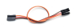 |  |                                                              |
| 3P Dupont Wire*1                                             | MicroUSB Cable*1                                             |                                                              |


#### **Wiring Diagram**

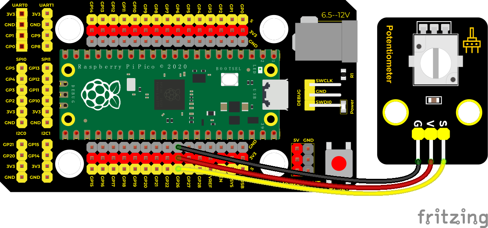

#### **Run the Test Code**

Find and double-click **potentiometer.py** to open it, then click to run the code.

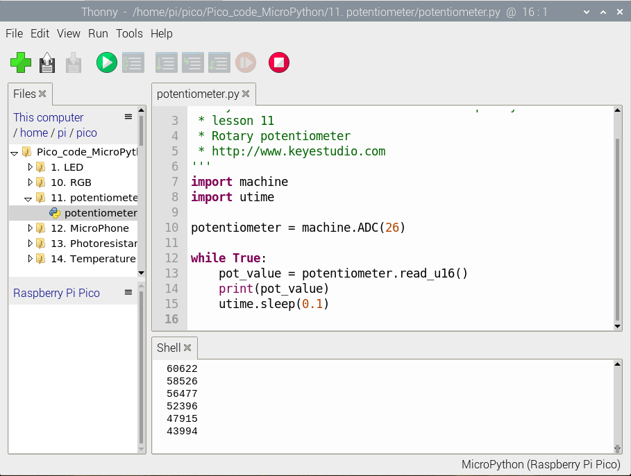

#### **Code Explanation**

In the experiment, we create **ADC examples**, connect GP26(ADC(26)).

**.read_u16():** this is used to read analog value, the range is 0\~65535, **potentiometer.read_u16()** means that reading the output analog value of pin ADC(26), then name **pot_value**.

**utime.sleep()** delayed function can work as same as the function **time.sleep()**.

**Test Result**

Run the test code and observe the corresponding simulation value displayed in the Shell below. In the experiment, rotate the potentiometer clockwise, the analog value increases, and turn the potentiometer counterclockwise, the analog value decreases, the range is 65535, as shown in the figure below. 

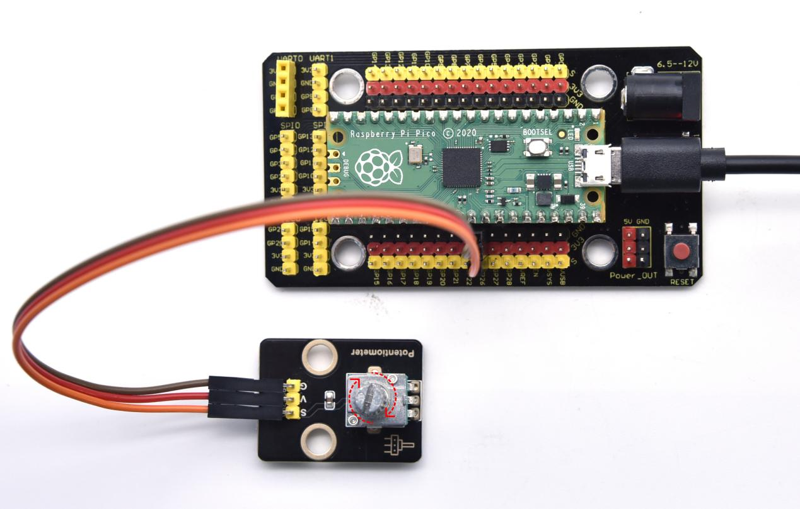

#### **Test Code**

```python
'''
 * Keyestudio 24 in 1 Starter Kit for Raspberry Pi Pico
 * lesson 11
 * Rotary potentiometer
 * http://www.keyestudio.com
'''
import machine
import utime

potentiometer = machine.ADC(26)

while True:
    pot_value = potentiometer.read_u16()
    print(pot_value)
    utime.sleep(0.1)
```


### Project 12: Sound Sensor


#### **Overview**

In this kit, there is a sound sensor. In the experiment, we test the analog value corresponding to the sound level in the current environment with it. The louder the sound, the larger the analog value.

#### **Working Principle**

It uses a high-sensitive microphone component and an LM386 chip. 

We build the circuit with the LM386 chip and amplify the sound through the high-sensitive microphone. In addition, we can adjust the sound volume by the potentiometer. Rotate it clockwise, the sound will get louder.


#### **Components**

|  |  |  |
| ------------------------------------------------------------ | ------------------------------------------------------------ | ------------------------------------------------------------ |
| Raspberry Pi Pico Board*1                                    | Raspberry Pi Pico Shield*1                                   | Keyestudio Sound Sensor*1                                    |
|  |  |                                                              |
| 3P Dupont Wire*1                                             | Micro USB Cable*1                                            |                                                              |


#### **Wiring Diagram**

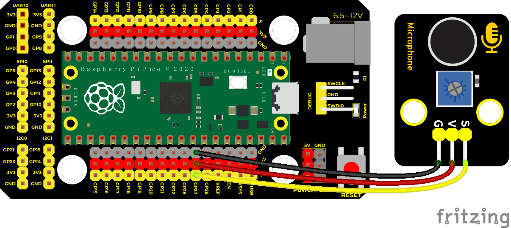

#### **Run the Test Code**

Find and double-click **MicroPhone.py** to open it, then clickto run the code.

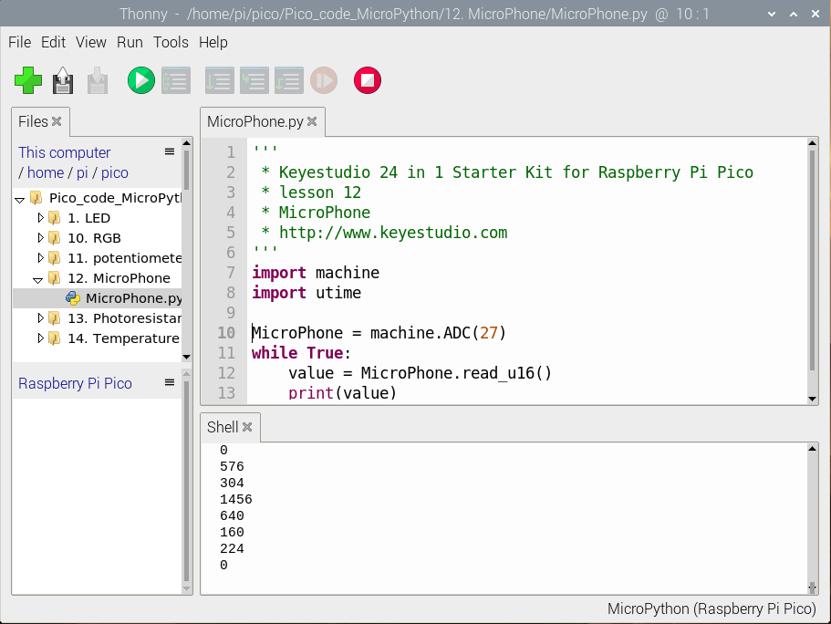

#### **Code Explanation**

The setting method is as same as the project 11. We use **ADC(27)** which is **ADC(1)**.

#### **Test Result**

Upload the test code, rotate clockwise the potentiometer and speak at the MIC. Then you can see the analog value get larger.

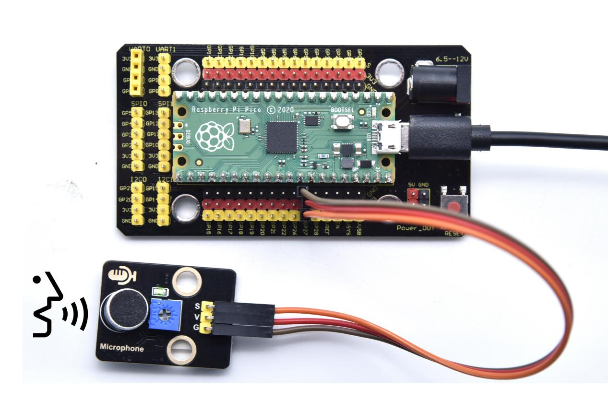

#### **Test Code**

```python
'''
 * Keyestudio 24 in 1 Starter Kit for Raspberry Pi Pico
 * lesson 12
 * MicroPhone
 * http://www.keyestudio.com
'''
import machine
import utime

MicroPhone = machine.ADC(27)
while True:
    value = MicroPhone.read_u16()
    print(value)
    utime.sleep(0.1)
```


### Project 13: Photoresistor


#### **Overview**

In this kit, there is a photoresistor which consists of a photosensitive resistance element. Its resistance changes with the light intensity. Also, it converts the resistance change into a voltage change.

We interface its signal terminal (S terminal) with the analog port of pico , so as to sense the change of the analog value, and display the corresponding analog value in the Shell.

#### **Working Principle**

If there is no light, the resistance is 0.2MΩ and the detected voltage at the terminal 2 is close to 0. When the light intensity increases, the resistance of photoresistor and detected voltage will diminish. 


#### **Components**

|  |  |  |
| ------------------------------------------------------------ | ------------------------------------------------------------ | ------------------------------------------------------------ |
| Raspberry Pi Pico Board*1                                    | Raspberry Pi Pico Shield*1                                   | Keyestudio Photoresistor*1                                   |
|  |  |                                                              |
| 3P Dupont Wire*1                                             | MicroUSB Cable*1                                             |                                                              |


#### **Wiring Diagram**


#### **Run the test code**

Find and double-click **photoresistance.py** to open it, then click  to run the code.

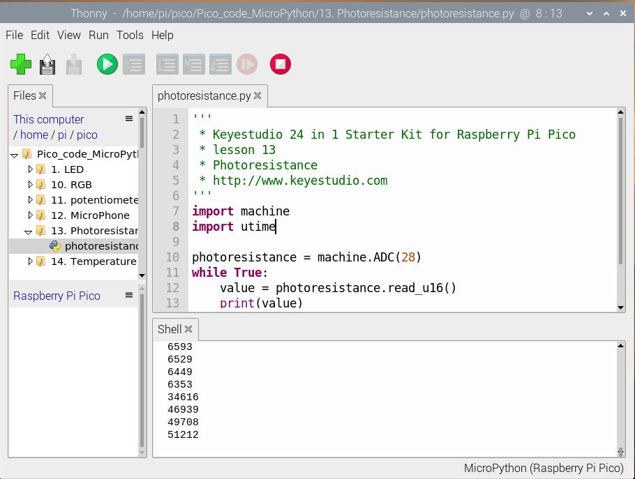

#### **Code Explanation**

The setting method is similar to the project 11. **ADC(28)** is channel 2 **(ADC(2)**.

#### **Test Result**

Wire up and upload the test code. When the light intensity gets stronger, the analog value will get larger.

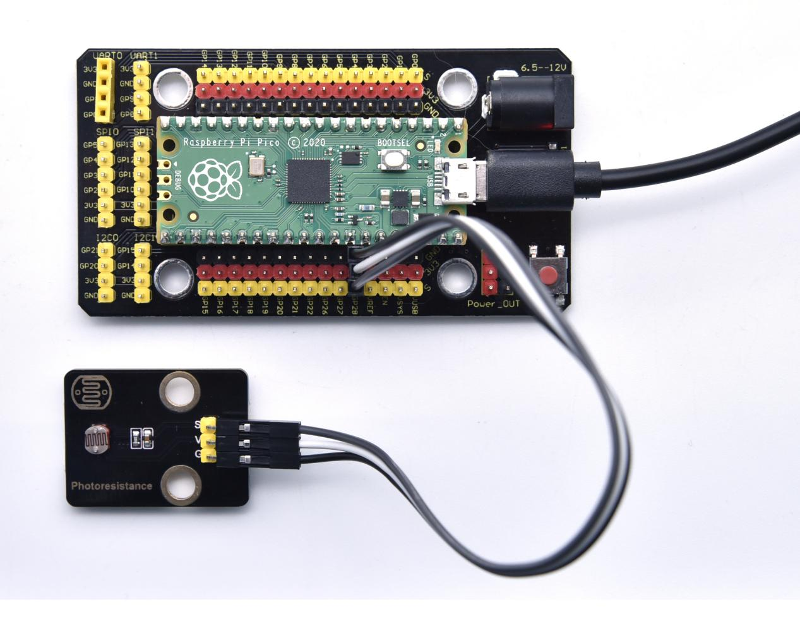

#### **Test Code**

```python
'''
 * Keyestudio 24 in 1 Starter Kit for Raspberry Pi Pico
 * lesson 13
 * Photoresistance
 * http://www.keyestudio.com
'''
import machine
import utime

photoresistance = machine.ADC(28)
while True:
    value = photoresistance.read_u16()
    print(value)
    utime.sleep(0.1)
```


### Project 14: NTC-MF52AT Thermistor


#### **Overview**

In the experiment, there is a NTC-MF52AT analog thermistor. We connect its signal terminal to the analog port of the Raspberry Pi Pico Board and read the corresponding analog value. 

We can use analog values to calculate the temperature of the current environment through specific formulas. Since the temperature calculation formula is more complicated, we only read the corresponding analog value. 

#### **Working Principle**

This module mainly uses NTC-MF52AT thermistor elements. The NTC-MF52AT thermistor element can sense the changes of the surrounding environment temperature. Resistance changes with the temperature, causing the voltage of the signal terminal S to change. 

This sensor uses the characteristics of NTC-MF52AT thermistor element to  convert resistance changes into voltage changes.

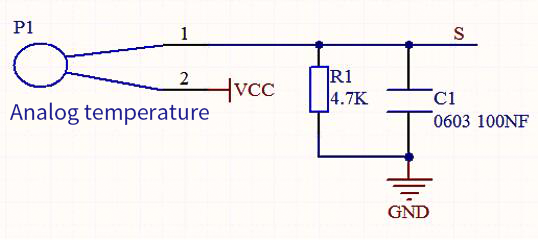

#### **Components**

|  |  |  |
| ------------------------------------------------------------ | ------------------------------------------------------------ | ------------------------------------------------------------ |
| Raspberry Pi Pico Board*1                                    | Raspberry Pi Pico Shield*1                                   | Keyestudio NTC-MF52AT Thermistor*1                           |
|  |  |                                                              |
| 3P Dupont Wire*1                                             | Micro USB Cable*1                                            |                                                              |


#### **Wiring Diagram**


#### **Run the Test Code**

Find and double-click **temperature.py** to open it, then click  to run the code.

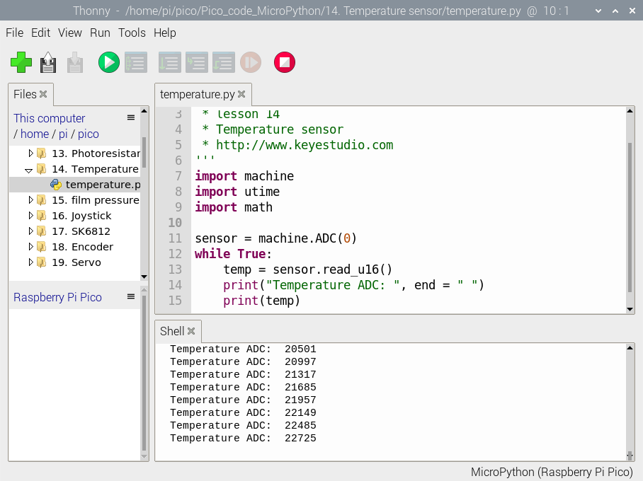

#### **Code Explanation**

The setting method is the same as experiment 11. **ADC(0)** is **ADC(26)**.

#### **Test Result**

Upload the test code, the more the temperature, the larger the analog value. As shown in Shell page.

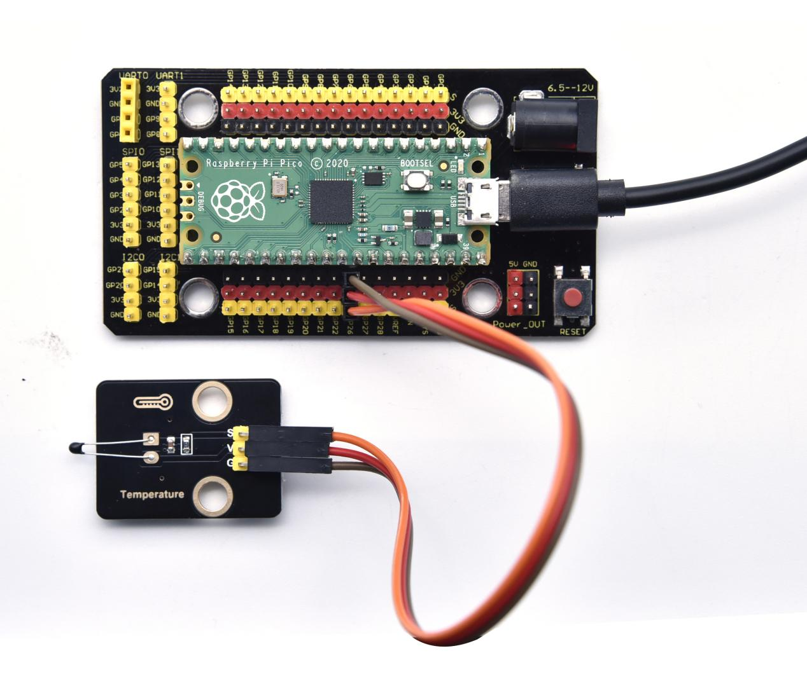

#### **Test Code**

```python
'''
 * Keyestudio 24 in 1 Starter Kit for Raspberry Pi Pico
 * lesson 14
 * Temperature sensor
 * http://www.keyestudio.com
'''
import machine
import utime
import math

sensor = machine.ADC(0)
while True:
    temp = sensor.read_u16()
    print("Temperature ADC: ", end = " ")
    print(temp)
    utime.sleep(0.1)
```


### Project 15: Thin-film Pressure Sensor


#### **Overview**

In this kit, there is a Keyestudio thin-film pressure sensor. The thin-film pressure sensor composed of a new type of nano pressure-sensitive material and a comfortable ultra-thin film substrate, has waterproof and pressure-sensitive functions.

In the experiment, we determine the pressure by collecting the analog signal on the S end of the module. The smaller the analog value, the greater the pressure; and the displayed results will shown on the Shell.

#### **Working Principle**

When the sensor is pressed by external forces, the resistance value of sensor will vary. We convert the pressure signals detected by the sensor into the electric signals through a circuit. Then we can obtain the pressure changes by detecting voltage signal changes.


#### **Components**

|  | 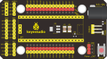 |  |
| ------------------------------------------------------------ | ------------------------------------------------------------ | ------------------------------------------------------------ |
| Raspberry Pi Pico Board*1                                    | Raspberry Pi Pico Shield*1                                   | Keyestudio Thin-film Pressure Sensor*1                       |
|  |  |                                                              |
| 3P Dupont Wire*1                                             | MicroUSB Cable*1                                             |                                                              |


#### **Wiring Diagram**


#### **Run the Test Code**

Find and double-click **film pressure.py** to open it, then click  to run the code.

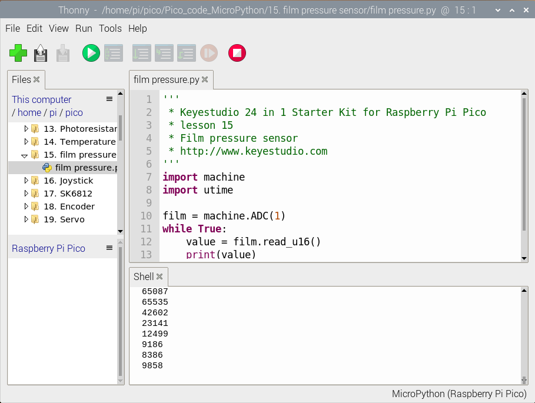

#### **Code Explanation**

The setting method is the same as experiment 11. **ADC(1)** is **ADC(27)**.

#### **Test Result**

Upload the code, when the thin-film is pressed by fingers, the analog value will decrease, as shown below.

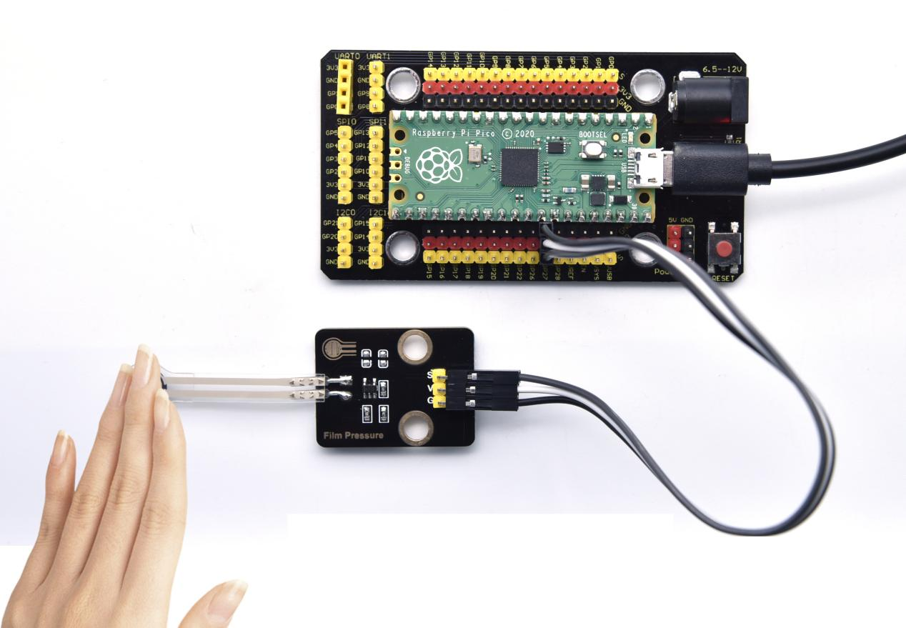

#### **Test Code**

```python
'''
 * Keyestudio 24 in 1 Starter Kit for Raspberry Pi Pico
 * lesson 15
 * Film pressure sensor
 * http://www.keyestudio.com
'''
import machine
import utime

film = machine.ADC(1)
while True:
    value = film.read_u16()
    print(value)
    utime.sleep(0.1)
```


### Project 16: Joystick Module


#### **Overview**

Game handle controllers are ubiquitous.

It mainly uses PS2 joysticks. When controlling it, we need to connect the X and Y ports of the module to the analog port of the single-chip microcomputer, port B to the digital port of the single-chip microcomputer, VCC to the power output port(3.3-5V), and GND to the GND of the MCU. We can read the high and low levels of two analog values and one digital port) to determine the working status of the joystick on the module.

In the experiment, two analog values(x axis and y axis) will be shown on Shell.

#### **Working Principle**

In fact, its working principle is very simple. Its inside structure is equivalent to two adjustable potentiometers and a button. When this button is not pressed and the module is pulled down by R1, low levels will be output ; on the contrary, when the button is pressed, VCC will be connected (high levels), When we move the joystick, the internal potentiometer will adjust to output different voltages, and we can read the analog value.


#### **Components**

|  |  |  |
| ------------------------------------------------------------ | ------------------------------------------------------------ | ------------------------------------------------------------ |
| Raspberry Pi Pico Board*1                                    | Raspberry Pi Pico Shield*1                                   | Keyestudio Joystick Module*1                                 |
|  |  |                                                              |
| 5P Dupont Wire*1                                             | MicroUSB Cable*1                                             |                                                              |


#### **Wiring Diagram**


#### **Run the Test Code**

Find and double-click **joystick.py** to open it, then click to run the code.

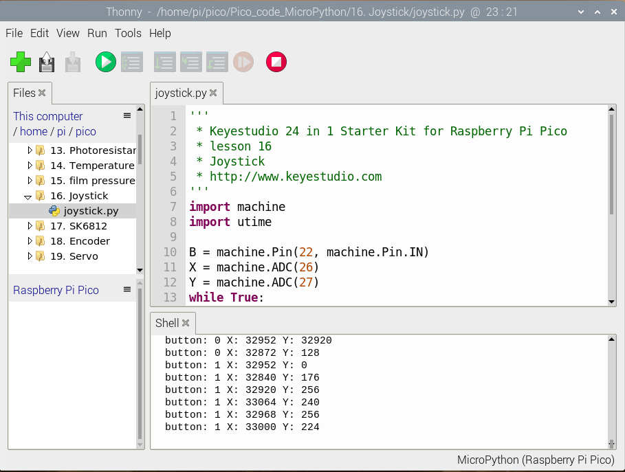

#### **Code Explanation**

In the experiment, X is set to **ADC(26)**, Y is set to **ADC(27)** and the pin of the button is set to **GP22**(input mode). When displaying data, we can add **end = " "** behind the function print() so as to not enter a new line while printing data.

#### **Test Result**

Upload the test code, move the joystick, then the value of x axis and y axis will change; press the thumb button, the value is 1; in contrast, the value is 0 as shown below.


#### **Test Code**

```python
'''
 * Keyestudio 24 in 1 Starter Kit for Raspberry Pi Pico
 * lesson 16
 * Joystick
 * http://www.keyestudio.com
'''
import machine
import utime

B = machine.Pin(22, machine.Pin.IN)
X = machine.ADC(26)
Y = machine.ADC(27)
while True:
    B_value = B.value()
    X_value = X.read_u16()
    Y_value = Y.read_u16()
    print("button:", end = " ")
    print(B_value, end = " ")
    print("X:", end = " ")
    print(X_value, end = " ")
    print("Y:", end = " ")
    print(Y_value)
    utime.sleep(0.1)
```


### Project 17: SK6812 RGB Module


#### **Overview**

In previous lessons, we learned about the plug-in RGB module and used PWM signals to color the three pins of the module. 

There is a Keyestudio 6812 RGB module whose the driving principle is different from the plug-in RGB module. It can only control with one pin. This is a set. It is an intelligent externally controlled LED light source with the control circuit and the light-emitting circuit. Each LED element is the same as a 5050 LED lamp bead, and each component is a pixel. There are four lamp beads on the module, which indicates four pixels.

In the experiment, we make different lights show different colors. 

#### **Working Principle**

From the schematic diagram, we can see that these four pixel lighting beads are all connected in series. In fact, no matter how many they are, we can use a pin to control a light and let it display any color. The pixel point contains a data latch signal shaping amplifier drive circuit, a high-precision internal oscillator and a 12V high-voltage programmable constant current control part, which effectively ensures the color of the pixel point light is highly consistent.

The data protocol adopts a single-wire zero-code communication method. After the pixel is powered up and reset, the S terminal receives the data transmitted from the controller. The first 24bit data sent is extracted by the first pixel and sent to the data latch of the pixel.


#### **Components**

|  |  |  |
| ------------------------------------------------------------ | ------------------------------------------------------------ | ------------------------------------------------------------ |
| Raspberry Pi Pico Board*1                                    | Raspberry Pi Pico Shield*1                                   | Keyestudio 6812 RGB Module*1                                 |
|  |  |                                                              |
| 3P Dupont Wire*1                                             | Micro USB Cable*1                                            |                                                              |


#### **Wiring Diagram**


#### **Run the Test Code**

Find and double-click **sk6812.py** to open it, then click  to run the code.

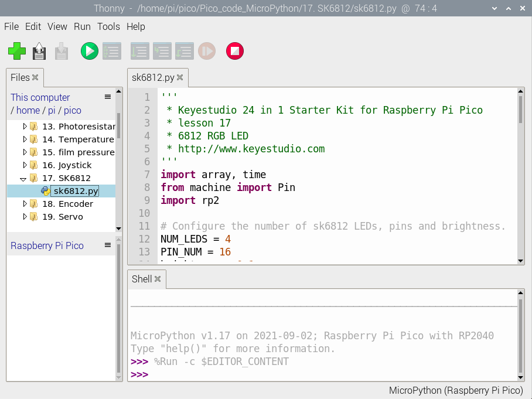

#### **Code Explanation**

**NUM_LEDS = 4**，there are four light beads, therefore, we set to 4

**PIN_NUM = 16**，this is the pin number, we connect to GP16, can be changeable

**brightness = 0.1**，this is the brightness setting, number 1 is the brightest

**pixels_show()**，this function is used to refresh and display

**pixels_set(i, color)**，this function is sued to set up the location of 6812RGB

**pixels_fill(color)**，display colors of all light beads

#### **Test Result**

Upload the code, wire up according to connection diagrams and power on. Then we can see the light beads on the module show red, green, blue and white color, as shown below.


#### **Test Code**

```python
'''
 * Keyestudio 24 in 1 Starter Kit for Raspberry Pi Pico
 * lesson 17
 * 6812 RGB LED
 * http://www.keyestudio.com
'''
import array, time
from machine import Pin
import rp2
 
# Configure the number of sk6812 LEDs, pins and brightness.
NUM_LEDS = 4
PIN_NUM = 16
brightness = 0.1
 
 
@rp2.asm_pio(sideset_init=rp2.PIO.OUT_LOW, out_shiftdir=rp2.PIO.SHIFT_LEFT, autopull=True, pull_thresh=24)
def sk6812():
    T1 = 2
    T2 = 5
    T3 = 3
    wrap_target()
    label("bitloop")
    out(x, 1)               .side(0)    [T3 - 1]
    jmp(not_x, "do_zero")   .side(1)    [T1 - 1]
    jmp("bitloop")          .side(1)    [T2 - 1]
    label("do_zero")
    nop()                   .side(0)    [T2 - 1]
    wrap()
 
 
# Create the StateMachine with the sk6812 program, outputting on Pin(16).
sm = rp2.StateMachine(0, sk6812, freq=8_000_000, sideset_base=Pin(PIN_NUM))
 
# Start the StateMachine, it will wait for data on its FIFO.
sm.active(1)
 
# Display a pattern on the LEDs via an array of LED RGB values.
ar = array.array("I", [0 for _ in range(NUM_LEDS)])
 
def pixels_show():
    dimmer_ar = array.array("I", [0 for _ in range(NUM_LEDS)])
    for i,c in enumerate(ar):
        r = int(((c >> 8) & 0xFF) * brightness)
        g = int(((c >> 16) & 0xFF) * brightness)
        b = int((c & 0xFF) * brightness)
        dimmer_ar[i] = (g<<16) + (r<<8) + b
    sm.put(dimmer_ar, 8)
    time.sleep_ms(10)
 
def pixels_set(i, color):
    ar[i] = (color[1]<<16) + (color[0]<<8) + color[2]
 
def pixels_fill(color):
    for i in range(len(ar)):
        pixels_set(i, color)

RED = (255, 0, 0)
GREEN = (0, 255, 0)
BLUE = (0, 0, 255)
WHITE = (255, 255, 255)
BLACK = (0, 0, 0)

pixels_set(0, RED)
pixels_set(1, GREEN)
pixels_set(2, BLUE)
pixels_set(3, WHITE)
pixels_show()
time.sleep(5)
'''
for i in range(len(ar)):
    pixels_set(i, BLACK)
pixels_show()
'''
```


### Project 18: Rotary Encoder


#### **Overview**

In this kit, there is a Keyestudio rotary encoder, dubbed as switch encoder. It is applied to automotive electronics, multimedia audio, instrumentation, household appliances, smart home, medical equipment and so on.

In the experiment, it it used for counting. When we rotate the rotary encoder clockwise, the set data falls by 1; if you rotate it anticlockwise, the set data is up 1; and when the middle button is pressed, the value will be show on Shell.

#### **Working Principle**

The incremental encoder converts the displacement into a periodic electric signal, and then converts this signal into a counting pulse, and the number of pulses indicates the size of the displacement. This module mainly uses 20-pulse rotary encoder components. It can calculate the number of pulses output during clockwise and reverse rotation. There is no limit to count rotation. It resets to the initial state, that is, starts counting from 0.


#### **Components**

|  |  |  |
| ------------------------------------------------------------ | ------------------------------------------------------------ | ------------------------------------------------------------ |
| Raspberry Pi Pico Board*1                                    | Raspberry Pi Pico Shield*1                                   | Keyestudio Rotary Encoder*1                                  |
|  |  |                                                              |
| 5P Dupont Wire*1                                             | Micro USB Cable*1                                            |                                                              |


#### **Wiring Diagram**


#### **Run the test code**

Find and double-click **encoder.py** to open it, then click  to run the code.

It will show the following content.


This is because we did not import the module needed by the encoder. We have mentioned how to import modules before, please refer to the previous method.

We save the code below to the Pico with the name of **rotary.py**.

```python
# The MIT License (MIT)
# Copyright (c) 2020 Mike Teachman
# https://opensource.org/licenses/MIT

# Platform-independent MicroPython code for the rotary encoder module

# Documentation:
#   https://github.com/MikeTeachman/micropython-rotary

import micropython

_DIR_CW = const(0x10)  # Clockwise step
_DIR_CCW = const(0x20)  # Counter-clockwise step

# Rotary Encoder States
_R_START = const(0x0)
_R_CW_1 = const(0x1)
_R_CW_2 = const(0x2)
_R_CW_3 = const(0x3)
_R_CCW_1 = const(0x4)
_R_CCW_2 = const(0x5)
_R_CCW_3 = const(0x6)
_R_ILLEGAL = const(0x7)

_transition_table = [

    # |------------- NEXT STATE -------------|            |CURRENT STATE|
    # CLK/DT    CLK/DT     CLK/DT    CLK/DT
    #   00        01         10        11
    [_R_START, _R_CCW_1, _R_CW_1,  _R_START],             # _R_START
    [_R_CW_2,  _R_START, _R_CW_1,  _R_START],             # _R_CW_1
    [_R_CW_2,  _R_CW_3,  _R_CW_1,  _R_START],             # _R_CW_2
    [_R_CW_2,  _R_CW_3,  _R_START, _R_START | _DIR_CW],   # _R_CW_3
    [_R_CCW_2, _R_CCW_1, _R_START, _R_START],             # _R_CCW_1
    [_R_CCW_2, _R_CCW_1, _R_CCW_3, _R_START],             # _R_CCW_2
    [_R_CCW_2, _R_START, _R_CCW_3, _R_START | _DIR_CCW],  # _R_CCW_3
    [_R_START, _R_START, _R_START, _R_START]]             # _R_ILLEGAL

_transition_table_half_step = [
    [_R_CW_3,            _R_CW_2,  _R_CW_1,  _R_START],
    [_R_CW_3 | _DIR_CCW, _R_START, _R_CW_1,  _R_START],
    [_R_CW_3 | _DIR_CW,  _R_CW_2,  _R_START, _R_START],
    [_R_CW_3,            _R_CCW_2, _R_CCW_1, _R_START],
    [_R_CW_3,            _R_CW_2,  _R_CCW_1, _R_START | _DIR_CW],
    [_R_CW_3,            _R_CCW_2, _R_CW_3,  _R_START | _DIR_CCW]]

_STATE_MASK = const(0x07)
_DIR_MASK = const(0x30)


def _wrap(value, incr, lower_bound, upper_bound):
    range = upper_bound - lower_bound + 1
    value = value + incr

    if value < lower_bound:
        value += range * ((lower_bound - value) // range + 1)

    return lower_bound + (value - lower_bound) % range


def _bound(value, incr, lower_bound, upper_bound):
    return min(upper_bound, max(lower_bound, value + incr))


def _trigger(rotary_instance):
    for listener in rotary_instance._listener:
        listener()


class Rotary(object):

    RANGE_UNBOUNDED = const(1)
    RANGE_WRAP = const(2)
    RANGE_BOUNDED = const(3)

    def __init__(self, min_val, max_val, reverse, range_mode, half_step):
        self._min_val = min_val
        self._max_val = max_val
        self._reverse = -1 if reverse else 1
        self._range_mode = range_mode
        self._value = min_val
        self._state = _R_START
        self._half_step = half_step
        self._listener = []

    def set(self, value=None, min_val=None,
            max_val=None, reverse=None, range_mode=None):
        # disable DT and CLK pin interrupts
        self._hal_disable_irq()

        if value is not None:
            self._value = value
        if min_val is not None:
            self._min_val = min_val
        if max_val is not None:
            self._max_val = max_val
        if reverse is not None:
            self._reverse = -1 if reverse else 1
        if range_mode is not None:
            self._range_mode = range_mode
        self._state = _R_START

        # enable DT and CLK pin interrupts
        self._hal_enable_irq()

    def value(self):
        return self._value

    def reset(self):
        self._value = 0

    def close(self):
        self._hal_close()

    def add_listener(self, l):
        self._listener.append(l)

    def remove_listener(self, l):
        if l not in self._listener:
            raise ValueError('{} is not an installed listener'.format(l))
        self._listener.remove(l)
        
    def _process_rotary_pins(self, pin):
        old_value = self._value
        clk_dt_pins = (self._hal_get_clk_value() <<
                       1) | self._hal_get_dt_value()
        # Determine next state
        if self._half_step:
            self._state = _transition_table_half_step[self._state &
                                                      _STATE_MASK][clk_dt_pins]
        else:
            self._state = _transition_table[self._state &
                                            _STATE_MASK][clk_dt_pins]
        direction = self._state & _DIR_MASK

        incr = 0
        if direction == _DIR_CW:
            incr = 1
        elif direction == _DIR_CCW:
            incr = -1

        incr *= self._reverse

        if self._range_mode == self.RANGE_WRAP:
            self._value = _wrap(
                self._value,
                incr,
                self._min_val,
                self._max_val)
        elif self._range_mode == self.RANGE_BOUNDED:
            self._value = _bound(
                self._value,
                incr,
                self._min_val,
                self._max_val)
        else:
            self._value = self._value + incr

        try:
            if old_value != self._value and len(self._listener) != 0:
                micropython.schedule(_trigger, self)
        except:
            pass
```

Save the following code to the Pico with the name of **rotary_irq_rp2.py**.

```python
# The MIT License (MIT)
# Copyright (c) 2020 Mike Teachman
# Copyright (c) 2021 Eric Moyer
# https://opensource.org/licenses/MIT

# Platform-specific MicroPython code for the rotary encoder module
# Raspberry Pi Pico implementation

# Documentation:
#   https://github.com/MikeTeachman/micropython-rotary

from machine import Pin
from rotary import Rotary

IRQ_RISING_FALLING = Pin.IRQ_RISING | Pin.IRQ_FALLING


class RotaryIRQ(Rotary):
    def __init__(
        self,
        pin_num_clk,
        pin_num_dt,
        min_val=0,
        max_val=10,
        reverse=False,
        range_mode=Rotary.RANGE_UNBOUNDED,
        pull_up=False,
        half_step=False,
    ):
        super().__init__(min_val, max_val, reverse, range_mode, half_step)

        if pull_up:
            self._pin_clk = Pin(pin_num_clk, Pin.IN, Pin.PULL_UP)
            self._pin_dt = Pin(pin_num_dt, Pin.IN, Pin.PULL_UP)
        else:
            self._pin_clk = Pin(pin_num_clk, Pin.IN)
            self._pin_dt = Pin(pin_num_dt, Pin.IN)

        self._hal_enable_irq()

    def _enable_clk_irq(self):
        self._pin_clk.irq(self._process_rotary_pins, IRQ_RISING_FALLING)

    def _enable_dt_irq(self):
        self._pin_dt.irq(self._process_rotary_pins, IRQ_RISING_FALLING)

    def _disable_clk_irq(self):
        self._pin_clk.irq(None, 0)

    def _disable_dt_irq(self):
        self._pin_dt.irq(None, 0)

    def _hal_get_clk_value(self):
        return self._pin_clk.value()

    def _hal_get_dt_value(self):
        return self._pin_dt.value()

    def _hal_enable_irq(self):
        self._enable_clk_irq()
        self._enable_dt_irq()

    def _hal_disable_irq(self):
        self._disable_clk_irq()
        self._disable_dt_irq()

    def _hal_close(self):
        self._hal_disable_irq()
```

After that, these two modules will be shown on the left side. Then open **encoder.py** again to run the code, it works.

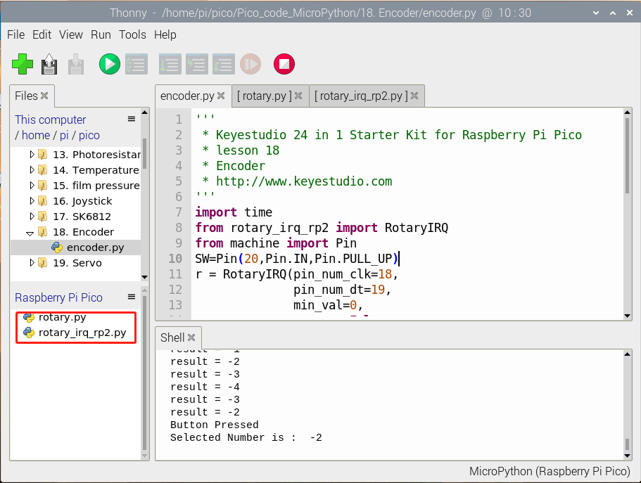

#### **Code Explanation**

**SW=Pin(20,Pin.IN,Pin.PULL_UP)** means the pin of SW is connected to GP20, **pin_num_clk=18** shows that CLK is connected to GP18. **pin_num_dt=19** indicates that DT is linked with GP19. These pins can be changed.

**try/except** is used to process the abnormal language of Python, **try** is the executable code. Press Ctrl+C to exit program.

**r.value()** returns the values of the encoder.

#### **Test Result**

Upload the code, rotate the knob on the rotary encoder clockwise, the displayed data will decrease; in contrast, rotate the knob anticlockwise, the data will rise. Equally, press the button on the rotary encoder.

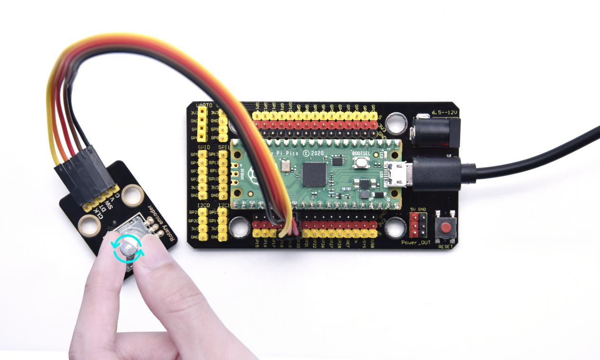

#### **Test Code**

```python
'''
 * Keyestudio 24 in 1 Starter Kit for Raspberry Pi Pico
 * lesson 18
 * Encoder
 * http://www.Keyestudio.com
'''
import time
from rotary_irq_rp2 import RotaryIRQ
from machine import Pin
SW=Pin(20,Pin.IN,Pin.PULL_UP)
r = RotaryIRQ(pin_num_clk=18,
              pin_num_dt=19,
              min_val=0,
              reverse=False,
              range_mode=RotaryIRQ.RANGE_UNBOUNDED)
val_old = r.value()
while True:
    try:
        val_new = r.value()
        if SW.value()==0 and n==0:
            print("Button Pressed")
            print("Selected Number is : ",val_new)
            n=1
            while SW.value()==0:
                continue
        n=0
        if val_old != val_new:
            val_old = val_new
            print('result =', val_new)
        time.sleep_ms(50)
    except KeyboardInterrupt:
        break
```


### Project 19: Servo Control


#### **Overview**

Servo motor is a position control rotary actuator. It mainly consists of a housing, a circuit board, a core-less motor, a gear and a position sensor. Its working principle is that the servo receives the signal sent by MCU or receiver and produces a reference signal with a period of 20ms and width of 1.5ms, then compares the acquired DC bias voltage to the voltage of the potentiometer and obtain the voltage difference output.

In general, servo has three lines in brown, red and orange. The brown wire is grounded, the red one is a positive pole line and the orange one is a signal line.


#### **Working Principle**

When the motor speed is constant, the potentiometer is driven to rotate through the cascade reduction gear, which leads that the voltage difference is 0, and the motor stops rotating. Generally, the angle range of servo rotation is 0° --180 °

The rotation angle of servo motor is controlled by regulating the duty cycle of PWM (Pulse-Width Modulation) signal. The standard cycle of PWM signal is 20ms (50Hz). Theoretically, the width is distributed between 1ms-2ms, but in fact, it's between 0.5ms-2.5ms. The width corresponds the rotation angle from 0° to 180°. But note that for different brand motors, the same signal may have different rotation angles.  


#### **Components**

|  |  |  |  |
| ------------------------------------------------------------ | ------------------------------------------------------------ | ------------------------------------------------------------ | ------------------------------------------------------------ |
| Raspberry Pi Pico Board*1                                    | Raspberry Pi Pico Shield*1                                   | Servo*1                                                      | MicroUSB Cable*1                                             |


#### **Wiring Diagram**


#### **Run the Test Code**

Find **Servo test 1.py** and **Servo test 2.py**, double-click to open them. Then click  to run the code.

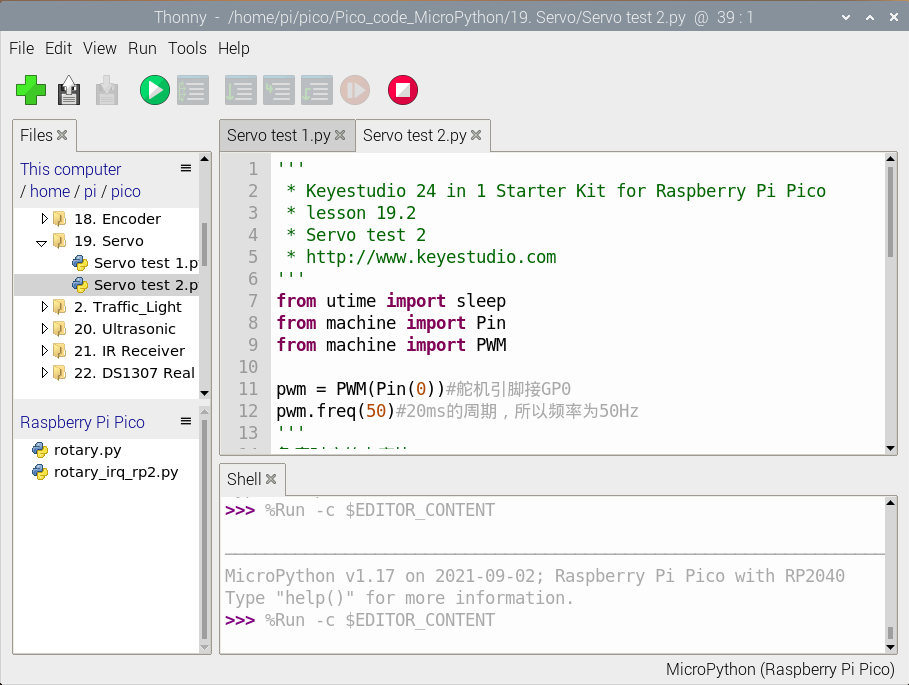

#### **Code Explanation**

Code 1:

Convert to duty cycle according to the angle of the signal pulse width, the formula is: 2.5+angle/180*10, taking the pin resolution of PWM of Pico as an example, 2^16 = 65535, when converted to 0 degree, the duty cycle value is 65535 * 2.5% = 1638.375, when the angle is 180 degrees, its duty cycle value is 65535 * 12.5% = 8191.875, these two values will be related to the program, considering the error and rotation angle, I will set the duty cycle at 1000 and 9000 to make servo rotate by 0~180 degrees.

Code 2:

**convert(x, i_m, i_M, o_m, o_M)：X is the value we will map.**

i_m, i_M is the lower limit and upper limit of the current value ；o_m, o_M is the lower limit and upper limit of the object range.

For instance, **convert(degree, 0, 180, 1000, 9000)**

Rotation angle degree is in the range of 0° and 180°. The duty cycle we will map is in the range of 1000 and 9000.

**Test Result 1:**

Upload the code，the servo will rotate 0°，90° and 180°.

**Test Result 2:**

Upload the code, the servo will rotate from 0° to 180° and move 1° for each 10ms.


#### **Test Code**

```python
'''
 * Keyestudio 24 in 1 Starter Kit for Raspberry Pi Pico
 * lesson 19.1
 * Servo test 1
 * http://www.Keyestudio.com
'''
from machine import Pin, PWM
import time
pwm = PWM(Pin(0))
pwm.freq(50)

'''
Angles correspond to duty cycle
0°----2.5%----1638
45°----5%----3276
90°----7.5%----4915
135°----10%----6553
180°----12.5%----8192
'''
angle_0 = 1638
angle_90 = 4915
angle_180 = 8192

while True:
    pwm.duty_u16(angle_0)
    time.sleep(1)
    pwm.duty_u16(angle_90)
    time.sleep(1)
    pwm.duty_u16(angle_180)
    time.sleep(1)
```

```python
'''
 * Keyestudio 24 in 1 Starter Kit for Raspberry Pi Pico
 * lesson 19.2
 * Servo test 2
 * http://www.Keyestudio.com
'''
from utime import sleep
from machine import Pin
from machine import PWM

pwm = PWM(Pin(0))#Pins of servo is connected to GP0
pwm.freq(50)#the cycle of 20ms，frequency is 50Hz
'''
Angles correspond to duty cycle
0°----2.5%----1638
45°----5%----3276
90°----7.5%----4915
135°----10%----6553
180°----12.5%----8192
considering the error，set the duty cycle in the range of 1000~9000 to rotate 0~180°
'''
# set the rotation angles of servo
def setServoCycle (position):
    pwm.duty_u16(position)
    sleep(0.01)

# Convert the angle of rotation to duty cycle
def convert(x, i_m, i_M, o_m, o_M):
    return max(min(o_M, (x - i_m) * (o_M - o_m) // (i_M - i_m) + o_m), o_m)

while True:
    for degree in range(0, 180, 1):#rotate from 0° to 180°
        pos = convert(degree, 0, 180, 1000, 9000)
        setServoCycle(pos)

    for degree in range(180, 0, -1):#rotate from 180° to 0°
        pos = convert(degree, 0, 180, 1000, 9000)
        setServoCycle(pos)
```


### Project 20: Ultrasonic Sensor

#### **Overview**

In this kit, there is a keyes HC-SR04 ultrasonic sensor, which can detect obstacles in front and the detailed distance between the sensor and the obstacle. Its principle is the same as that of bat flying. It can emit the ultrasonic signals that cannot be heard by humans. When these signals hit an obstacle and come back immediately. The distance between the sensor and the obstacle can be calculated by the time gap of emitting signals and receiving signals.

In the experiment, we use the sensor to detect the distance between the sensor and the obstacle, and print the test result.

#### **Working Principle**

The most common ultrasonic ranging method is the echo detection. As shown below; when the ultrasonic emitter emits the ultrasonic waves towards certain direction, the counter will count. The ultrasonic waves travel and reflect back once encountering the obstacle. Then the counter will stop counting when the receiver receives the ultrasonic waves coming back.

The ultrasonic wave is also sound wave, and its speed of sound V is related to temperature. Generally, it travels 340m/s in the air. According to time t, we can calculate the distance s from the emitting spot to the obstacle. 
$$
s=340t/2
$$
The HC-SR04 ultrasonic ranging module can provide a non-contact distance sensing function of 2cm-400cm, and the ranging accuracy can reach as high as 3mm; the module includes an ultrasonic transmitter, receiver and control circuit. Basic working principle:

1. First pull down the TRIG, and then trigger it with at least 10us high level signal;

2. After triggering, the module will automatically transmit eight 40KHZ square waves, and automatically detect whether there is a signal to return.

3. If there is a signal returned back, through the ECHO to output a high level, the duration time of high level is actually the time from emission to reception of ultrasonic.

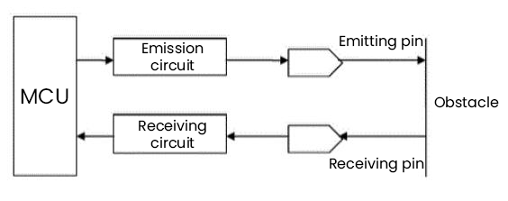

#### **Components**

|  |  |  |
| ------------------------------------------------------------ | ------------------------------------------------------------ | ------------------------------------------------------------ |
| Raspberry Pi Pico Board*1                                    | Raspberry Pi Pico Shield*1                                   | Keyestudio SR01 Ultrasonic Sensor*1                          |
|  |  |                                                              |
| 4P Dupont Wire*1                                             | Micro USB Cable*1                                            |                                                              |


#### **Wiring Diagram**


#### **Run the test code**

Find and double-click **ultrasonic.pyto** to open it, then click to run the code.

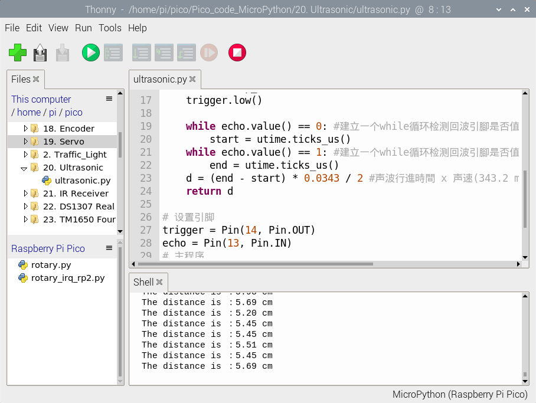

#### **Code Explanation**

HC-SR04 ultrasonic sensor can detect the maximum distance of 3 to 4m, the minimum is 2cm. The shell displays the distance between the sensor and the obstacle in cm.

**utime.ticks_us()** returns the time the program has been running until now.

#### **Test Result**

Upload the code. The distance between the ultrasonic sensor and the obstacle is shown on Shell.

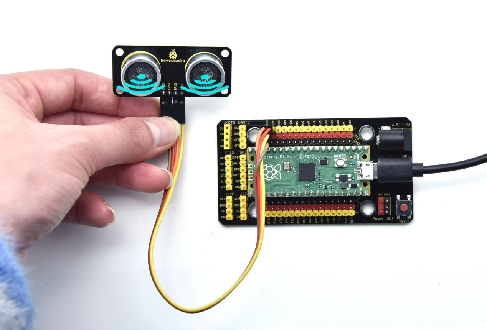

#### **Test Code**

```python
'''
 * Keyestudio 24 in 1 Starter Kit for Raspberry Pi Pico
 * lesson 20
 * Ultrasonic
 * http://www.Keyestudio.com
'''
from machine import Pin
import utime

# ultrasonic ranging，unit：cm
def getDistance(trigger, echo):
    # produce the square wave of 10us
    trigger.low()   #give a short low level and ensure a high pulse
    utime.sleep_us(2)
    trigger.high()
    utime.sleep_us(10)#pull up the high levels, wait for 10us and set to low level
    trigger.low()
    
    while echo.value() == 0: #build a while loop to detect if the pin is 0, record the current time
        start = utime.ticks_us()
    while echo.value() == 1: #build a while loop to detect if the pin is 1，record the current time
        end = utime.ticks_us()
    d = (end - start) * 0.0343 / 2 #travelling time x speed of sound(343.2 m/s，0.0343 for each us)，the total distance is divided by 2
    return d

# set pins
trigger = Pin(14, Pin.OUT)
echo = Pin(13, Pin.IN)
# main program
while True:
    distance = getDistance(trigger, echo)
    print("The distance is ：{:.2f} cm".format(distance))
    utime.sleep(0.1)
```


### Project 21: IR Receiver Module


#### **Overview**

There is no doubt that infrared remote control is ubiquitous in daily life. It is used to control various household appliances, such as TVs, stereos, video recorders and satellite signal receivers. Infrared remote control is composed of infrared transmitting and infrared receiving systems, that is, an infrared remote control and infrared receiving module and a single-chip microcomputer capable of decoding.   

In this experiment, we need to know how to use the infrared receiving sensor. The infrared receiving sensor mainly uses the VS1838B infrared receiving sensor element. It integrates receiving, amplifying, and demodulating. The internal IC has already completed the demodulation, and the output is a digital signal. It can receive 38KHz modulated remote control signal. In the experiment, we use the IR receiver to receive the infrared signal emitted by the external infrared transmitting device, and display the received signal in the shell.

#### **Working Principle**


The main part of the IR remote control system is modulation, transmission and reception. The modulated carrier frequency is generally between 30khz and 60khz, and most of them use a square wave of 38kHz and a duty ratio of 1/3. A 4.7K pull-up resistor R3 is added to the signal end of the infrared receiver. 

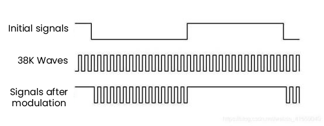

#### **Components**

|  |  | 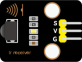 |
| ------------------------------------------------------------ | ------------------------------------------------------------ | ------------------------------------------------------------ |
| Raspberry Pi Pico Board*1                                    | Raspberry Pi Pico Shield*1                                   | Keyestudio DIYIR Receiver *1                                 |
|  | 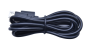 |  |
| 3P Dupont Wire*1                                             | MicroUSB Cable*1                                             | Remote Control*1                                             |


#### **Wiring Diagram**

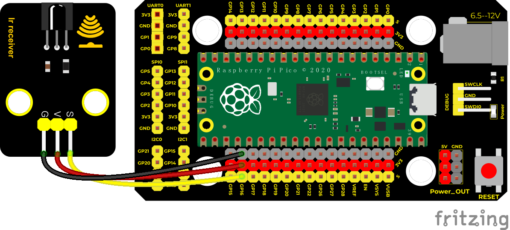

#### **Run the test code：**

Double-click IR receive.py，and clickto run the code.

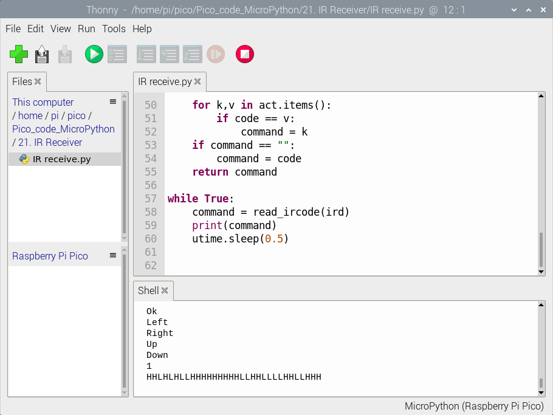

#### **Code Explanation：**

**read_ircode(ird):** keys returning corresponds to keys on the remote control.

#### **Test Result：**

Get a remote control and pull out the insolation chip. Point at the IR receiver and press keys on the IR remote control. Then the LED on the IR receiver will flash, as shown below;


#### **Test Code：**

```python
'''
 * Keyestudio 24 in 1 Starter Kit for Raspberry Pi Pico
 * lesson 21
 * IR Receiver
 * http://www.Keyestudio.com
'''
import utime
from machine import Pin

ird = Pin(16,Pin.IN)

act = {"1": "LLLLLLLLHHHHHHHHLHHLHLLLHLLHLHHH","2": "LLLLLLLLHHHHHHHHHLLHHLLLLHHLLHHH","3": "LLLLLLLLHHHHHHHHHLHHLLLLLHLLHHHH",
       "4": "LLLLLLLLHHHHHHHHLLHHLLLLHHLLHHHH","5": "LLLLLLLLHHHHHHHHLLLHHLLLHHHLLHHH","6": "LLLLLLLLHHHHHHHHLHHHHLHLHLLLLHLH",
       "7": "LLLLLLLLHHHHHHHHLLLHLLLLHHHLHHHH","8": "LLLLLLLLHHHHHHHHLLHHHLLLHHLLLHHH","9": "LLLLLLLLHHHHHHHHLHLHHLHLHLHLLHLH",
       "0": "LLLLLLLLHHHHHHHHLHLLHLHLHLHHLHLH","Up": "LLLLLLLLHHHHHHHHLHHLLLHLHLLHHHLH","Down": "LLLLLLLLHHHHHHHHHLHLHLLLLHLHLHHH",
       "Left": "LLLLLLLLHHHHHHHHLLHLLLHLHHLHHHLH","Right": "LLLLLLLLHHHHHHHHHHLLLLHLLLHHHHLH","Ok": "LLLLLLLLHHHHHHHHLLLLLLHLHHHHHHLH",
       "*": "LLLLLLLLHHHHHHHHLHLLLLHLHLHHHHLH","#": "LLLLLLLLHHHHHHHHLHLHLLHLHLHLHHLH"}

def read_ircode(ird):
    wait = 1
    complete = 0
    seq0 = []
    seq1 = []

    while wait == 1:
        if ird.value() == 0:
            wait = 0
    while wait == 0 and complete == 0:
        start = utime.ticks_us()
        while ird.value() == 0:
            ms1 = utime.ticks_us()
        diff = utime.ticks_diff(ms1,start)
        seq0.append(diff)
        while ird.value() == 1 and complete == 0:
            ms2 = utime.ticks_us()
            diff = utime.ticks_diff(ms2,ms1)
            if diff > 10000:
                complete = 1
        seq1.append(diff)

    code = ""
    for val in seq1:
        if val < 2000:
            if val < 700:
                code += "L"
            else:
                code += "H"
    # print(code)
    command = ""
    for k,v in act.items():
        if code == v:
            command = k
    if command == "":
        command = code
    return command

while True:
    command = read_ircode(ird)
    print(command)
    utime.sleep(0.5)
```


### Project 22: DS1307 Clock Module


#### **Overview**

The  DS1307  serial  real-time  clock  (RTC)  is  a  low-power, full binary-coded decimal (BCD) clock/calendar plus  56  bytes of NV  SRAM.  Address and data are transferred serially through an I2C,  bidirectional  bus. 

The clock/calendar provides seconds, minutes, hours, day, date, month,  and year information. The end of the  month  date  is  automatically  adjusted for months with fewer than 31 days, including corrections for leap year. The clock operates in either the 24-hour or 12-hour format with AM/PM indicator. The DS1307 has a built-in power-sense circuit that detects power failures and automatically switches to the backup supply. 

Timekeeping operation continues while the part operates from the backup supply.

#### **Working Principle**

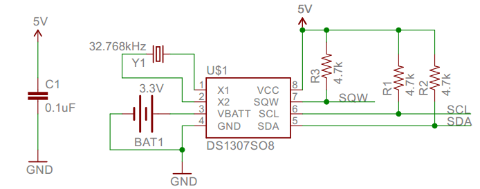

**Detailed address and data:**

Serial real-time clock records year, month, day, hour, minute, second and week; AM and PM indicate morning and afternoon respectively; 56 bytes of NVRAM store data; 2-wire serial port; programmable square wave output; power failure detection and automatic switching circuit; battery current is less than 500nA.

**Pins description**: X1, 32.768kHz crystal terminal

**VBAT:X2**: +3V input

**SDA**: serial data

**SCL**: serial clock

**SQW/OUT**: square waves/output drivers

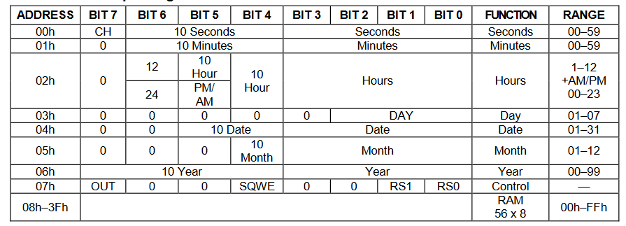

#### **Components**

| 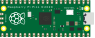 | 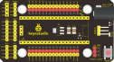 |  |
| ------------------------------------------------------------ | ------------------------------------------------------------ | ------------------------------------------------------------ |
| Raspberry Pi Pico Board*1                                    | Raspberry Pi Pico Shield*1                                   | Keyestudio DS1307 Clock Module*1                             |
|  |  |                                                              |
| 4P Dupont Wire*1                                             | Micro USB Cable*1                                            |                                                              |


#### **Wiring Diagram**

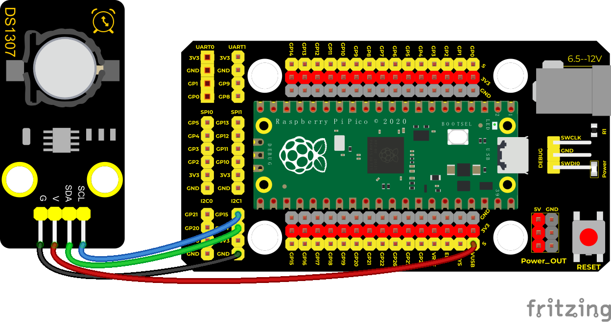

VUSB is 5V，hence the power we use can be connected to VUSB

#### **Run the test code：**

Double-click **DS1307.py** and run the test code.

We need to import the clock module.

Save the following code in the pico and name urtc.py

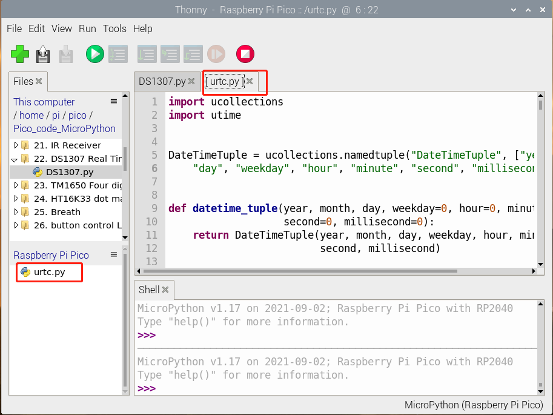

```python
import ucollections
import utime


DateTimeTuple = ucollections.namedtuple("DateTimeTuple", ["year", "month",
    "day", "weekday", "hour", "minute", "second", "millisecond"])


def datetime_tuple(year, month, day, weekday=0, hour=0, minute=0,
                   second=0, millisecond=0):
    return DateTimeTuple(year, month, day, weekday, hour, minute,
                         second, millisecond)


def _bcd2bin(value):
    return value - 6 * (value >> 4)


def _bin2bcd(value):
    return value + 6 * (value // 10)


def tuple2seconds(datetime):
    return utime.mktime((datetime.year, datetime.month, datetime.day,
        datetime.hour, datetime.minute, datetime.second, datetime.weekday, 0))


def seconds2tuple(seconds):
    year, month, day, hour, minute, second, weekday, _yday = utime.localtime()
    return DateTimeTuple(year, month, day, weekday, hour, minute, second, 0)


class _BaseRTC:
    def __init__(self, i2c, address=0x68):
        self.i2c = i2c
        self.address = address

    def _register(self, register, buffer=None):
        if buffer is None:
            return self.i2c.readfrom_mem(self.address, register, 1)[0]
        self.i2c.writeto_mem(self.address, register, buffer)

    def _flag(self, register, mask, value=None):
        data = self._register(register)
        if value is None:
            return bool(data & mask)
        if value:
            data |= mask
        else:
            data &= ~mask
        self._register(register, bytearray((data,)))


    def datetime(self, datetime=None):
        buffer = bytearray(7)
        if datetime is None:
            self.i2c.readfrom_mem_into(self.address, self._DATETIME_REGISTER,
                                       buffer)
            return datetime_tuple(
                year=_bcd2bin(buffer[6]) + 2000,
                month=_bcd2bin(buffer[5]),
                day=_bcd2bin(buffer[4]),
                weekday=_bcd2bin(buffer[3]),
                hour=_bcd2bin(buffer[2]),
                minute=_bcd2bin(buffer[1]),
                second=_bcd2bin(buffer[0]),
            )
        datetime = datetime_tuple(*datetime)
        buffer[0] = _bin2bcd(datetime.second)
        buffer[1] = _bin2bcd(datetime.minute)
        buffer[2] = _bin2bcd(datetime.hour)
        buffer[3] = _bin2bcd(datetime.weekday)
        buffer[4] = _bin2bcd(datetime.day)
        buffer[5] = _bin2bcd(datetime.month)
        buffer[6] = _bin2bcd(datetime.year - 2000)
        self._register(self._DATETIME_REGISTER, buffer)

    def alarm_time(self, datetime=None):
        buffer = bytearray(4)
        if datetime is None:
            self.i2c.redfrom_mem_into(self.address, self._ALARM_REGISTER,
                                      buffer)
            return datetime_tuple(
                weekday=_bcd2bin(
                    buffer[3] & 0x7f) if buffer[0] & 0x80 else None,
                day=_bcd2bin(buffer[2] & 0x7f) if buffer[0] & 0x80 else None,
                hour=_bcd2bin(buffer[1] & 0x7f) if buffer[0] & 0x80 else None,
                minute=_bcd2bin(
                    buffer[0] & 0x7f) if buffer[0] & 0x80 else None,
            )
        datetime = datetime_tuple(*datetime)
        buffer[0] = (_bin2bcd(datetime.minute)
                     if datetime.minute is not None else 0x80)
        buffer[1] = (_bin2bcd(datetime.hour)
                     if datetime.hour is not None else 0x80)
        buffer[2] = (_bin2bcd(datetime.day)
                     if datetime.day is not None else 0x80)
        buffer[3] = (_bin2bcd(datetime.weekday) | 0b01000000
                     if datetime.weekday is not None else 0x80)
        self._register(self._ALARM_REGISTER, buffer)


class DS1307(_BaseRTC):
    _NVRAM_REGISTER = 0x08
    _DATETIME_REGISTER = 0x00
    _SQUARE_WAVE_REGISTER = 0x07

    def stop(self, value=None):
        return self._flag(0x00, 0b10000000, value)

    def memory(self, address, buffer=None):
        if buffer is not None and address + len(buffer) > 56:
            raise ValueError("address out of range")
        return self._register(self._NVRAM_REGISTER + address, buffer)

    def alarm_time(self, datetime=None):
        raise NotImplementedError("alarms not available")


class DS3231(_BaseRTC):
    _CONTROL_REGISTER = 0x0e
    _STATUS_REGISTER = 0x0f
    _DATETIME_REGISTER = 0x00
    _ALARM_REGISTER = 0x07
    _SQUARE_WAVE_REGISTER = 0x0e

    def lost_power(self):
        return self._flag(self._STATUS_REGISTER, 0b10000000)

    def alarm(self, value=None):
        return self._flag(self._STATUS_REGISTER, 0b00000011, value)

    def stop(self, value=None):
        return self._flag(self._CONTROL_REGISTER, 0b10000000, value)

    def datetime(self, datetime=None):
        if datetime is not None:
            status = self._register(self._STATUS_REGISTER) & 0b01111111
            self._register(self._STATUS_REGISTER, bytearray((status,)))
        return super().datetime(datetime)


class PCF8523(_BaseRTC):
    _CONTROL1_REGISTER = 0x00
    _CONTROL2_REGISTER = 0x01
    _CONTROL3_REGISTER = 0x02
    _DATETIME_REGISTER = 0x03
    _ALARM_REGISTER = 0x0a
    _SQUARE_WAVE_REGISTER = 0x0f

    def __init__(self, *args, **kwargs):
        super().__init__(*args, **kwargs)
        self.init()

    def init(self):
        # Enable battery switchover and low-battery detection.
        self._flag(self._CONTROL3_REGISTER, 0b11100000, False)

    def reset(self):
        self._flag(self._CONTROL1_REGISTER, 0x58, True)
        self.init()

    def lost_power(self, value=None):
        return self._flag(self._CONTROL3_REGISTER, 0b00010000, value)

    def stop(self, value=None):
        return self._flag(self._CONTROL1_REGISTER, 0b00010000, value)

    def battery_low(self):
        return self._flag(self._CONTROL3_REGISTER, 0b00000100)

    def alarm(self, value=None):
        return self._flag(self._CONTROL2_REGISTER, 0b00001000, value)

    def datetime(self, datetime=None):
        if datetime is not None:
            self.lost_power(False) # clear the battery switchover flag
        return super().datetime(datetime)
```

Then run the DS1307.py：

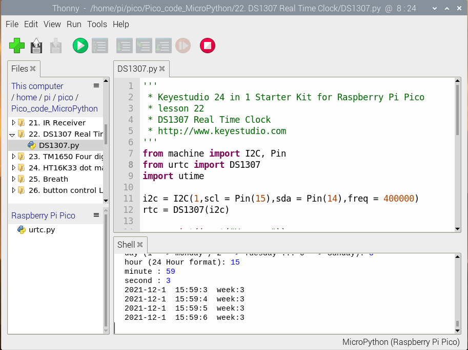

#### **Code Explanation：**

**rtc.datetime()** returns a array with time. When programming, set“ Enter Please”and run the code. Then we need to input time and date, after inputting, the data will be printed for each second.

**DateTimeTuple[0]: save years**

**DateTimeTuple[1]: save months**

**DateTimeTuple[2]: save days**

**DateTimeTuple[3]: save weeks**

**Rtc.GetDateTime().Month(): return months**

**DateTimeTuple[4]: save hours**

**DateTimeTuple[5]: save minutes**

**DateTimeTuple[6]: save seconds**

#### **Test Result：**

Upload the test code, we can see the displayed year, month, day, hour, minute, second and week on the shell, as shown below;


#### **Test Code：**

```python
'''
 * Keyestudio 24 in 1 Starter Kit for Raspberry Pi Pico
 * lesson 22
 * DS1307 Real Time Clock
 * http://www.Keyestudio.com
'''
from machine import I2C, Pin
from urtc import DS1307
import utime

i2c = I2C(1,scl = Pin(15),sda = Pin(14),freq = 400000)
rtc = DS1307(i2c)

year = int(input("Year : "))
month = int(input("month (Jan --> 1 , Dec --> 12): "))
date = int(input("date : "))
day = int(input("day (1 --> monday , 2 --> Tuesday ... 0 --> Sunday): "))
hour = int(input("hour (24 Hour format): "))
minute = int(input("minute : "))
second = int(input("second : "))

now = (year,month,date,day,hour,minute,second,0)
rtc.datetime(now)

#(year,month,date,day,hour,minute,second,p1) = rtc.datetime()
while True:
    DateTimeTuple = rtc.datetime()
    print(DateTimeTuple[0], end = '-')
    print(DateTimeTuple[1], end = '-')
    print(DateTimeTuple[2], end = '  ')
    print(DateTimeTuple[4], end = ':')
    print(DateTimeTuple[5], end = ':')
    print(DateTimeTuple[6], end = '  week:')
    print(DateTimeTuple[3])
    utime.sleep(1)
```


### Project 23: TM1650 4-Digit Tube Display


#### **Overview**

This module is mainly composed of a 0.36 inch red common anode 4-digit digital tube, and its driver chip is TM1650. When using it, we only need two signal lines to make the single-chip microcomputer control a 4-bitdigit tube, which greatly saves the IO port resources of the control board.

TM1650 is a special circuit for LED (light emitting diode display) drive control. It integrates MCU input and output control digital interface, data latch, LED drivers, keyboard scanning, brightness adjustment and other circuits.

TM1650 has stable performance, reliable quality and strong anti-interference ability. 

It can be applied to the application of long-term continuous working for 24 hours. 

TM1650 uses 2-wire serial transmission protocol for communication (note that this data transmission protocol is not a standard I2C protocol). The chip can drive the digital tube and save MCU pin resources through two pins and MCU communication.

#### **Working Principle**

TM1650 adopts IIC treaty and SDA and SCL wire

Data command setting is 0x48. This means that lighting up the tube display not perform its button scanning function.


**Data command setting**: 0x48 means that we light up the digital tube, instead of enable the function of key scanning


**Command display setting:**

bit[6:4]：set the brightness of tube display, and 000 is brightest

bit[3]：set to show decimal points

bit[0]：start the display of the tube display

#### **Components**

|  |  |  |
| ------------------------------------------------------------ | ------------------------------------------------------------ | ------------------------------------------------------------ |
| Raspberry Pi Pico Board*1                                    | Raspberry Pi Pico Shield*1                                   | Keyestudio TM1650 4-Digit Tube Display*1                     |
|  |  |                                                              |
| 4P Dupont Wire*1                                             | Micro USB Cable*1                                            |                                                              |


#### **Wiring Diagram**

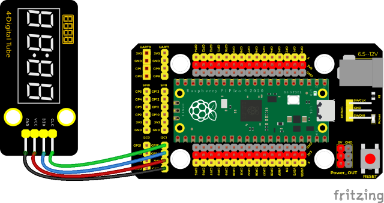

#### **Run the test code：**

Double-click TM1650.p to open the code and click  to run the code.

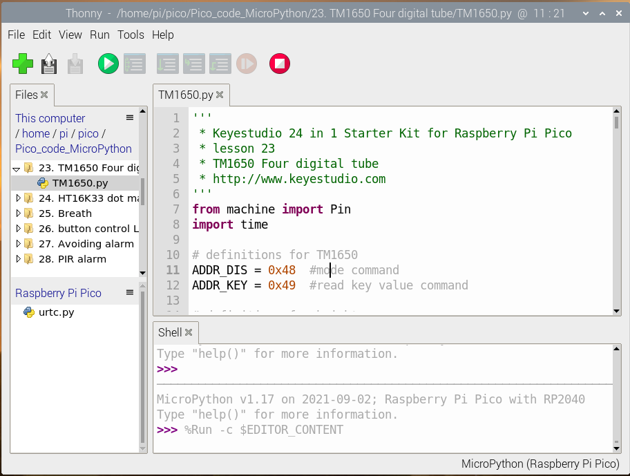

#### **Code Explanation：**

clkPin = 15、dioPin = 14: the CLK pin is connected to GP15, and the DIO pin is connected to GOP14, we can set any two pins.

**displayBit(bit, num): show** bit(1\~4) and display numbers num(0\~9)

**clearBit(bit):** clear up 1-4 bit display

**setBrightness():** brightness setting

**displayOnOFF():** 0 is OFF，1 is ON

**displayDot(bit, OnOff):** show dismal, 0 is OFF and 1 is ON.

**ShowNum(num):** show the integer num，in the range of 0\~9999

#### **Test Result：**

Run the test code, wire up and power on. The 4-digit tube display will show numbers from 1, add by 1 for each 10ms and increase to 9999 then restart from 0.

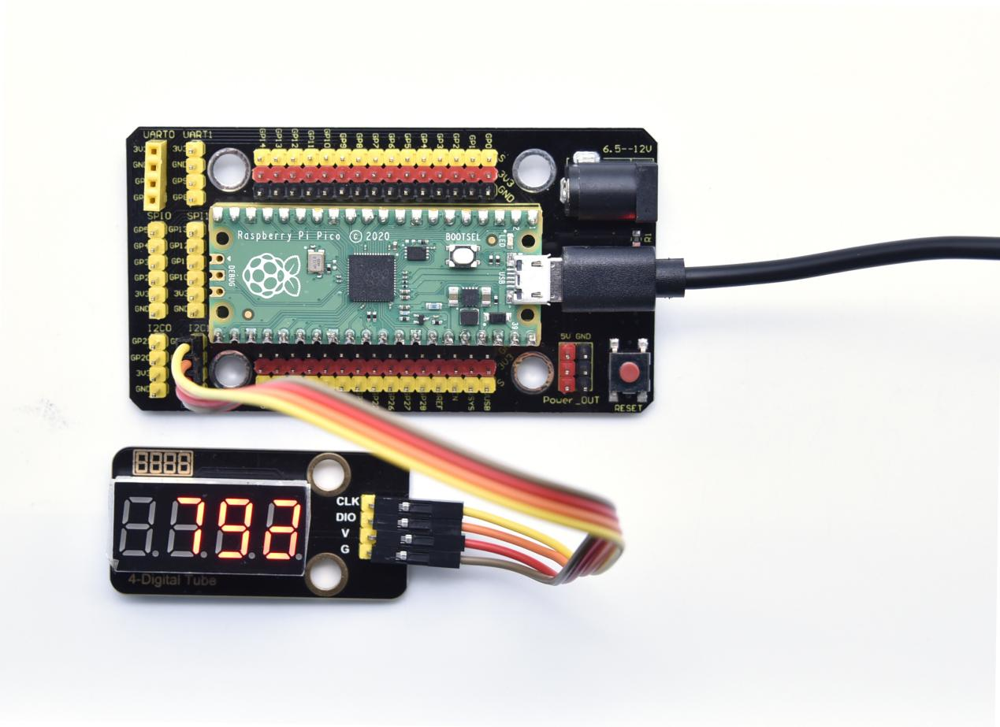

#### **Test Code：**

```python
'''
 * Keyestudio 24 in 1 Starter Kit for Raspberry Pi Pico
 * lesson 23
 * TM1650 Four digital tube
 * http://www.Keyestudio.com
'''
from machine import Pin
import time

# definitions for TM1650
ADDR_DIS = 0x48  #mode command
ADDR_KEY = 0x49  #read key value command

# definitions for brightness
BRIGHT_DARKEST = 0
BRIGHT_TYPICAL = 2
BRIGHTEST      = 7

on  = 1
off = 0

# number:0~9
NUM = [0x3f,0x06,0x5b,0x4f,0x66,0x6d,0x7d,0x07,0x7f,0x6f] 
# DIG = [0x68,0x6a,0x6c,0x6e]
DIG = [0x6e,0x6c,0x6a,0x68]
DOT = [0,0,0,0]

clkPin = 15
dioPin = 14
clk = machine.Pin(clkPin, machine.Pin.OUT)
dio = machine.Pin(dioPin, machine.Pin.OUT)

DisplayCommand = 0

def writeByte(wr_data):
    global clk,dio
    for i in range(8):
        if(wr_data & 0x80 == 0x80):
            dio.value(1)
        else:
            dio.value(0)
        clk.value(0)
        time.sleep(0.0001)
        clk.value(1)
        time.sleep(0.0001)
        clk.value(0)
        wr_data <<= 1
    return

def start():
    global clk,dio
    dio.value(1)
    clk.value(1)
    time.sleep(0.0001)
    dio.value(0)
    return
    
def ack():
    global clk,dio
    dy = 0
    clk.value(0)
    time.sleep(0.0001)
    dio = Pin(dioPin, machine.Pin.IN)
    while(dio.value() == 1):
        time.sleep(0.0001)
        dy += 1
        if(dy>5000):
            break
    clk.value(1)
    time.sleep(0.0001)
    clk.value(0)
    dio = Pin(dioPin, machine.Pin.OUT)
    return
    
def stop():
    global clk,dio
    dio.value(0)
    clk.value(1)
    time.sleep(0.0001)
    dio.value(1)
    return
    
def displayBit(bit, num):
    global ADDR_DIS
    if(num > 9 and bit > 4):
        return
    start()
    writeByte(ADDR_DIS)
    ack()
    writeByte(DisplayCommand)
    ack()
    stop()
    start()
    writeByte(DIG[bit-1])
    ack()
    if(DOT[bit-1] == 1):
        writeByte(NUM[num] | 0x80)
    else:
        writeByte(NUM[num])
    ack()
    stop()
    return
    
def clearBit(bit):
    if(bit > 4):
        return
    start()
    writeByte(ADDR_DIS)
    ack()
    writeByte(DisplayCommand)
    ack()
    stop()
    start()
    writeByte(DIG[bit-1])
    ack()
    writeByte(0x00)
    ack()
    stop()
    return
    
    
def setBrightness(b = BRIGHT_TYPICAL):
    global DisplayCommand,brightness
    DisplayCommand = (DisplayCommand & 0x0f)+(b<<4)
    return

def setMode(segment = 0):
    global DisplayCommand
    DisplayCommand = (DisplayCommand & 0xf7)+(segment<<3)
    return
    
def displayOnOFF(OnOff = 1):
    global DisplayCommand
    DisplayCommand = (DisplayCommand & 0xfe)+OnOff
    return

def displayDot(bit, OnOff):
    if(bit > 4):
        return
    if(OnOff == 1): 
        DOT[bit-1] = 1;
    else:
        DOT[bit-1] = 0;
    return
        
def InitDigitalTube():
    setBrightness(2)
    setMode(0)
    displayOnOFF(1)
    for _ in range(4):
        clearBit(_)
    return

def ShowNum(num): #0~9999
    displayBit(1,num%10)
    if(num < 10):
        clearBit(2)
        clearBit(3)
        clearBit(4)
    if(num > 9 and num < 100):
        displayBit(2,num//10%10)
        clearBit(3)
        clearBit(4)
    if(num > 99 and num < 1000):
        displayBit(2,num//10%10)
        displayBit(3,num//100%10)
        clearBit(4)
    if(num > 999 and num < 10000):
        displayBit(2,num//10%10)
        displayBit(3,num//100%10)
        displayBit(4,num//1000)

InitDigitalTube()

while True:
    #displayDot(1,on)     # on or off, DigitalTube.Display(bit,number); bit=1---4  number=0---9
    for i in range(0,9999):
        ShowNum(i)
        time.sleep(0.01)
```


### Project 24: HT16K33_8X8 Dot Matrix Module


#### **Overview**

What is the dot matrix display?

The 8X8 dot matrix is composed of 64 light-emitting diodes, and each light-emitting diode is placed at the intersection of the row line and the column line. When the corresponding row is set to 1 level, and a certain column is set to 0 level, the corresponding diode will light up.

#### **Working Principle**

As the schematic diagram shown, to light up the LED at the first row and column, we only need to set C1 to high level and R1 to low level. To turn on LEDs at the first row, we set R1 to low level and C1-C8 to high level.

16 IO ports are needed, which will highly waste the MCU resources.

Therefore, we designed this module, using the HT16K33 chip to drive an 8\*8 dot matrix, which greatly saves the resources of the single-chip microcomputer.

There are three DIP switches on the module, all of which are set to I2C communication address. The setting method is shown below.

A0, A1and A2 are grounded, that is, the address is 0x70

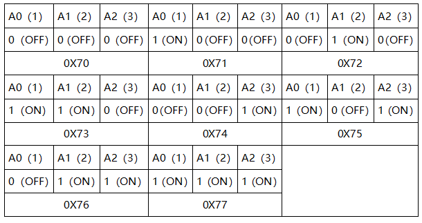

#### **Components**

|  |  |  |
| ------------------------------------------------------------ | ------------------------------------------------------------ | ------------------------------------------------------------ |
| Raspberry Pi Pico Board*1                                    | Raspberry Pi Pico Shield*1                                   | Keyestudio HT16K33_8X8 Dot Matrix*1                          |
|  |  |                                                              |
| 4P Dupont Wire*1                                             | Micro USB Cable*1                                            |                                                              |

#### **Wiring Diagram**

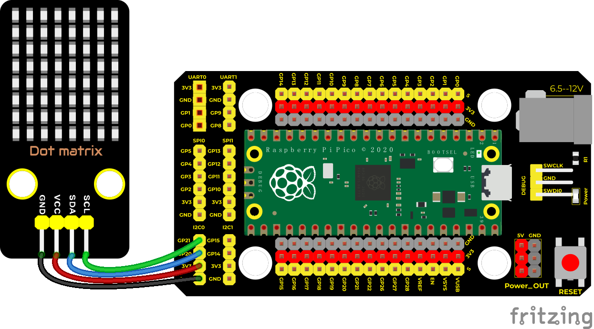

#### **Run the test code：**

Save the following code to pico, import modules, name it as ht16k33_matrix.py：

```python
import machine
showbytes = 0
class ht16k33_matrix:

    _HT16K33_BLINK_CMD = const(0x80)
    _HT16K33_BLINK_DISPLAYON = const(0x01)
    _HT16K33_CMD_BRIGHTNESS = const(0xE0)
    _HT16K33_OSCILATOR_ON = const(0x21)
    
    def __init__(self,dt,clk,bus,addr):
        self.addr = addr
        self.i2c = machine.I2C(bus,sda=machine.Pin(dt),scl=machine.Pin(clk))
        self.setup()
        
    def setup(self):
        self.reg_write(_HT16K33_OSCILATOR_ON,0x00) # 00100001 turn on multiplexing
        self.reg_write(_HT16K33_BLINK_CMD | _HT16K33_BLINK_DISPLAYON,0x00)
        self.set_brightness(15)
       
    def show_char(self, c):
        bytes = bytearray()  # a variable binary data (byte)
        global showbytes
        for item in c:
            temp = item
            for i in range(8):
                if temp & 0x01:
                    showbytes |= 0x01
                showbytes <<= 1
                temp >>= 1
            bytes.append( ((showbytes & 0xFE)<<0)|((showbytes & 0x01)>>7) )  # move to right and determine 01
            #bytes.append((item & 0x01)<<7)
            bytes.append(0x00)
        self.i2c.writeto_mem(self.addr, 0x00, bytes)       
    
    def set_brightness(self,brightness):
        self.reg_write(_HT16K33_CMD_BRIGHTNESS | brightness,0x00)

    def reg_write(self, reg, data):
        msg = bytearray()
        msg.append(data)
        self.i2c.writeto_mem(self.addr, reg, msg)
```

Save the code to pico，and name matrix_fonts.py

```python
textFont1={
' ':[0x00, 0x00, 0x00, 0x00, 0x00, 0x00, 0x00, 0x00],
    '!':[0x18, 0x3c, 0x3c, 0x18, 0x18, 0x00, 0x18, 0x00],
    '"':[0x66, 0x66, 0x24, 0x00, 0x00, 0x00, 0x00, 0x00],
    '#':[0x6c, 0x6c, 0xfe, 0x6c, 0xfe, 0x6c, 0x6c, 0x00],
    '%':[0x00, 0xc6, 0xcc, 0x18, 0x30, 0x66, 0xc6, 0x00],
    '&':[0x38, 0x6c, 0x38, 0x76, 0xdc, 0xcc, 0x76, 0x00],
    '\'':[0x18, 0x18, 0x30, 0x00, 0x00, 0x00, 0x00, 0x00],
    '(':[0x0c, 0x18, 0x30, 0x30, 0x30, 0x18, 0x0c, 0x00],
    ')':[0x30, 0x18, 0x0c, 0x0c, 0x0c, 0x18, 0x30, 0x00],
    '*':[0x00, 0x66, 0x3c, 0xff, 0x3c, 0x66, 0x00, 0x00],
    '+':[0x00, 0x18, 0x18, 0x7e, 0x18, 0x18, 0x00, 0x00],
    '-':[0x00, 0x00, 0x00, 0x7e, 0x00, 0x00, 0x00, 0x00],
    '.':[0x00, 0x00, 0x00, 0x00, 0x00, 0x18, 0x18, 0x00],
    '/':[0x06, 0x0c, 0x18, 0x30, 0x60, 0xc0, 0x80, 0x00],
    '0':[0x7c, 0xc6, 0xce, 0xd6, 0xe6, 0xc6, 0x7c, 0x00],
    '1':[0x18, 0x38, 0x18, 0x18, 0x18, 0x18, 0x7e, 0x00],
    '2':[0x7c, 0xc6, 0x06, 0x1c, 0x30, 0x66, 0xfe, 0x00],
    '3':[0x7c, 0xc6, 0x06, 0x3c, 0x06, 0xc6, 0x7c, 0x00],
    '4':[0x1c, 0x3c, 0x6c, 0xcc, 0xfe, 0x0c, 0x1e, 0x00],
    '5':[0xfe, 0xc0, 0xc0, 0xfc, 0x06, 0xc6, 0x7c, 0x00],
    '6':[0x38, 0x60, 0xc0, 0xfc, 0xc6, 0xc6, 0x7c, 0x00],
    '7':[0xfe, 0xc6, 0x0c, 0x18, 0x30, 0x30, 0x30, 0x00],
    '8':[0x7c, 0xc6, 0xc6, 0x7c, 0xc6, 0xc6, 0x7c, 0x00],
    '9':[0x7c, 0xc6, 0xc6, 0x7e, 0x06, 0x0c, 0x78, 0x00],
    ':':[0x00, 0x18, 0x18, 0x00, 0x00, 0x18, 0x18, 0x00],
    ';':[0x7c, 0xc6, 0x0c, 0x18, 0x18, 0x00, 0x18, 0x00],
    '<':[0x06, 0x0c, 0x18, 0x30, 0x18, 0x0c, 0x06, 0x00],
    '=':[0x00, 0x00, 0x7e, 0x00, 0x00, 0x7e, 0x00, 0x00],
    '>':[0x60, 0x30, 0x18, 0x0c, 0x18, 0x30, 0x60, 0x00],
    '?':[0x7c, 0xc6, 0x0c, 0x18, 0x18, 0x00, 0x18, 0x00],
    '@':[0x7c, 0xc6, 0xde, 0xde, 0xde, 0xc0, 0x78, 0x00],
    'A':[0x38, 0x6c, 0xc6, 0xfe, 0xc6, 0xc6, 0xc6, 0x00],
    'B':[0xfc, 0x66, 0x66, 0x7c, 0x66, 0x66, 0xfc, 0x00],
    'C':[0x3c, 0x66, 0xc0, 0xc0, 0xc0, 0x66, 0x3c, 0x00],
    'D':[0xf8, 0x6c, 0x66, 0x66, 0x66, 0x6c, 0xf8, 0x00],
    'E':[0xfe, 0x62, 0x68, 0x78, 0x68, 0x62, 0xfe, 0x00],
    'F':[0xfe, 0x62, 0x68, 0x78, 0x68, 0x60, 0xf0, 0x00],
    'G':[0x3c, 0x66, 0xc0, 0xc0, 0xce, 0x66, 0x3a, 0x00],
    'H':[0xc6, 0xc6, 0xc6, 0xfe, 0xc6, 0xc6, 0xc6, 0x00],
    'I':[0x3c, 0x18, 0x18, 0x18, 0x18, 0x18, 0x3c, 0x00],
    'J':[0x1e, 0x0c, 0x0c, 0x0c, 0xcc, 0xcc, 0x78, 0x00],
    'K':[0xe6, 0x66, 0x6c, 0x78, 0x6c, 0x66, 0xe6, 0x00],
    'L':[0xf0, 0x60, 0x60, 0x60, 0x62, 0x66, 0xfe, 0x00],
    'M':[0xc6, 0xee, 0xfe, 0xfe, 0xd6, 0xc6, 0xc6, 0x00],
    'N':[0xc6, 0xe6, 0xf6, 0xde, 0xce, 0xc6, 0xc6, 0x00],
    'O':[0x7c, 0xc6, 0xc6, 0xc6, 0xc6, 0xc6, 0x7c, 0x00],
    'P':[0xfc, 0x66, 0x66, 0x7c, 0x60, 0x60, 0xf0, 0x00],
    'Q':[0x7c, 0xc6, 0xc6, 0xc6, 0xc6, 0xce, 0x7c, 0x0e],
    'R':[0xfc, 0x66, 0x66, 0x7c, 0x6c, 0x66, 0xe6, 0x00],
    'S':[0x7c, 0xc6, 0x60, 0x38, 0x0c, 0xc6, 0x7c, 0x00],
    'T':[0x7e, 0x7e, 0x5a, 0x18, 0x18, 0x18, 0x3c, 0x00],
    'U':[0xc6, 0xc6, 0xc6, 0xc6, 0xc6, 0xc6, 0x7c, 0x00],
    'V':[0xc6, 0xc6, 0xc6, 0xc6, 0xc6, 0x6c, 0x38, 0x00],
    'W':[0xc6, 0xc6, 0xc6, 0xd6, 0xd6, 0xfe, 0x6c, 0x00],
    'X':[0xc6, 0xc6, 0x6c, 0x38, 0x6c, 0xc6, 0xc6, 0x00],
    'Y':[0x66, 0x66, 0x66, 0x3c, 0x18, 0x18, 0x3c, 0x00],
    'Z':[0xfe, 0xc6, 0x8c, 0x18, 0x32, 0x66, 0xfe, 0x00],
    '[':[0x3c, 0x30, 0x30, 0x30, 0x30, 0x30, 0x3c, 0x00],
    '\\':[0xc0, 0x60, 0x30, 0x18, 0x0c, 0x06, 0x02, 0x00],
    ']':[0x3c, 0x0c, 0x0c, 0x0c, 0x0c, 0x0c, 0x3c, 0x00],
    '^':[0x10, 0x38, 0x6c, 0xc6, 0x00, 0x00, 0x00, 0x00],
    '_':[0x00, 0x00, 0x00, 0x00, 0x00, 0x00, 0x00, 0xff],
    '`':[0x30, 0x18, 0x0c, 0x00, 0x00, 0x00, 0x00, 0x00],
    'a':[0x00, 0x00, 0x78, 0x0c, 0x7c, 0xcc, 0x76, 0x00],
    'b':[0xe0, 0x60, 0x7c, 0x66, 0x66, 0x66, 0xdc, 0x00],
    'c':[0x00, 0x00, 0x7c, 0xc6, 0xc0, 0xc6, 0x7c, 0x00],
    'd':[0x1c, 0x0c, 0x7c, 0xcc, 0xcc, 0xcc, 0x76, 0x00],
    'e':[0x00, 0x00, 0x7c, 0xc6, 0xfe, 0xc0, 0x7c, 0x00],
    'f':[0x3c, 0x66, 0x60, 0xf8, 0x60, 0x60, 0xf0, 0x00],
    'g':[0x00, 0x00, 0x76, 0xcc, 0xcc, 0x7c, 0x0c, 0xf8],
    'h':[0xe0, 0x60, 0x6c, 0x76, 0x66, 0x66, 0xe6, 0x00],
    'i':[0x18, 0x00, 0x38, 0x18, 0x18, 0x18, 0x3c, 0x00],
    'j':[0x06, 0x00, 0x06, 0x06, 0x06, 0x66, 0x66, 0x3c],
    'k':[0xe0, 0x60, 0x66, 0x6c, 0x78, 0x6c, 0xe6, 0x00],
    'l':[0x38, 0x18, 0x18, 0x18, 0x18, 0x18, 0x3c, 0x00],
    'm':[0x00, 0x00, 0xec, 0xfe, 0xd6, 0xd6, 0xd6, 0x00],
    'n':[0x00, 0x00, 0xdc, 0x66, 0x66, 0x66, 0x66, 0x00],
    'o':[0x00, 0x00, 0x7c, 0xc6, 0xc6, 0xc6, 0x7c, 0x00],
    'p':[0x00, 0x00, 0xdc, 0x66, 0x66, 0x7c, 0x60, 0xf0],
    'q':[0x00, 0x00, 0x76, 0xcc, 0xcc, 0x7c, 0x0c, 0x1e],
    'r':[0x00, 0x00, 0xdc, 0x76, 0x60, 0x60, 0xf0, 0x00],
    's':[0x00, 0x00, 0x7e, 0xc0, 0x7c, 0x06, 0xfc, 0x00],
    't':[0x30, 0x30, 0xfc, 0x30, 0x30, 0x36, 0x1c, 0x00],
    'u':[0x00, 0x00, 0xcc, 0xcc, 0xcc, 0xcc, 0x76, 0x00],
    'v':[0x00, 0x00, 0xc6, 0xc6, 0xc6, 0x6c, 0x38, 0x00],
    'w':[0x00, 0x00, 0xc6, 0xd6, 0xd6, 0xfe, 0x6c, 0x00],
    'x':[0x00, 0x00, 0xc6, 0x6c, 0x38, 0x6c, 0xc6, 0x00],
    'y':[0x00, 0x00, 0xc6, 0xc6, 0xc6, 0x7e, 0x06, 0xfc],
    'z':[0x00, 0x00, 0x7e, 0x4c, 0x18, 0x32, 0x7e, 0x00],
    '{':[0x0e, 0x18, 0x18, 0x70, 0x18, 0x18, 0x0e, 0x00],
    '|':[0x18, 0x18, 0x18, 0x18, 0x18, 0x18, 0x18, 0x00],
    '}':[0x70, 0x18, 0x18, 0x0e, 0x18, 0x18, 0x70, 0x00],
    '~':[0x76, 0xdc, 0x00, 0x00, 0x00, 0x00, 0x00, 0x00],
}

eyes={
    'straight':[0x3c,0x7e,0xff,0xe7,0xe7,0xff,0x7e,0x3c],
    'straightX2':[0x3c,0x7e,0xe7,0xc3,0xc3,0xe7,0x7e,0x3c],
    'straightX3':[0x3c,0x66,0xc3,0x81,0x81,0xc3,0x66,0x3c],
    'straightX4':[0x3c,0x42,0x81,0x81,0x81,0x81,0x42,0x3c],
    'straightX2Left1':[0x3c,0x7e,0xcf,0x87,0x87,0xcf,0x7e,0x3c],
    'straightX2Left2':[0x3c,0x7e,0x9f,0x0f,0x0f,0x9f,0x7e,0x3c],
    'straightX2Left3':[0x3c,0x7e,0x3f,0x1f,0x1f,0x3f,0x7e,0x3c],
    'straightX2Left4':[0x3c,0x7e,0x7f,0x3f,0x3f,0x7f,0x7e,0x3c],
    'straightX2Left5':[0x3c,0x7e,0xff,0x7f,0x7f,0xff,0x7e,0x3c],
    'straightR2':[0x3c,0x7e,0xe7,0xdb,0xdb,0xe7,0x7e,0x3c],
    'noEyeball':[0x3c,0x7e,0xff,0xff,0xff,0xff,0x7e,0x3c],
    'straightBlink1':[0x00,0x7e,0xff,0xe7,0xe7,0xff,0x7e,0x00],
    'straightBlink2':[0x00,0x00,0xff,0xe7,0xe7,0xff,0x00,0x00],
    'straightBlink3':[0x00,0x00,0x00,0xe7,0xe7,0x00,0x00,0x00],
    'straightBlinkLine':[0x00,0x00,0x00,0xff,0xff,0x00,0x00,0x00],
    'all_off':[0x00,0x00,0x00,0x00,0x00,0x00,0x00,0x00],
    'up1':[0x3c,0x7e,0xe7,0xe7,0xff,0xff,0x7e,0x3c],
    'up2':[0x3c,0x66,0xe7,0xff,0xff,0xff,0x7e,0x3c],
    'up3':[0x24,0x66,0xff,0xff,0xff,0xff,0x7e,0x3c],
    'up4':[0x24,0x7e,0xff,0xff,0xff,0xff,0x7e,0x3c],
    'upLeft':[0x3c,0x4e,0xcf,0xff,0xff,0xff,0x7e,0x3c],
    'upLeft1':[0x3c,0x7e,0x9f,0x9f,0xff,0xff,0x7e,0x3c],
    'upLeft2':[0x3c,0x1e,0x9f,0xff,0xff,0xff,0x7e,0x3c],
    'upRight1':[0x3c,0x7e,0xf9,0xf9,0xff,0xff,0x7e,0x3c],
    'upRight':[0x3c,0x72,0xf3,0xff,0xff,0xff,0x7e,0x3c],
    'down1':[0x3c,0x7e,0xff,0xff,0xe7,0xe7,0x7e,0x3c],
    'down2':[0x3c,0x7e,0xff,0xff,0xff,0xe7,0x66,0x3c],
    'down3':[0x3c,0x7e,0xff,0xff,0xff,0xe7,0x66,0x3c],
    'down4':[0x3c,0x7e,0xff,0xff,0xff,0xff,0x7e,0x24],
    'downRight':[0x3c,0x7e,0xff,0xff,0xf9,0xf9,0x7e,0x3c],
    'downRight1':[0x3c,0x7e,0xff,0xff,0xff,0xf3,0x72,0x3c],
    'downRight2':[0x3c,0x7e,0xff,0xff,0xff,0xf9,0x78,0x3c],
    'downLeft':[0x3c,0x7e,0xff,0xff,0xff,0xcf,0x4e,0x3c],
    'downLeftB':[0x3c,0x7e,0xff,0xff,0x9f,0x9f,0x7e,0x3c],
    'downLeft1':[0x3c,0x7e,0xff,0xff,0xcf,0xcf,0x7e,0x3c],
    'downLeft1Blink1':[0x00,0x7e,0xff,0xff,0xcf,0xcf,0x7e,0x00],
    'downLeft1Blink2':[0x00,0x00,0xff,0xff,0xcf,0xcf,0x00,0x00],
    'downLeft1Blink3':[0x00,0x00,0x00,0xff,0xcf,0x00,0x00,0x00],
    'downLeft2':[0x3c,0x7e,0xff,0xff,0xff,0x9f,0x1e,0x3c],
    'left1':[0x3c,0x7e,0xff,0xcf,0xcf,0xff,0x7e,0x3c],
    'left2':[0x3c,0x7e,0xff,0x9f,0x9f,0xff,0x7e,0x3c],
    'left3':[0x3c,0x7e,0xff,0x3f,0x3f,0xff,0x7e,0x3c],
    'left4':[0x3c,0x7e,0xff,0x7f,0x7f,0xff,0x7e,0x3c],
    'right1':[0x3c,0x7e,0xff,0xf3,0xf3,0xff,0x7e,0x3c],
    'right2':[0x3c,0x7e,0xff,0xf9,0xf9,0xff,0x7e,0x3c],
    'right3':[0x3c,0x7e,0xff,0xfc,0xfc,0xff,0x7e,0x3c],
    'right4':[0x3c,0x7e,0xff,0xfe,0xfe,0xff,0x7e,0x3c],
    'ghost1':[0x3c,0x56,0x93,0xdb,0xff,0xff,0xdd,0x89],
    'ghost2':[0x38,0x7c,0x92,0x92,0xfe,0xfe,0xfe,0xaa],
    
}

shapes={
    'smile':[0x3c, 0x42, 0xa5, 0x81, 0xa5, 0x99, 0x42, 0x3c],
    'smileL':[0x3c, 0x42, 0xa9, 0xa9, 0x85, 0xb9, 0x42, 0x3c],
    'empty':[0x00,0x00,0x00,0x00,0x00,0x00,0x00,0x00],
    'all_on':[0xff,0xff,0xff,0xff,0xff,0xff,0xff,0xff],
    'arrow':[0x18,0x24,0x42,0xff,0x18,0x18,0x18,0x18],
    'invader1':[0x18,0x3c,0x7e,0xdb,0xff,0x24,0x5a,0xa5],
    'invader2':[0x18,0x3c,0x7e,0xdb,0xff,0x24,0x5a,0x42],
    'tree1':[0x18, 0x18, 0x3c, 0x3c, 0x7e, 0xff, 0x18, 0x18],
    'tree1lit1':[0x18, 0x18, 0x3c, 0x3c, 0x7e, 0xff, 0x18, 0x18],
    'tree1lit2':[0x5a,0x99,0x3c,0xbd,0x7e,0xff,0x18,0x18],
    'tree2':[0x18, 0x18, 0x3c, 0x3c, 0x7e, 0x7e, 0xff, 0x18],
    'bunny1':[0x66, 0x66, 0x66, 0xff, 0x81, 0xa5, 0x99, 0x7e],
    'bunny2':[0x66, 0xe7, 0x66, 0xff, 0x81, 0xa5, 0x99, 0x7e],
    'bunny3':[0x66, 0x66, 0xff, 0x81, 0xa5, 0x81, 0x99, 0x7e],
    'danbo':[0x00, 0xff, 0x81, 0xa5, 0x81, 0x81, 0xff, 0x00],
    'clock1':[0x3c, 0x42, 0x91, 0x91, 0x9d, 0x81, 0x42, 0x3c],
    'heart1F':[0x00, 0x66, 0xff, 0xff, 0x7e, 0x3c, 0x18, 0x00],
    'heart1':[0x00, 0x66, 0x99, 0x81, 0x42, 0x24, 0x18, 0x00],
    'heart2':[0x00, 0x66, 0x99, 0x81, 0x81, 0x42, 0x24, 0x18],
    'heart2F':[0x00, 0x66, 0xff, 0xff, 0xff, 0x7e, 0x3c, 0x18],
    'santaHat':[0x00, 0x3c, 0x7e, 0x4f, 0xef, 0xef, 0xef, 0x0f],
    'santaHat2':[0x00,0x00,0x3c,0x7e,0x4f,0xef,0xef,0xef],
    'star1':[0x00,0x00,0x00,0x18,0x18,0x00,0x00,0x00],
    'star2':[0x00,0x00,0x24,0x18,0x18,0x24,0x00,0x00],
    'star3':[0x00,0x42,0x24,0x18,0x18,0x24,0x42,0x00],
    'star4':[0x81,0x42,0x24,0x18,0x18,0x24,0x42,0x81],
    'star5':[0x02,0x84,0x48,0x38,0x1c,0x12,0x21,0x40],
    'star6':[0x06,0x8c,0xd8,0x7c,0x3e,0x1b,0x31,0x60],
    'star7':[0x04,0x08,0x90,0x5c,0x3a,0x09,0x10,0x20],
    'star8':[0x08,0x10,0x10,0x9e,0x79,0x08,0x08,0x10],
    'star9':[0x10,0x10,0x10,0x1f,0xf8,0x08,0x08,0x08],
    'star10':[0x20,0x10,0x11,0x1e,0x78,0x88,0x08,0x04],
    'star11':[0x40,0x21,0x12,0x1c,0x38,0x48,0x84,0x02],

}
```

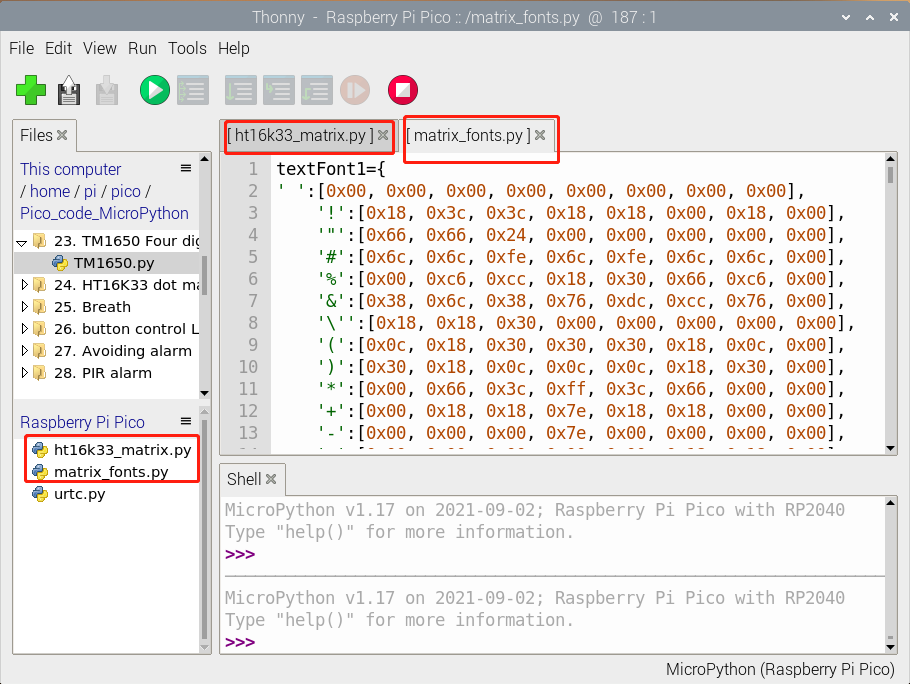

Double-click matrix dot.py and click to run the test code.


#### **Code Explanation**：

show_char(): show characters, for example, show_char(matrix_fonts.textFont1['A']) means showing A

scroll_message(font,message='hello',delay=0.05): scroll to display, 0.05 is the speed to scroll

Massage means displayed character strings, font is a model file.

#### **Test Result：**

Wire up and upload the test code. Then the dot matrix display will show “A”,“B”and“C”then“Hello World”.

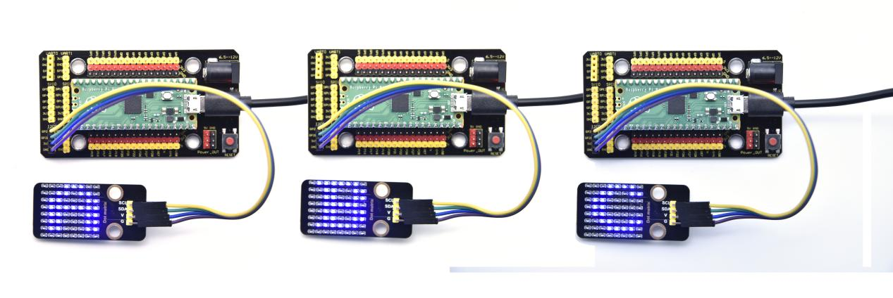

#### **Test Code：**

```python
'''
 * Keyestudio 24 in 1 Starter Kit for Raspberry Pi Pico
 * lesson 24
 * HT16K33 8*8 dot matrix
 * http://www.Keyestudio.com
'''
import machine
import time
import json
import matrix_fonts
from ht16k33_matrix import ht16k33_matrix
## Tool To Make Sprites https://gurgleapps.com/tools/matrix
#i2c config
clock_pin = 21
data_pin = 20
bus = 0
i2c_addr_left = 0x70
use_i2c = True

def scan_for_devices():
    i2c = machine.I2C(bus,sda=machine.Pin(data_pin),scl=machine.Pin(clock_pin))
    devices = i2c.scan()
    if devices:
        for d in devices:
            print(hex(d))
    else:
        print('no i2c devices')

if use_i2c:
    scan_for_devices()
    left_eye = ht16k33_matrix(data_pin, clock_pin, bus, i2c_addr_left)

def show_char(left):
    if use_i2c:
        left_eye.show_char(left)
        
def scroll_message(font,message='hello',delay=0.05):
    left_message = '   ' + message
    right_message = message + '   '
    length=len(right_message)
    char_range=range(length-1)
    for char_pos in char_range:
      right_left_char=font[right_message[char_pos]]
      right_right_char=font[right_message[char_pos+1]]
      left_left_char=font[left_message[char_pos]]
      left_right_char=font[left_message[char_pos+1]]
      for shift in range(8):
        left_bytes=[0,0,0,0,0,0,0,0]
        right_bytes=[0,0,0,0,0,0,0,0]
        for col in range(8):
          left_bytes[col]=left_bytes[col]|left_left_char[col]<<shift
          left_bytes[col]=left_bytes[col]|left_right_char[col]>>8-shift;
          right_bytes[col]=right_bytes[col]|right_left_char[col]<<shift
          right_bytes[col]=right_bytes[col]|right_right_char[col]>>8-shift;
        if use_i2c:
                left_eye.show_char(left_bytes)
        time.sleep(delay)


while True:
    show_char(matrix_fonts.textFont1['A'])
    time.sleep(1)
    show_char(matrix_fonts.textFont1['B'])
    time.sleep(1)
    show_char(matrix_fonts.textFont1['C'])
    time.sleep(1)
    scroll_message(matrix_fonts.textFont1, ' Hello World ')
```

### Project 25: Breathing LED


#### **Overview**

A “breathing LED” is a phenomenon where an LED's brightness smoothly changes from dark to bright and back to dark, continuing to do so and giving the illusion of an LED“breathing.”This phenomenon is similar to a lung breathing in and out. So how to control LED’s brightness? We need to take advantage of PWM.

#### **Components**

|  |  |  |
| ------------------------------------------------------------ | ------------------------------------------------------------ | ------------------------------------------------------------ |
| Raspberry Pi Pico Board*1                                    | Raspberry Pi Pico Shield*1                                   | Keyestudio White LED Module*1                                |
|  |  |                                                              |
| 3P Dupont Wire*1                                             | Micro USB Cable*1                                            |                                                              |


#### **Wiring Diagram**

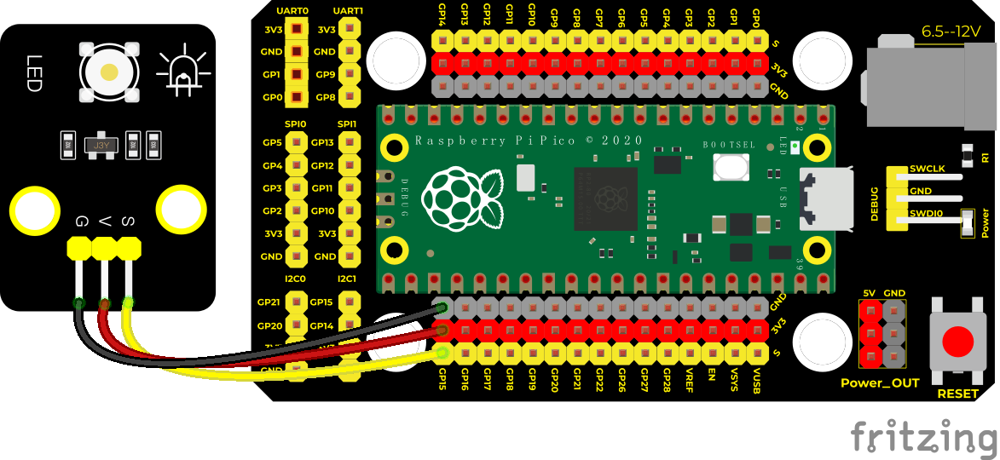

#### **Run the test code：**

Double-click **Breath.py**, and clickto run the code.

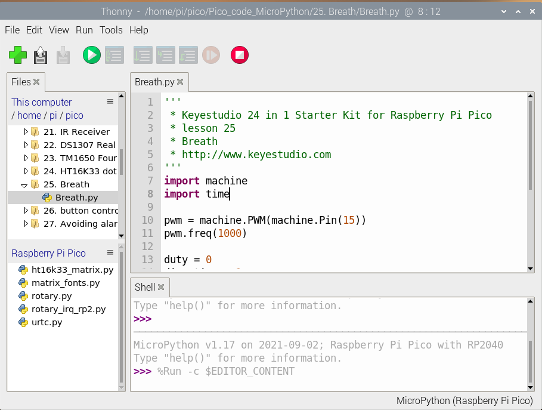

#### **Code Explanation：**

The bigger the duty cycle is set, the brighter the LED. The maximum is 65535. When duty increases from 0 to 255, up 1 and delay 10ms for each time, then LED will gradually get bright. When PWM is 255*255, i decreases from 255 to 0, down by1 and delay 10ms for each time, then the LED will get dimmer, like human breathe.

Also, we can change the time of getting dimmer or brighter in the code. Another way is changing step length like direction = -2 or direction = 2.

#### **Test Result：**

Run the test code, the LED on the module gradually gets dimmer then brighter, cyclically, like human breathe

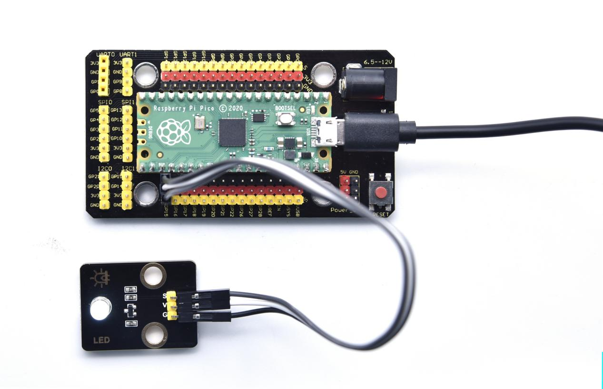

#### **Test Code：**

```python
'''
 * Keyestudio 24 in 1 Starter Kit for Raspberry Pi Pico
 * lesson 25
 * Breath
 * http://www.Keyestudio.com
'''
import machine
import time

pwm = machine.PWM(machine.Pin(15))
pwm.freq(1000)

duty = 0
direction = 1
while True:
    duty += direction
    if duty > 255:
        duty = 255
        direction = -1
    elif duty < 0:
        duty = 0
        direction = 1
    pwm.duty_u16(duty * duty)
    time.sleep(0.01)
```


### Project 26: Button-controlled LED


#### **Overview**

In this lesson, we will make an extension experiment with a button and an LED. When the button is pressed and low levels are output, the LED will light up; when the button is released, the LED will go off. Then we can control a module with another module. 

#### **Components**

| 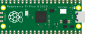 |  |  |
| ------------------------------------------------------------ | ------------------------------------------------------------ | ------------------------------------------------------------ |
| Raspberry Pi Pico Board*1                                    | Raspberry Pi Pico Shield*1                                   | Keyestudio White LED Module*1                                |
| 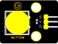 |  | 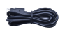 |
| Keyestudio DIY  Button Module*1                              | 3P Dupont Wire*2                                             | Micro USB Cable*1                                            |

#### **Wiring Diagram**

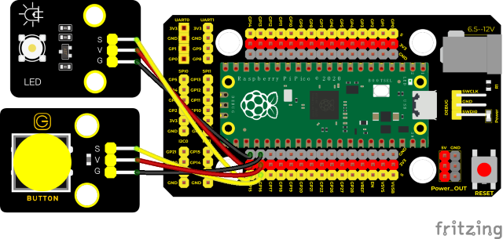

#### **Run the test code：**

Double-click **button control LED.py** and click  to run the test code.

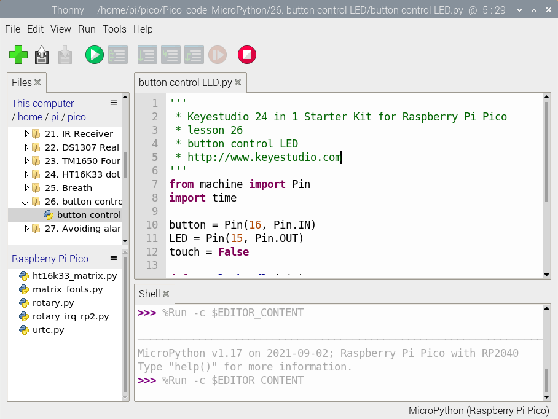

#### **Code Explanation：**

The trigger mode of the function button.irq(trigger = Pin.IRQ_FALLING, handler = toggle_handle) is when high levels turn into low levels, the trigger will interrupt, the interrupt function **toggle_handle** will be used.

#### **Test Result：**

Run the test code, when buttons are pressed, the LED module will light up; if pressed again, the LED module will go off.

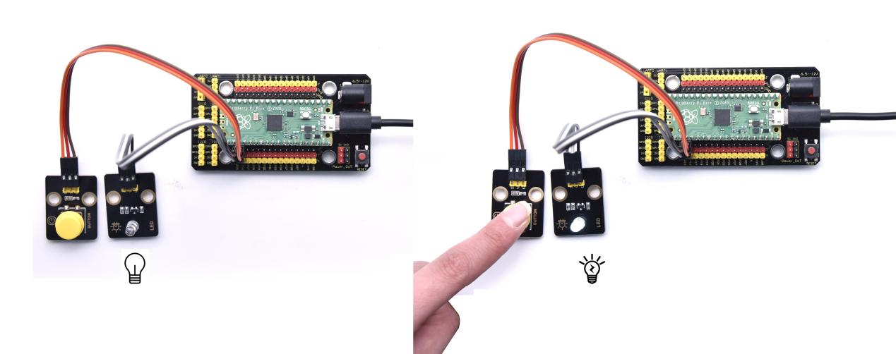

#### **Test Code：**

```python
'''
 * Keyestudio 24 in 1 Starter Kit for Raspberry Pi Pico
 * lesson 26
 * button control LED
 * http://www.Keyestudio.com
'''
from machine import Pin
import time

button = Pin(16, Pin.IN)
LED = Pin(15, Pin.OUT)
touch = False

def toggle_handle(pin):
    global touch
    touch = not touch

button.irq(trigger = Pin.IRQ_FALLING, handler = toggle_handle)

while True:
    LED.value(touch)
    time.sleep(0.01)
```


### Project 27: Alarm Experiment


#### **Overview**

In the previous experiment, we control an output module though an input module. In this lesson, we will make an experiment that the active buzzer will emit sounds once an obstacle appears.

#### **Components**

|  |  |  |
| ------------------------------------------------------------ | ------------------------------------------------------------ | ------------------------------------------------------------ |
| Raspberry Pi Pico Board*1                                    | Raspberry Pi Pico Shield*1                                   | Keyestudio Obstacle Avoidance Sensor*1                       |
|  |  |  |
| Keyestudio Active Buzzer*1                                   | 3P Dupont Wire*2                                             | Micro USB Cable*1                                            |

#### Wiring Diagram


#### **Run the test code**

Click Avoiding alarm.py and double-click the code，and click to run the test code

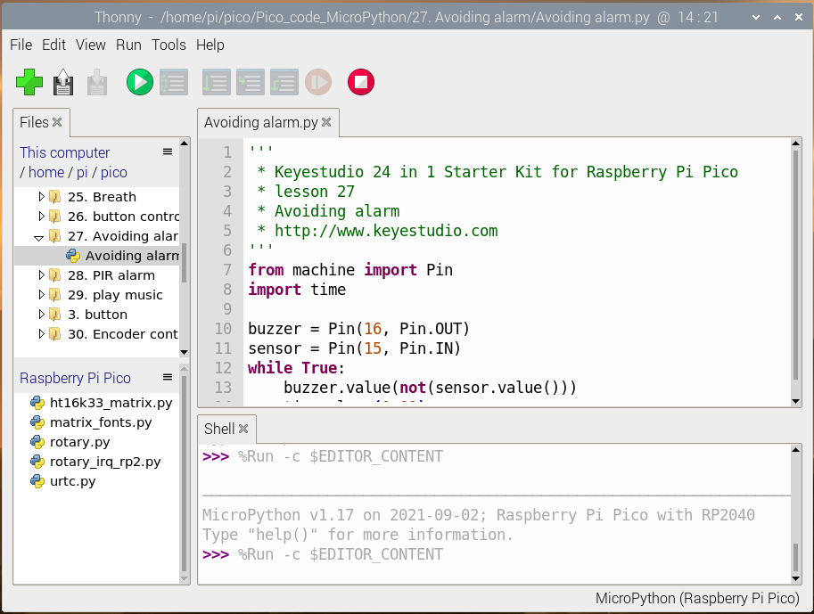

#### **Code Explanation：**

The function sensor.value() will return a low level if an obstacle is detected.

#### **Test Result：**

Upload the test code, if the obstacle is detected, the external active buzzer will chime; if not, it won’t beep


#### **Test Code：**

```python
'''
 * Keyestudio 24 in 1 Starter Kit for Raspberry Pi Pico
 * lesson 27
 * Avoiding alarm
 * http://www.Keyestudio.com
'''
from machine import Pin
import time

buzzer = Pin(16, Pin.OUT)
sensor = Pin(15, Pin.IN)
while True:
    buzzer.value(not(sensor.value()))
    time.sleep(0.01)
```


### Project 28: PIR Motion Sensor


#### **Introduction**

In this experiment, we will control an active buzzer and an on-board LED through a PIR motion sensor.

#### **Components**

|  |  | 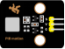 |
| ------------------------------------------------------------ | ------------------------------------------------------------ | ------------------------------------------------------------ |
| Raspberry Pi Pico Board*1                                    | Raspberry Pi Pico Shield*1                                   | Keyestudio PIR Motion Sensor*1                               |
|  |  |  |
| Keyestudio Active Buzzer*1                                   | 3P Dupont Wire*2                                             | Micro USB Cable*1                                            |

#### **Connection Diagram**


#### **Run the test code：**

Double-click **PIR alarm.py,** and clickto run the code.

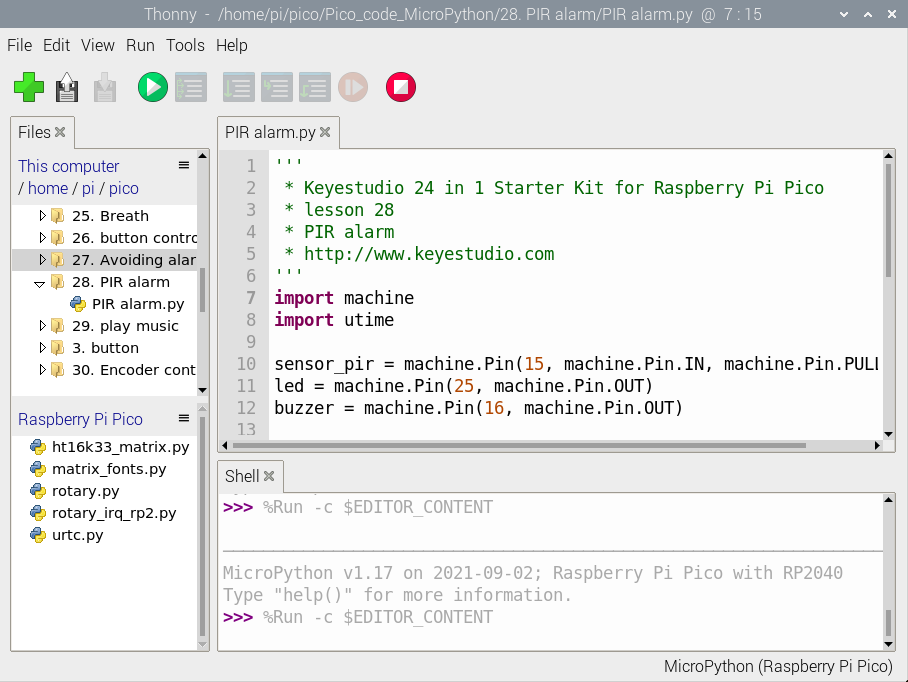

#### **Code Explanation：**

**sensor_pir.irq(trigger=machine.Pin.IRQ_RISING, handler=pir_handler)** is the interrupt function. When low levels become high levels trigger, the buzzer will chimp and LED will flash quickly.

#### **Test Result：**

Run the test code, the LED light will flash slowly, and the interrupt trigger mode is IRQ_RISING. When there are people appear, the PIR motion sensor outputs levels becoming from 0 to 1. The pir_handler() function is used, and the buzzer will chime, and the LED will flash quickly.


#### **Test Code：**

```python
'''
 * Keyestudio 24 in 1 Starter Kit for Raspberry Pi Pico
 * lesson 28
 * PIR alarm
 * http://www.Keyestudio.com
'''
import machine
import utime

sensor_pir = machine.Pin(15, machine.Pin.IN, machine.Pin.PULL_DOWN)
led = machine.Pin(25, machine.Pin.OUT)
buzzer = machine.Pin(16, machine.Pin.OUT)

def pir_handler(pin):
    utime.sleep_ms(100)
    if pin.value():
        print("Warning! Intrusion detected！")
        buzzer.value(1)
        for i in range(20):
            led.toggle()
            utime.sleep_ms(100)

sensor_pir.irq(trigger=machine.Pin.IRQ_RISING, handler=pir_handler)

while True:
    led.toggle()
    buzzer.value(0)
    utime.sleep(2)
```


### Project 29: Speaker Module


#### **Introduction**

We learned about controlling the speaker module to make sounds, play beats and adjust its volume. In fact, each song is a combination of specific beats and tones (frequencies). In this experiment, we use this speaker module to play a song.

The frequency of each tone is shown below.

Bass:

| Key Note | 1\# | 2\# | 3\# | 4\# | 5\# | 6\# | 7\# |
|----------|-----|-----|-----|-----|-----|-----|-----|
| A        | 221 | 248 | 278 | 294 | 330 | 371 | 416 |
| B        | 248 | 278 | 294 | 330 | 371 | 416 | 467 |
| C        | 131 | 147 | 165 | 175 | 196 | 221 | 248 |
| D        | 147 | 165 | 175 | 196 | 221 | 248 | 278 |
| E        | 165 | 175 | 196 | 221 | 248 | 278 | 312 |
| F        | 175 | 196 | 221 | 234 | 262 | 294 | 330 |
| G        | 196 | 221 | 234 | 262 | 294 | 330 | 371 |

Midrange :

| Key Note | 1   | 2   | 3   | 4   | 5   | 6   | 7   |
|----------|-----|-----|-----|-----|-----|-----|-----|
| A        | 441 | 495 | 556 | 589 | 661 | 724 | 833 |
| B        | 495 | 556 | 624 | 661 | 724 | 833 | 935 |
| C        | 262 | 294 | 330 | 350 | 393 | 441 | 495 |
| D        | 294 | 330 | 350 | 393 | 441 | 495 | 556 |
| E        | 330 | 350 | 393 | 441 | 495 | 556 | 624 |
| F        | 350 | 393 | 441 | 495 | 556 | 624 | 661 |
| G        | 393 | 441 | 495 | 556 | 624 | 661 | 724 |
|          |     |     |     |     |     |     |     |

Treble:

| Key Note | 1\# | 2\#  | 3\#  | 4\#  | 5\#  | 6\#  | 7\#  |
|----------|-----|------|------|------|------|------|------|
| A        | 882 | 990  | 1112 | 1178 | 1322 | 1484 | 1665 |
| B        | 990 | 1112 | 1178 | 1322 | 1484 | 1665 | 1869 |
| C        | 525 | 589  | 661  | 700  | 786  | 882  | 990  |
| D        | 589 | 661  | 700  | 786  | 882  | 990  | 1112 |
| E        | 661 | 700  | 786  | 882  | 990  | 1112 | 1248 |
| F        | 700 | 786  | 882  | 935  | 1049 | 1178 | 1322 |
| G        | 786 | 882  | 990  | 1049 | 1178 | 1322 | 1484 |

Beats are the time delay for each note. The larger the number, the longer the delay time. A note without a line in the spectrum is a beat, with a delay of 1s. while a beat with an underline is 1/2 of a beat without a line, with a delay of 0.5s, and a beat with two underlines is 1/4 of a beat without a line, with a delay of 0.25s. The 1/8 of a beat is with a delay of 0.125s.

We will take Happy Birthday Song as an example.

#### **Components**

|  |  |  |
| ------------------------------------------------------------ | ------------------------------------------------------------ | ------------------------------------------------------------ |
| Raspberry Pi Pico Board*1                                    | Raspberry Pi Pico Shield*1                                   | Keyestudio Speaker Module*1                                  |
|  |  |                                                              |
| 3P Dupont Wire*1                                             | Micro USB Cable*1                                            |                                                              |

#### **Connection Diagram**


#### **Run the test code：**

Click play music to double-click play music.py and clickto run the test code.

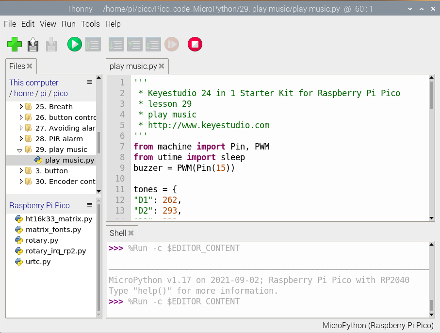

#### **Code Explanation：**

We first listed all the frequencies of the D key for later use. Then list the frequencies and beats according to the numbered musical notation. The beat we use is 500ms. This can be adjusted by ourselves, and then the pitch and corresponding beats will be looped to become a song.

#### **Test Result：**

Connect components according to the connection diagram and run the test code, the speaker module will play a song.


#### **Test Code：**

```python
'''
 * Keyestudio 24 in 1 Starter Kit for Raspberry Pi Pico
 * lesson 29
 * play music
 * http://www.Keyestudio.com
'''
from machine import Pin, PWM
from utime import sleep
buzzer = PWM(Pin(15))

tones = {
"D1": 262,
"D2": 293,
"D3": 329,
"D4": 349,
"D5": 392,
"D6": 440,
"D7": 494,
"M1": 523,
"M2": 586,
"M3": 658,
"M4": 697,
"M5": 783,
"M6": 879,
"M7": 987,
"H1": 1045,
"H2": 1171,
"H3": 1316,
"H4": 1393,
"H5": 1563,
"H6": 1755,
"H7": 1971
}

song = ["D5","D5","D6","D5","M1","D7",
        "D5","D5","D6","D5","M2","M1",
        "D5","D5","M5","M3","M1","D7","D6",
        "M4","M4","M3","M1","M2","M1"
]

durt = [0.25, 0.25, 0.5, 0.5, 0.5, 1,
       0.25, 0.25, 0.5, 0.5, 0.5, 1,
       0.25, 0.25, 0.5, 0.5, 0.5, 0.5, 0.5,
       0.25, 0.25, 0.5, 0.5, 0.5, 1
]

def playtone(frequency):
    buzzer.duty_u16(1000)
    buzzer.freq(frequency)

def bequiet():
    buzzer.duty_u16(0)

def playsong(mysong):
    for i in range(len(mysong)):
        playtone(tones[mysong[i]])
        sleep(durt[i])
    bequiet()
playsong(song)
```


### Project 30: Rotary Encoder


#### **Introduction**

In this lesson, we will control the LED on the RGB module to show different colors through a rotary encoder.

When designing the code, we need to divide the obtained values by 3 to get the remainders. The remainder is 0 and the LED will become red. The remainder is 1, the LED will become green. The remainder is 2, the LED will turn blue.

#### **Components**

|  |  |  |  |
| ------------------------------------------------------------ | ------------------------------------------------------------ | ------------------------------------------------------------ | ------------------------------------------------------------ |
| Raspberry Pi Pico Board*1                                    | Raspberry Pi Pico Shield*1                                   | Common Cathode RGB Module*1                                  | Rotary Encoder Module*1                                      |
|  |  |  |                                                              |
| 5P Dupont Wire*1                                             | 4P Dupont Wire*1                                             | Micro USB Cable*1                                            |                                                              |

#### **Connection Diagram**

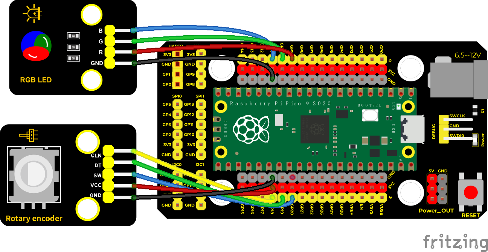

#### **Run the test code：**

Double-click **Encoder control RGB .py** and clickto run the test code.

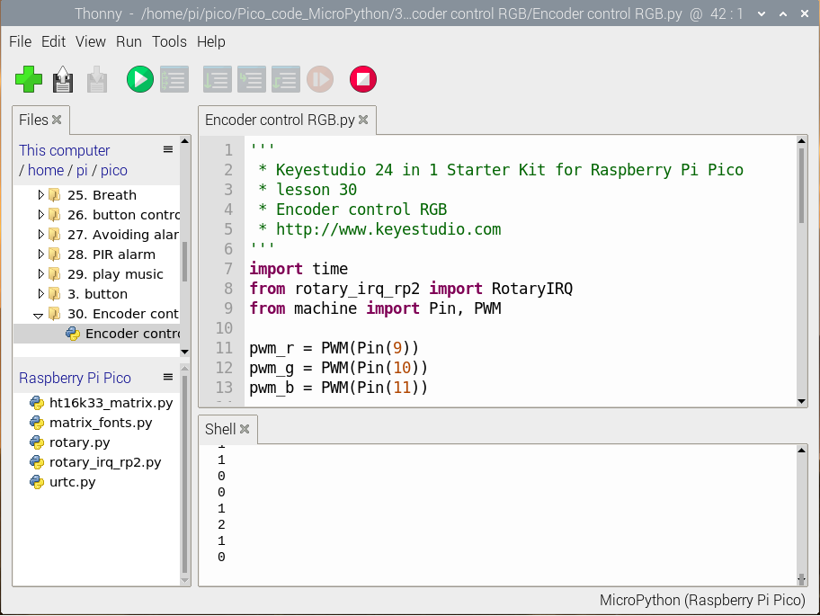

#### **Code Explanation：**

In the experiment, divide val by 3, then we get its remainder. Next, set the pins to GP9 (red light), GP10 (green light) and GP11 (blue light) according to the wiring. 

Then, we can control the LED to display different colors by remainders.

#### **Test Result：**

Wire up, run the test code, and observe the Shell. Rotate the encoder and the corresponding remainders will be displayed on the Shell and the RGB module show colors

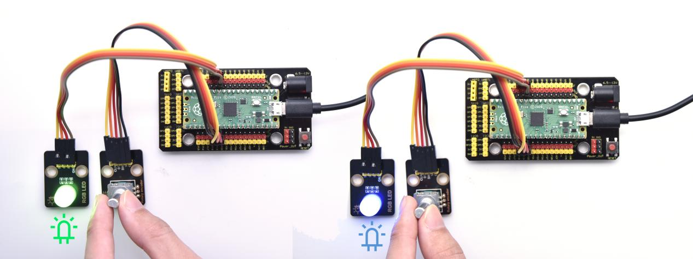

#### **Test Code：**

```python
'''
 * Keyestudio 24 in 1 Starter Kit for Raspberry Pi Pico
 * lesson 30
 * Encoder control RGB
 * http://www.Keyestudio.com
'''
import time
from rotary_irq_rp2 import RotaryIRQ
from machine import Pin, PWM

pwm_r = PWM(Pin(9))
pwm_g = PWM(Pin(10))
pwm_b = PWM(Pin(11))

pwm_r.freq(1000)
pwm_g.freq(1000)
pwm_b.freq(1000)

def light(red, green, blue):
    pwm_r.duty_u16(red)
    pwm_g.duty_u16(green)
    pwm_b.duty_u16(blue)

SW=Pin(20,Pin.IN,Pin.PULL_UP)
r = RotaryIRQ(pin_num_clk=18,
              pin_num_dt=19,
              min_val=0,
              reverse=False,
              range_mode=RotaryIRQ.RANGE_UNBOUNDED)

while True:
    val = r.value()
    print(val%3)
    if val%3 == 0:
        light(65535, 0, 0)
    elif val%3 == 1:
        light(0, 65535, 0)
    elif val%3 == 2:
        light(0, 0, 65535)
    time.sleep(0.1)
```

### Project 31: Rotary Potentiometer


#### **Introduction**

In the previous courses, we did experiments of breathing light and controlling LED with button. In this course, we do these two experiments by controlling the brightness of LED through an adjustable potentiometer. The brightness of LED is controlled by PWM values, and the range of analog values is the same as the PWM’s, from 0 to 65535.

After the code is set successfully, we can control the brightness of the LED on the module by rotating the potentiometer.

#### **Components**

| 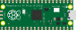 | 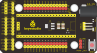 |  |
| ------------------------------------------------------------ | ------------------------------------------------------------ | ------------------------------------------------------------ |
| Raspberry Pi Pico Board*1                                    | Raspberry Pi Pico Shield*1                                   | White LED Module*1                                           |
| 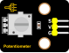 |  |  |
| Rotary Potentiometer*1                                       | 3P Dupont Wire*2                                             | Micro USB Cable*1                                            |

#### **Connection Diagram**

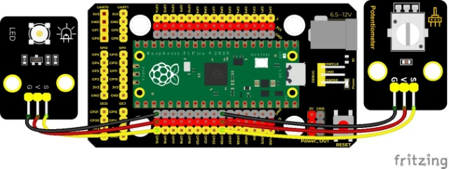

#### **Run the test code：**

Double-click adjust the light.py，and clickto run the test code.

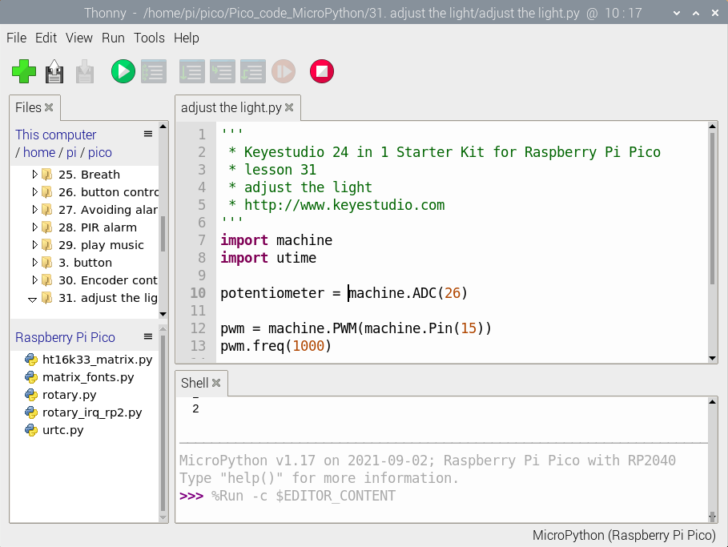

#### **Code Explanation：**

MicroPython make the value range of ADC between 0 and 65535, just assign the value directly, which is simple and convenient.

#### **Test Result：**

Run the test code and turn the potentiometer on the module to adjust the brightness of the LED module.

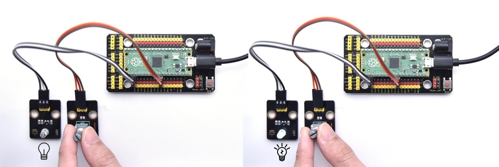

#### **Test Code：**

```python
'''
 * Keyestudio 24 in 1 Starter Kit for Raspberry Pi Pico
 * lesson 31
 * adjust the light
 * http://www.Keyestudio.com
'''
import machine
import utime

potentiometer = machine.ADC(26)

pwm = machine.PWM(machine.Pin(15))
pwm.freq(1000)

while True:
    pot_value = potentiometer.read_u16()
    pwm.duty_u16(pot_value)
    utime.sleep(0.1)
```


### Project 32: Sound Activated Light


#### **Introduction**

In this lesson, we will make a smart sound activated light using a sound sensor
and an LED module. When we make a sound, the light will automatically turn on;
when there is no sound, the lights will automatically turn off. How it works?
Because the sound-controlled light is equipped with a sound sensor, and this
sensor converts the intensity of external sound into a corresponding value. Then
set a threshold, when the threshold is exceeded, the light will turn on, and
when it is not exceeded, the light will go out.

#### **Components**

|  |  | 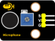 |
| ------------------------------------------------------------ | ------------------------------------------------------------ | ------------------------------------------------------------ |
| Raspberry Pi Pico Board*1                                    | Raspberry Pi Pico Shield*1                                   | Keyestudio Sound Sensor*1                                    |
| 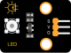 |  |  |
| Keyestudio White LED Module*1                                | 3P Dupont Wire*2                                             | Micro USB Cable*1                                            |

#### **Connection Diagram**

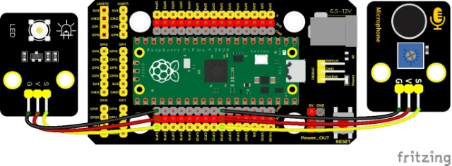

#### **Run the Test Code：**

Double-click **sound-controlled lights.py** and clickto run the test code.

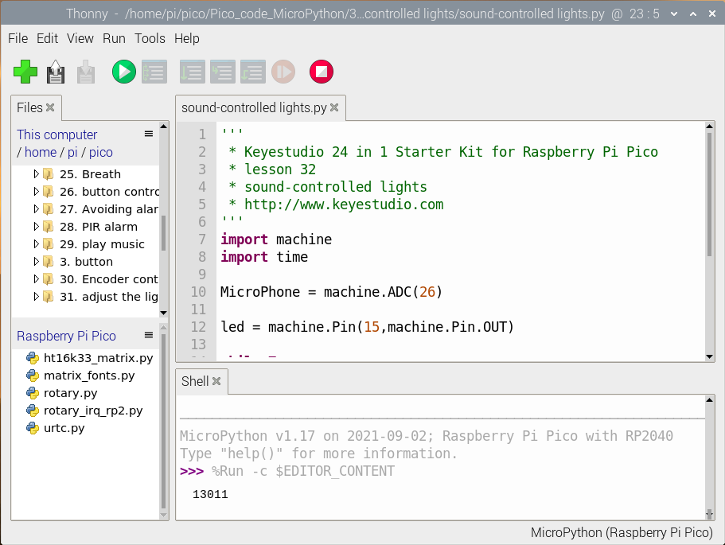

#### **Code Explanation：**

In the experiment, we set a threshold of 5000. If the analog value is more than 5000, the LED will be turned on if it exceeds 5000, otherwise it will be turned off.

#### **Test Result：**

Run the test code, the shell displays the corresponding volume analog value. When the value of sound is greater than 5000, the LED module will light up, otherwise it will go out.


#### **Test Code：**

```python
'''
 * Keyestudio 24 in 1 Starter Kit for Raspberry Pi Pico
 * lesson 32
 * sound-controlled lights
 * http://www.Keyestudio.com
'''
import machine
import time

MicroPhone = machine.ADC(26)

led = machine.Pin(15,machine.Pin.OUT)

while True:
    value = MicroPhone.read_u16()
    print(value)
    if value > 5000:
        led.value(1)
        time.sleep(3)
    else:
        led.value(0)
    time.sleep(0.1)
```


### Project 33: 6812 RGB Module


#### **Introduction**

We learned how to use the 6812 RGB module, we knew that this module can light up each LED through a pin. In this experiment, we will control the RGB module to display different colors. 

(Note: do not look directly at the LEDs for a long time to avoid damage to our eyes.)

#### **Components**

|  |  | 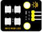 |
| ------------------------------------------------------------ | ------------------------------------------------------------ | ------------------------------------------------------------ |
| Raspberry Pi Pico Board*1                                    | Raspberry Pi Pico Shield*1                                   | Keyestudio 6812 RGB Module*1                                 |
|  |  |                                                              |
| 3P Dupont Wire*1                                             | Micro USB Cable*1                                            |                                                              |

#### **Connection Diagram**


#### **Run the test code：**

Double-click 6812.py and click  to run the test code.

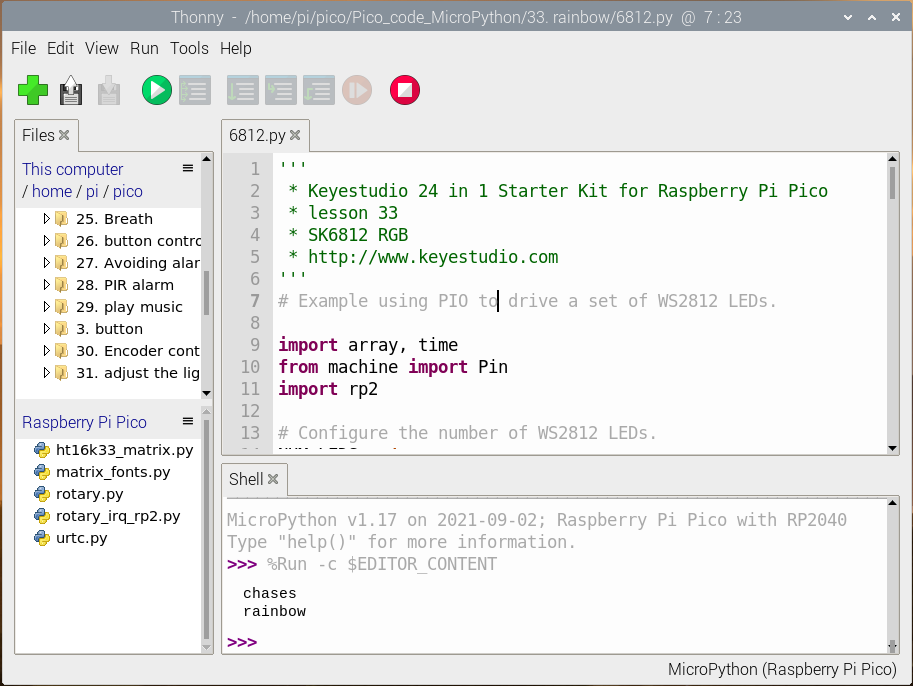

#### **Code Explanation：**

**color_chase(color, wait):** show the color of the water flowing light

**rainbow_cycle(0)**：show rainbow effect

#### **Test Result：**

Wire up and run the code, the 6812RGB module will show black, red, yellow, green, blue, purple and white afterwards


#### **Test Code：**

```python
'''
 * Keyestudio 24 in 1 Starter Kit for Raspberry Pi Pico
 * lesson 33
 * SK6812 RGB
 * http://www.Keyestudio.com
'''
# Example using PIO to drive a set of WS2812 LEDs.

import array, time
from machine import Pin
import rp2

# Configure the number of WS2812 LEDs.
NUM_LEDS = 4
PIN_NUM = 15
brightness = 0.2

@rp2.asm_pio(sideset_init=rp2.PIO.OUT_LOW, out_shiftdir=rp2.PIO.SHIFT_LEFT, autopull=True, pull_thresh=24)
def ws2812():
    T1 = 2
    T2 = 5
    T3 = 3
    wrap_target()
    label("bitloop")
    out(x, 1)               .side(0)    [T3 - 1]
    jmp(not_x, "do_zero")   .side(1)    [T1 - 1]
    jmp("bitloop")          .side(1)    [T2 - 1]
    label("do_zero")
    nop()                   .side(0)    [T2 - 1]
    wrap()


# Create the StateMachine with the ws2812 program, outputting on pin
sm = rp2.StateMachine(0, ws2812, freq=8_000_000, sideset_base=Pin(PIN_NUM))

# Start the StateMachine, it will wait for data on its FIFO.
sm.active(1)

# Display a pattern on the LEDs via an array of LED RGB values.
ar = array.array("I", [0 for _ in range(NUM_LEDS)])

##########################################################################
def pixels_show():
    dimmer_ar = array.array("I", [0 for _ in range(NUM_LEDS)])
    for i,c in enumerate(ar):
        r = int(((c >> 8) & 0xFF) * brightness)
        g = int(((c >> 16) & 0xFF) * brightness)
        b = int((c & 0xFF) * brightness)
        dimmer_ar[i] = (g<<16) + (r<<8) + b
    sm.put(dimmer_ar, 8)
    time.sleep_ms(10)

def pixels_set(i, color):
    ar[i] = (color[1]<<16) + (color[0]<<8) + color[2]

def color_chase(color, wait):
    for i in range(NUM_LEDS):
        pixels_set(i, color)
        time.sleep(wait)
        pixels_show()
    time.sleep(0.2)
 
def wheel(pos):
    # Input a value 0 to 255 to get a color value.
    # The colours are a transition r - g - b - back to r.
    if pos < 0 or pos > 255:
        return (0, 0, 0)
    if pos < 85:
        return (255 - pos * 3, pos * 3, 0)
    if pos < 170:
        pos -= 85
        return (0, 255 - pos * 3, pos * 3)
    pos -= 170
    return (pos * 3, 0, 255 - pos * 3)
 
 
def rainbow_cycle(wait):
    for j in range(255):
        for i in range(NUM_LEDS):
            rc_index = (i * 256 // NUM_LEDS) + j
            pixels_set(i, wheel(rc_index & 255))
        pixels_show()
        time.sleep(wait)

BLACK = (0, 0, 0)
RED = (255, 0, 0)
YELLOW = (255, 150, 0)
GREEN = (0, 255, 0)
CYAN = (0, 255, 255)
BLUE = (0, 0, 255)
PURPLE = (180, 0, 255)
WHITE = (255, 255, 255)
COLORS = (BLACK, RED, YELLOW, GREEN, CYAN, BLUE, PURPLE, WHITE)

print("chases")
for color in COLORS:       
    color_chase(color, 0.05)

print("rainbow")
rainbow_cycle(0)
```


### Project 34: Ultrasonic Sensor


#### **Introduction**


We know that bats use echoes to determine the direction and the location of their preys. In real life, sonar is used to detect sounds in the water. Since the attenuation rate of electromagnetic waves in water is very high, it cannot be used to detect signals, however, the attenuation rate of sound waves in the water is much smaller, so sound waves are most commonly used underwater for observation and measurement.

In this experiment, we will use a speaker module, an RGB module and a 4-digit tube display to make a device for detection through ultrasonic.


#### **Components**

|  |  |  |
| ------------------------------------------------------------ | ------------------------------------------------------------ | ------------------------------------------------------------ |
| Raspberry Pi Pico Board*1                                    | Raspberry Pi Pico Shield*1                                   | brick HC-SR04 Ultrasonic Sensor*1                            |
| 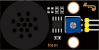 |  |  |
| Speaker Module*1                                             | Common Cathode RGB Module*1                                  | TM1650 4-Digit Tube Display*1                                |
|  |  |  |
| 4P Dupont Wire*3                                             | 3P Dupont Wire*1                                             | Micro USB Cable*1                                            |

#### **Connection Diagram**


#### **Run the test code：**

Double-click Ultrasonic radar.py, and clickto run the test code.


#### **Code Explanation：**

We set the sound frequency and light color by adjusting different distance ranges. We can also adjust the distance range in the above code.

#### **Test Result：**

Wire up according to the connection diagram and run the code. When the ultrasonic sensor detects an obstacle at different distances, the buzzer on the speaker module will produce different frequencies of sound, the RGB will show different colors, and the measured distances will be displayed on the 4-digit tube display.


#### **Test Code：**

```python
'''
 * Keyestudio 24 in 1 Starter Kit for Raspberry Pi Pico
 * lesson 34
 * Ultrasonic radar
 * http://www.Keyestudio.com
'''
from machine import Pin, PWM
import utime

# definitions for TM1650
ADDR_DIS = 0x48  #mode command
ADDR_KEY = 0x49  #read key value command

# definitions for brightness
BRIGHT_DARKEST = 0
BRIGHT_TYPICAL = 2
BRIGHTEST      = 7

on  = 1
off = 0

# number:0~9
NUM = [0x3f,0x06,0x5b,0x4f,0x66,0x6d,0x7d,0x07,0x7f,0x6f] 
# DIG = [0x68,0x6a,0x6c,0x6e]
DIG = [0x6e,0x6c,0x6a,0x68]
DOT = [0,0,0,0]

clkPin = 15
dioPin = 14
clk = machine.Pin(clkPin, machine.Pin.OUT)
dio = machine.Pin(dioPin, machine.Pin.OUT)

DisplayCommand = 0

def writeByte(wr_data):
    global clk,dio
    for i in range(8):
        if(wr_data & 0x80 == 0x80):
            dio.value(1)
        else:
            dio.value(0)
        clk.value(0)
        utime.sleep(0.0001)
        clk.value(1)
        utime.sleep(0.0001)
        clk.value(0)
        wr_data <<= 1
    return

def start():
    global clk,dio
    dio.value(1)
    clk.value(1)
    utime.sleep(0.0001)
    dio.value(0)
    return
    
def ack():
    global clk,dio
    dy = 0
    clk.value(0)
    utime.sleep(0.0001)
    dio = Pin(dioPin, machine.Pin.IN)
    while(dio.value() == 1):
        utime.sleep(0.0001)
        dy += 1
        if(dy>5000):
            break
    clk.value(1)
    utime.sleep(0.0001)
    clk.value(0)
    dio = Pin(dioPin, machine.Pin.OUT)
    return
    
def stop():
    global clk,dio
    dio.value(0)
    clk.value(1)
    utime.sleep(0.0001)
    dio.value(1)
    return
    
def displayBit(bit, num):
    global ADDR_DIS
    if(num > 9 and bit > 4):
        return
    start()
    writeByte(ADDR_DIS)
    ack()
    writeByte(DisplayCommand)
    ack()
    stop()
    start()
    writeByte(DIG[bit-1])
    ack()
    if(DOT[bit-1] == 1):
        writeByte(NUM[num] | 0x80)
    else:
        writeByte(NUM[num])
    ack()
    stop()
    return
    
def clearBit(bit):
    if(bit > 4):
        return
    start()
    writeByte(ADDR_DIS)
    ack()
    writeByte(DisplayCommand)
    ack()
    stop()
    start()
    writeByte(DIG[bit-1])
    ack()
    writeByte(0x00)
    ack()
    stop()
    return
    
    
def setBrightness(b = BRIGHT_TYPICAL):
    global DisplayCommand,brightness
    DisplayCommand = (DisplayCommand & 0x0f)+(b<<4)
    return

def setMode(segment = 0):
    global DisplayCommand
    DisplayCommand = (DisplayCommand & 0xf7)+(segment<<3)
    return
    
def displayOnOFF(OnOff = 1):
    global DisplayCommand
    DisplayCommand = (DisplayCommand & 0xfe)+OnOff
    return

def displayDot(bit, OnOff):
    if(bit > 4):
        return
    if(OnOff == 1): 
        DOT[bit-1] = 1;
    else:
        DOT[bit-1] = 0;
    return
        
def InitDigitalTube():
    setBrightness(2)
    setMode(0)
    displayOnOFF(1)
    for _ in range(4):
        clearBit(_)
    return

def ShowNum(num): #0~9999
    displayBit(1,num%10)
    if(num < 10):
        clearBit(2)
        clearBit(3)
        clearBit(4)
    if(num > 9 and num < 100):
        displayBit(2,num//10%10)
        clearBit(3)
        clearBit(4)
    if(num > 99 and num < 1000):
        displayBit(2,num//10%10)
        displayBit(3,num//100%10)
        clearBit(4)
    if(num > 999 and num < 10000):
        displayBit(2,num//10%10)
        displayBit(3,num//100%10)
        displayBit(4,num//1000)

pwm_r = PWM(Pin(9))
pwm_g = PWM(Pin(10))
pwm_b = PWM(Pin(11))

pwm_r.freq(1000)
pwm_g.freq(1000)
pwm_b.freq(1000)

def light(red, green, blue):
    pwm_r.duty_u16(red)
    pwm_g.duty_u16(green)
    pwm_b.duty_u16(blue)

# ultrasonic ranging, unit: cm
def getDistance(trigger, echo):
    # produce 0us square waves
    trigger.low()   #reserve a short low level to ensure a clear high pulse:
    utime.sleep_us(2)
    trigger.high()
    utime.sleep_us(10)#After pulling up the high level, wait for 10s, then set it to the low level immediately
    trigger.low()
    
    while echo.value() == 0: # build a while loop to detect the value of the pin and record the current time
        start = utime.ticks_us()
    while echo.value() == 1: #build a while loop to detect the value of the pin and record the current time
        end = utime.ticks_us()
    d = (end - start) * 0.0343 / 2 #time of waves travelling  x sound speed(343.2 m/s, 0.0343 cm each microseconds)，and double distance is divided by 2
    return d

# set pins
trigger = Pin(20, Pin.OUT)
echo = Pin(19, Pin.IN)

buzzer = PWM(Pin(16))

def playtone(frequency):
    buzzer.duty_u16(1000)
    buzzer.freq(frequency)

def bequiet():
    buzzer.duty_u16(0)
    
# main program
InitDigitalTube()
while True:
    distance = int(getDistance(trigger, echo))
    ShowNum(distance)
    if distance <= 10:
        playtone(880)
        utime.sleep(0.1)
        bequiet()
        light(65535, 0, 0)
    elif distance <= 20:
        playtone(532)
        utime.sleep(0.2)
        bequiet()
        light(0, 0, 65535)
    else:
        light(0, 65535, 0)
```


### Project 35: IR Remote Control


#### **Introduction**

In the previous experiments, we learned to turn on or turn off the LED, adjust the brightness of a light through PWM, and how to use the infrared receiver module. So in this experiment, we use an infrared remote control to control an LED module.

When we receive a value, we set the PWM value by the corresponding button value, thus you can adjust the brightness. Control the LED to turn on or turn off is in the same way. If we want to use the same button to control the LED to turn on or turn off, we can achieve it through the code.

#### **Components**

|  |  |  |
| ------------------------------------------------------------ | ------------------------------------------------------------ | ------------------------------------------------------------ |
| Raspberry Pi Pico Board*1                                    | Raspberry Pi PicoShield*1                                    | Keyestudio White LED Module*1                                |
|  |  |  |
| KeyestudioIR Receiver*1                                      | MicroUSB Cable*1                                             | Remote Control*1                                             |
|  |                                                              |                                                              |
| 3P Dupont Wire*2                                             |                                                              |                                                              |

#### **Connection Diagram**


#### **Run the test code：**

Double-click IR control LED.py，and clickto run the code

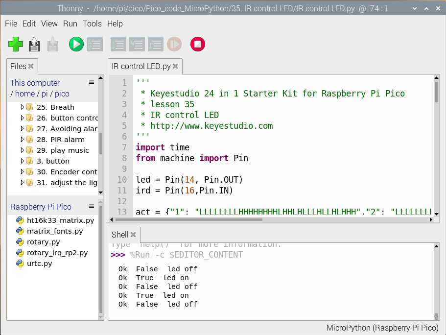

#### **Code Explanation：**

We define a Boolean variable, values of the Boolean variable are true (True) or false (False).

When we press the OK button, at this time we need to set a Boolean variable flag. When the flag is true (True), the LED will be turned on, and when it is false (False), it will be turned off. 

#### **Test Result：**

Wire up, run the code and look at the Shell. Press keys on the IR remote control, the Shell will show values. Press“OK”to turn on the LED, and press it again to turn off the LED.


#### **Test Code：**

```python
'''
 * Keyestudio 24 in 1 Starter Kit for Raspberry Pi Pico
 * lesson 35
 * IR control LED
 * http://www.Keyestudio.com
'''
import time
from machine import Pin

led = Pin(14, Pin.OUT)
ird = Pin(16,Pin.IN)

act = {"1": "LLLLLLLLHHHHHHHHLHHLHLLLHLLHLHHH","2": "LLLLLLLLHHHHHHHHHLLHHLLLLHHLLHHH","3": "LLLLLLLLHHHHHHHHHLHHLLLLLHLLHHHH",
       "4": "LLLLLLLLHHHHHHHHLLHHLLLLHHLLHHHH","5": "LLLLLLLLHHHHHHHHLLLHHLLLHHHLLHHH","6": "LLLLLLLLHHHHHHHHLHHHHLHLHLLLLHLH",
       "7": "LLLLLLLLHHHHHHHHLLLHLLLLHHHLHHHH","8": "LLLLLLLLHHHHHHHHLLHHHLLLHHLLLHHH","9": "LLLLLLLLHHHHHHHHLHLHHLHLHLHLLHLH",
       "0": "LLLLLLLLHHHHHHHHLHLLHLHLHLHHLHLH","Up": "LLLLLLLLHHHHHHHHLHHLLLHLHLLHHHLH","Down": "LLLLLLLLHHHHHHHHHLHLHLLLLHLHLHHH",
       "Left": "LLLLLLLLHHHHHHHHLLHLLLHLHHLHHHLH","Right": "LLLLLLLLHHHHHHHHHHLLLLHLLLHHHHLH","Ok": "LLLLLLLLHHHHHHHHLLLLLLHLHHHHHHLH",
       "*": "LLLLLLLLHHHHHHHHLHLLLLHLHLHHHHLH","#": "LLLLLLLLHHHHHHHHLHLHLLHLHLHLHHLH"}

def read_ircode(ird):
    wait = 1
    complete = 0
    seq0 = []
    seq1 = []

    while wait == 1:
        if ird.value() == 0:
            wait = 0
    while wait == 0 and complete == 0:
        start = time.ticks_us()
        while ird.value() == 0:
            ms1 = time.ticks_us()
        diff = time.ticks_diff(ms1,start)
        seq0.append(diff)
        while ird.value() == 1 and complete == 0:
            ms2 = time.ticks_us()
            diff = time.ticks_diff(ms2,ms1)
            if diff > 10000:
                complete = 1
        seq1.append(diff)

    code = ""
    for val in seq1:
        if val < 2000:
            if val < 700:
                code += "L"
            else:
                code += "H"
    # print(code)
    command = ""
    for k,v in act.items():
        if code == v:
            command = k
    if command == "":
        command = code
    return command

flag = False
while True:
#     global flag
    command = read_ircode(ird)
    print(command, end = "  ")
    print(flag, end = "  ")
    if command == "Ok":
        if flag == True:
            led.value(1)
            flag = False
            print("led on")
        else:
            led.value(0)
            flag = True
            print("led off")
    time.sleep(0.1)
```


### Project 36: Comprehensive Experiment


#### **Introduction**

We did a lot of experiments, and for each one we needed to re-upload the code, so can we achieve different functions through an experiment? In this experiment, we will use an external button module to achieve different functions.

#### **Components**

| 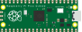 | 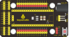 | 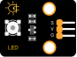 |
| ------------------------------------------------------------ | ------------------------------------------------------------ | ------------------------------------------------------------ |
| Raspberry Pi Pico Board*1                                    | Raspberry Pi Pico Shield*1                                   | Keyestudio White LED Module*1                                |
| 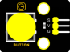 | 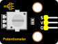 | 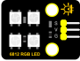 |
| Keyestudio Button Module*1                                   | Keyestudio Rotary Potentiometer*1                            | Keyestudio 6812 RGB Module*1                                 |
| 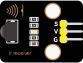 |  |  |
| Keyestudio IR Receiver*1                                     | Keyestudio Joystick Module*1                                 | HC-SR04 Ultrasoic Sensor*1                                   |
| 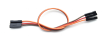 | 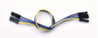 |  |
| 3P Dupont Wire*5                                             | 4P Dupont Wire*1                                             | 5P Dupont Wire*1                                             |
|  |  |                                                              |
| MicroUSB Cable*1                                             | Remote Control*1                                             |                                                              |

#### **Connection Diagram**


#### **Run the Test Code：**

Double-click **Comprehensive experiment.py** and click to run the code

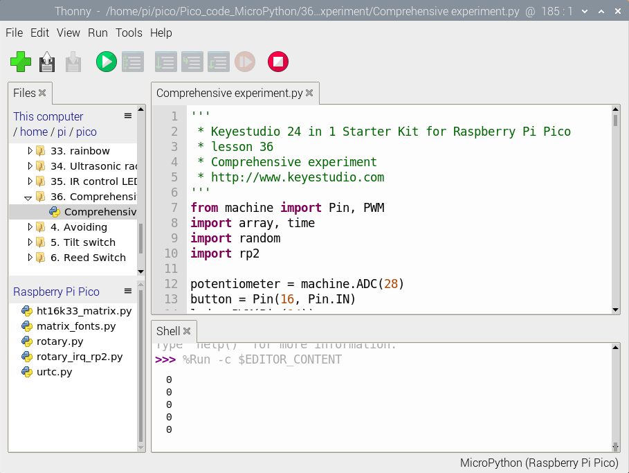

#### **Code Explanation：**

Calculate how many times keys are pressed, then divided by 5. Remainders are 0, 1, 2, 3 and 4. According to diverse remainders, five single functions will be generated to perform different functions.

#### **Test Result：**


At the beginning, the number of key taps is 0, the remainder is 0, and the four lamp beads on the 6812RGB module will flash random colors.

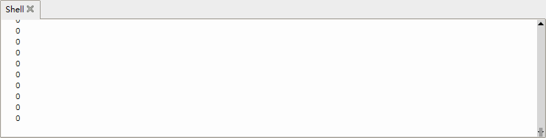


Look at the Shell, press a key, the 6812 light will stop flashing, the number of key taps is 1, the remainder is 1, the infrared emitter will send information. If we use the infrared remote control to aim at the receiving module and press a key, as shown below.


Press a key, the number of key taps is 2, the remainder is 2, analog values of X axis, Y axis and Z axis will be read. As shown below;

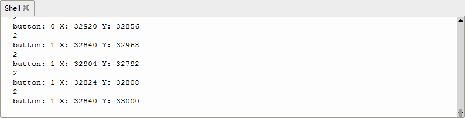

Press a key, the number of key taps is 3, the remainder is 3, the potentiometer
can control the PWM value and brightness of the LED. As shown below;

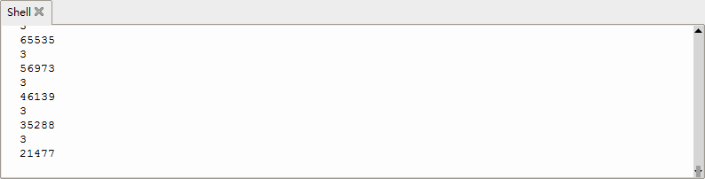

Press a key, the number of key taps is 4, the remainder is 4, the distance value detected by the ultrasonic sensor will be shown on the Shell;

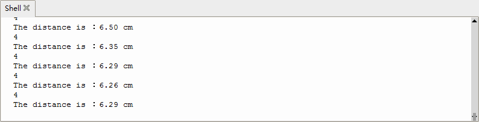

Press a key, the number of key taps is 5, the remainder is 0, the 6812RGB will flash.

#### **Test Code：**

```python
'''
 * Keyestudio 24 in 1 Starter Kit for Raspberry Pi Pico
 * lesson 36
 * Comprehensive experiment
 * http://www.Keyestudio.com
'''
from machine import Pin, PWM
import array, time
import random
import rp2

potentiometer = machine.ADC(28)
button = Pin(16, Pin.IN)
led = PWM(Pin(14))
led.freq(1000)
ird = Pin(11,Pin.IN)
B = machine.Pin(22, machine.Pin.IN)
X = machine.ADC(26)
Y = machine.ADC(27)
# set the pin of the ultrasonic sensor
trigger = Pin(6, Pin.OUT)
echo = Pin(7, Pin.IN)
# Configure the number of sk6812 LEDs, pins and brightness.
NUM_LEDS = 4
PIN_NUM = 15
brightness = 0.2

act = {"1": "LLLLLLLLHHHHHHHHLHHLHLLLHLLHLHHH","2": "LLLLLLLLHHHHHHHHHLLHHLLLLHHLLHHH","3": "LLLLLLLLHHHHHHHHHLHHLLLLLHLLHHHH",
       "4": "LLLLLLLLHHHHHHHHLLHHLLLLHHLLHHHH","5": "LLLLLLLLHHHHHHHHLLLHHLLLHHHLLHHH","6": "LLLLLLLLHHHHHHHHLHHHHLHLHLLLLHLH",
       "7": "LLLLLLLLHHHHHHHHLLLHLLLLHHHLHHHH","8": "LLLLLLLLHHHHHHHHLLHHHLLLHHLLLHHH","9": "LLLLLLLLHHHHHHHHLHLHHLHLHLHLLHLH",
       "0": "LLLLLLLLHHHHHHHHLHLLHLHLHLHHLHLH","Up": "LLLLLLLLHHHHHHHHLHHLLLHLHLLHHHLH","Down": "LLLLLLLLHHHHHHHHHLHLHLLLLHLHLHHH",
       "Left": "LLLLLLLLHHHHHHHHLLHLLLHLHHLHHHLH","Right": "LLLLLLLLHHHHHHHHHHLLLLHLLLHHHHLH","Ok": "LLLLLLLLHHHHHHHHLLLLLLHLHHHHHHLH",
       "*": "LLLLLLLLHHHHHHHHLHLLLLHLHLHHHHLH","#": "LLLLLLLLHHHHHHHHLHLHLLHLHLHLHHLH"}

def read_ircode(ird):
    wait = 1
    complete = 0
    seq0 = []
    seq1 = []

    while wait == 1:
        if ird.value() == 0:
            wait = 0
    while wait == 0 and complete == 0:
        start = time.ticks_us()
        while ird.value() == 0:
            ms1 = time.ticks_us()
        diff = time.ticks_diff(ms1,start)
        seq0.append(diff)
        while ird.value() == 1 and complete == 0:
            ms2 = time.ticks_us()
            diff = time.ticks_diff(ms2,ms1)
            if diff > 10000:
                complete = 1
        seq1.append(diff)

    code = ""
    for val in seq1:
        if val < 2000:
            if val < 700:
                code += "L"
            else:
                code += "H"
    # print(code)
    command = ""
    for k,v in act.items():
        if code == v:
            command = k
    if command == "":
        command = code
    return command

@rp2.asm_pio(sideset_init=rp2.PIO.OUT_LOW, out_shiftdir=rp2.PIO.SHIFT_LEFT, autopull=True, pull_thresh=24)
def sk6812():
    T1 = 2
    T2 = 5
    T3 = 3
    wrap_target()
    label("bitloop")
    out(x, 1)               .side(0)    [T3 - 1]
    jmp(not_x, "do_zero")   .side(1)    [T1 - 1]
    jmp("bitloop")          .side(1)    [T2 - 1]
    label("do_zero")
    nop()                   .side(0)    [T2 - 1]
    wrap()
 
 
# Create the StateMachine with the sk6812 program, outputting on Pin(16).
sm = rp2.StateMachine(0, sk6812, freq=8_000_000, sideset_base=Pin(PIN_NUM))
 
# Start the StateMachine, it will wait for data on its FIFO.
sm.active(1)
 
# Display a pattern on the LEDs via an array of LED RGB values.
ar = array.array("I", [0 for _ in range(NUM_LEDS)])
 
def pixels_show():
    dimmer_ar = array.array("I", [0 for _ in range(NUM_LEDS)])
    for i,c in enumerate(ar):
        r = int(((c >> 8) & 0xFF) * brightness)
        g = int(((c >> 16) & 0xFF) * brightness)
        b = int((c & 0xFF) * brightness)
        dimmer_ar[i] = (g<<16) + (r<<8) + b
    sm.put(dimmer_ar, 8)
    time.sleep_ms(10)
 
def pixels_set(i, color):
    ar[i] = (color[1]<<16) + (color[0]<<8) + color[2]

# Ultrasonic ranging，unit：cm
def getDistance(trigger, echo):
    # a method to produce 10us square wave
    trigger.low()   #reserve a short low level to ensure a clear high pulse:
    time.sleep_us(2)
    trigger.high()
    time.sleep_us(10)#After pulling up the high level, wait for 10s, then set it to the low level immediately
    trigger.low()
    
    while echo.value() == 0: #build a while loop to detect the value of the pin and record the current time
        start = time.ticks_us()
    while echo.value() == 1: #build a while loop to detect the value of the pin and record the current time
        end = time.ticks_us()
    d = (end - start) * 0.0343 / 2 #time of waves travelling  x sound speed(343.2 m/s, 0.0343 cm each microseconds)，and double distance is divided by 2
    return d


keys = 0
nums = 0

def toggle_handle(pin):
    global keys
    keys += 1

button.irq(trigger = Pin.IRQ_FALLING, handler = toggle_handle)

def show6812():
    R = random.randint(0,255)
    G = random.randint(0,255)
    B = random.randint(0,255)
    for i in range(NUM_LEDS):
        pixels_set(i, (R, G, B))
        pixels_show()
    time.sleep(0.3)

def IRreceive():
    command = read_ircode(ird)
    print(command)

def showJoystick():
    B_value = B.value()
    X_value = X.read_u16()
    Y_value = Y.read_u16()
    print("button:", end = " ")
    print(B_value, end = " ")
    print("X:", end = " ")
    print(X_value, end = " ")
    print("Y:", end = " ")
    print(Y_value)
    time.sleep(0.1)

def adjustLight():
    pot_value = potentiometer.read_u16()
    print(pot_value)
    led.duty_u16(pot_value)
    time.sleep(0.1)

def showDistance():
    distance = getDistance(trigger, echo)
    print("The distance is ：{:.2f} cm".format(distance))
    time.sleep(0.1)

while True:
    nums = keys % 5
    print(nums)
    if nums == 0:
        show6812()
    elif nums == 1:
        IRreceive()
    elif nums == 2:
        showJoystick()
    elif nums == 3:
        adjustLight()
    elif nums == 4:
        showDistance()
```


## 5. Resources:

**Download test code:**

**https://fs.keyestudio.com/KS3021**

