# **Pico 24 in 1 Sensor Kit-Arduino tutorial**

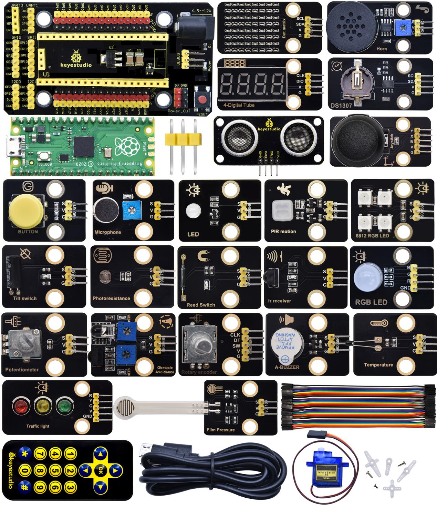

## 1.Introduction

The Keyestudio Raspberry Pi Pico 24 in 1 sensor kit mainly contains 24 commonly used sensors/modules, the Raspberry Pi Pico board, the Raspberry Pi Pico expansion board and Dupont wires.

The 24 sensors and modules are fully compatible with the Raspberry Pi Pico shield. You only need to stack the Raspberry Pi Pico board onto the Raspberry Pi Pico shield, and hook up them with Dupont wires, which is simple and convenient.

To make you master the electronic knowledge, detailed tutorials (Micropython), schematic diagrams, wiring methods and test code are included. Through these projects, you will have a better understanding about programming, logic and electronics.

## 2. Kit List

|                           Picture                            |                  Model                   | QTY  |
| :----------------------------------------------------------: | :--------------------------------------: | :--: |
|  |       Keyestudio White LED Module        |  1   |
|  |   Keyestudio Common Cathode RGB Module   |  1   |
|  |     Keyestudio Traffic Lights Module     |  1   |
|  |         Keyestudio Active Buzzer         |  1   |
|  |  Keyestudio 8002b Audio Power Amplifier  |  1   |
|  |         Keyestudio Button Module         |  1   |
|       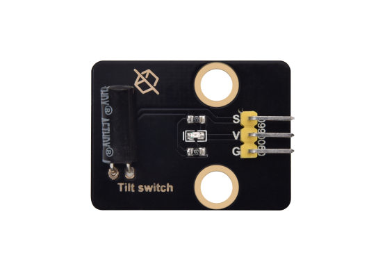        |          Keyestudio Tilt Sensor          |  1   |
|  |       Keyestudio PIR Motion Sensor       |  1   |
|               |   Keyestudio Obstacle Avoidance Sensor   |  1   |
|  |        Keyestudio 6812 RGB Module        |  1   |
|               |     Keyestudio NTC-MF52AT Thermistor     |  1   |
|               |         Keyestudio Photoresistor         |  1   |
|  |         Keyestudio Sound Sensor          |  1   |
|               |     Keyestudio Rotary Potentiometer      |  1   |
| 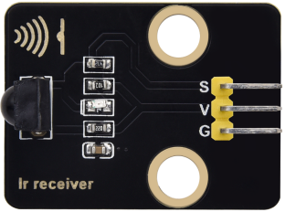 |          Keyestudio IR Receiver          |  1   |
| 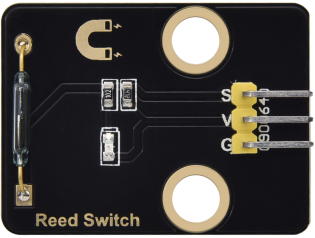 |      Keyestudio Reed Switch Sensor       |  1   |
|               |     Keyestudio Rotary Encoder Module     |  1   |
|  |        Keyestudio Joystick Module        |  1   |
|  | Keyestudio HT16K33 8X8 Dot Matrix Module |  1   |
|  |  Keyestudio TM1650 4-Digit Tube Display  |  1   |
|               |   Keyestudio Thin-film Pressure Sensor   |  1   |
|  |      Keyestudio DS1307 Clock Sensor      |  1   |
|  |    Keyestudio SR01 Ultrasonic Sensor     |  1   |
|               |               9G 90° Servo               |  1   |
|               |         Raspberry Pi Pico Board          |  1   |
|               |   Keyestudio Raspberry Pico IO Shield    |  1   |
|               | Keyestudio JMFP-4 17-Key Remote Control  |  1   |
|               |                USB Cable                 |  1   |
|               |             F-F Dupont Wire              |  1   |

## 3.Raspberry Pi Pico & Arduino IDE

### **3.1 Raspberry Pi Pico**


At the end of January 2021, the Raspberry Pi Foundation launched the Raspberry Pi Pico, which received a lot of attention due to its high-performance and low-cost.

The size of Pico is 21mm \*51mm, which is similar to Arduino Nano’s.

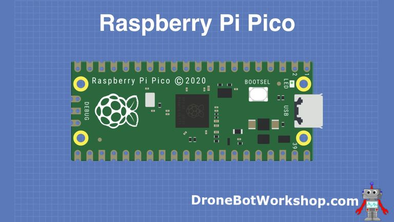

Raspberry Pi Pico is a low-cost, high-performance microcontroller board with flexible digital interfaces. It integrates the RP2040 microcontroller chip designed by Raspberry Pi, with dual-core Arm Cortex M0+ processor running up to 133 MHz, embedded 264KB of SRAM and 2MB of on-board Flash memory, as well as 26 multi-function GPIO pins. For software development, either Raspberry Pi's C/C++ SDK, or the MicroPython is available. In this tutorial, we will use MicroPython.


The bare board does not come with pins and you need to solder yourself. This is a well-made board that can also be used as an SMD component and soldered directly to a printed circuit board.


The most predominant feature on the board is the microUSB connector at one end. This is used both for communication and to supply power to the Pico. An on-board LED is mounted next to the microUSB connector, it is internally connected to GPIO pin 25. It’s worthwhile to note that this is the only LED on the entire Pico board.

The BOOTSEL pushbutton switch is mounted a bit down from the LED, it allows you to change the boot mode of the Pico so that you can load MicroPython onto it and perform drag-and-drop programming.

At the bottom of the board, you’ll see three connections, these are for a serial Debug option that we won’t be exploring here.

In the center of the board is the brains of the whole thing, the RP2040 MCU, which is capable of supporting up to 16MB of off-chip Flash memory, although in the Pico there is only 4MB.

-   Dual-core 32-bit Arm Cortex M0+ processor

-   Runs at 48MHz, but can be overclocked to 133MHz

-   30 GPIO pins

-   Can support USB Host or Device mode

-   8 Programmable I/O(PIO) state machines


The Pico is a 3.3V logic device, however, it can be powered with a range of power supplies thanks to a built-in voltage converter and regulator.

**GND:** Ground connection. 8 grounding wires plus an additional one on the 3-pin Debug connector. They are square as opposed to rounded like the other connections.

**VBUS:** This is the power from the microUSB bus, 5 V. If the Pico is not being powered by the microUSB connector then there will be no output here.

**VSYS:** This is the input voltage, which can range from 2 to 5V. The on-board voltage converter will change it to 3.3V for the Pico.

**3V3:** This is a 3.3V output from the Pico’s internal regulator. It can be used to power additional components, providing you keep the load under 300ma.

**3V3_EN:** You can use this input to disable the Pico’s internal voltage regulator, which will shut off the Pico and any components powered by it.

**RUN:** It can enable or disable the RP2040 microcontroller, it can also reset it.


There are 26 exposed GPIO connections on the Raspberry Pi Pico board. They are laid out pretty-well in order, with a“gap”between GP22 and GP26 (those“missing”pins are used internally). All these pins have multiple functions, and you can configure up to 16 of them for PWM. There are two I2C buses, two UARTs, and two SPI buses, these can be configured to use a wide variety of GPIO pins. 

The Pico has three Analog-to-Digital Converters, they are ADC0-GP26, ADC1-GP27, ADC2-GP28, and plus ADC-VREF converter used internally for an on-board temperature sensor. Note: The ADCs have a 12-bit resolution. However, the Micropython has scaled the 12-bit resolution into a 16-bit resolution, which means that we will receive ADC values from 0 to 65535. The microcontroller’s working voltage is 3.3V, indicating that 0 corresponds to 0V and 65535 corresponds to 3.3V.

You can also provide an external precision voltage-reference on the ADC_VREF pin. One of the grounds, the ADC_GND on pin 33 is used as a ground point for that reference.

| **Raspberry Pi Pico Configuration**                                     |
|-------------------------------------------------------------------------|
| Dual-core Arm Cortex-M0 + @ 133MHz                                      |
| 2 × SPI, 2 × I2C, 2 × UART                                              |
| 264KB of SRAM, and 2MB of on-board Flash memory                         |
| 16 PWM channels                                                         |
| QSPI bus controller, supporting up to 16 MB of external Flash memory    |
| USB 1.1 with host and device support                                    |
| DMA controller                                                          |
| 8 × Programmable I/O (PIO) state machines for custom peripheral support |
| 30 GPIO pins, 4 of which can optionally be used as analog inputs        |
| Drag-and-drop programming using mass storage over USB                   |

**Pin out**


Raspberry Pi did release a ton of technical documentation, plus a great guide called **Get Started with MicroPython on Raspberry Pi Pico**.  It’s available in softcover, and as a PDF download as well. 

For more information, please refer to:

<https://www.raspberrypi.com/products/raspberry-pi-pico/>

### **3.2 Install Arduino IDE and Driver**

#### **Installing Arduino IDE**

When you get control board, you need to download Arduino IDE and driver firstly.

You could download Arduino IDE from the official website:

<https://www.arduino.cc/>, click the **SOFTWARE** on the browse bar, click“DOWNLOADS” to enter download page, as shown below:


There are two versions of IDE for WINDOWS system. You can choose between the installer (.exe) and the Zip file. For installer, it can be directly downloaded, without the need of installing it manually. However, for Zip package, you will need to install the driver manually.


Click JUST DOWNLOAD.

#### Setting Arduino IDE

Clickicon，and open Arduino IDE.


A- Used to verify whether there is any compiling mistakes or not.

B- Used to upload the sketch to your Arduino board.

C- Used to create shortcut window of a new sketch.

D- Used to directly open an example sketch.

E- Used to save the sketch.

F- Used to send the serial data received from board to the serial monitor.

Set pico environment: (https://github.com/earlephilhower/arduino-pico)

Select(File) → (Preferences)


Copy the following URL in the Additional Boards Manager URLs page

<https://github.com/earlephilhower/arduino-pico/releases/download/global/package_rp2040_index.json>

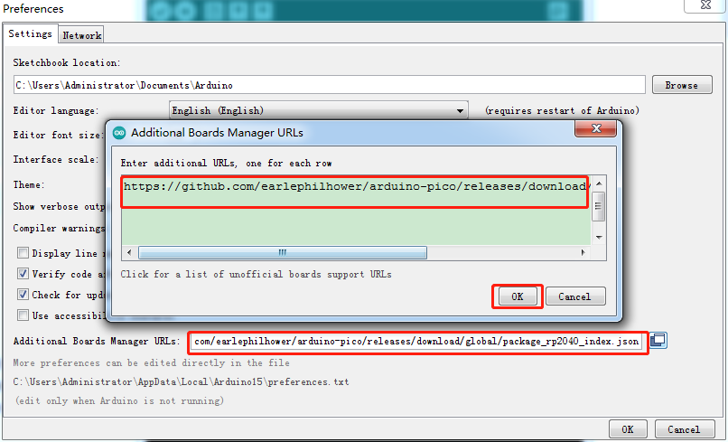

Click OK and return the mange page.

Select (Tools)→ (Board) → (Board Manager)

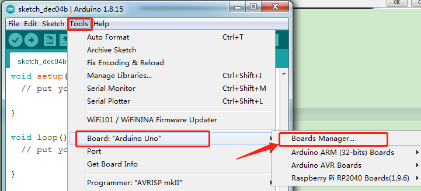

Enter pico in the searching bar, as shown below.

Then click Install.


The IDE is installed.

Then return the main page to select (Tools)→(Board) → Raspberry Pi RP2040 Boards(1.9.6) → Raspberry Pi Pico

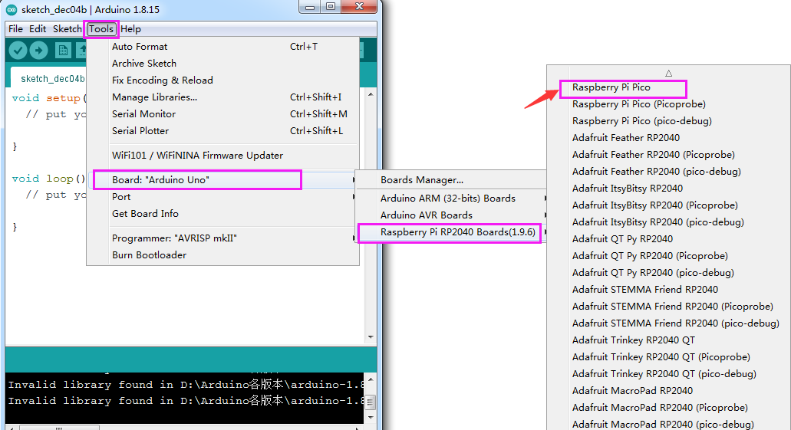

Select the development board and the port connected to Pico.

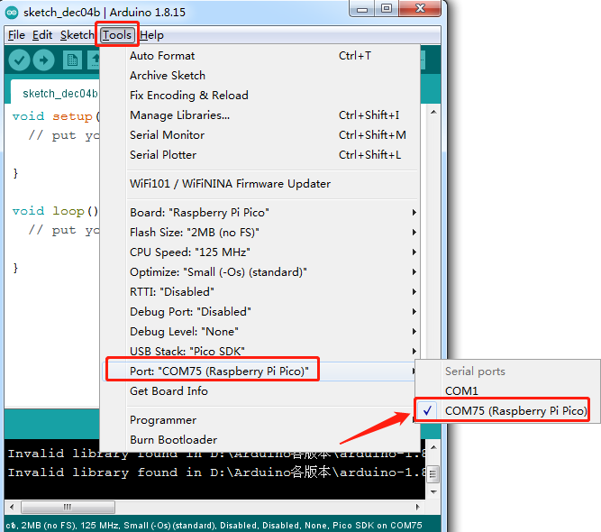

We can make on-board LED show changes of light brightness:

Select(File)→ (Examples)→ rp2040→ Fade.


**How to upload the test code**

1.  Power off the Pi Pico board

2.  Press and hold the white BOOTSEL button on the development board, then interface a power supply via a USB cable.
    
3.  Click  to upload and compile.

4.  Wait until the "Compiling sketch..." is compiled, and the following prompt message appears "Uploading...", then release the BOOTSEL button
    
5.  Release the BOOTSEL button if the information box shows“Uploading...”. The code won’t be uploaded successfully until “Done uploading.”appears

After uploading the test code, select the corresponding port and click **upload** directly. Then you can see that the LED on the development board become from dark to bright, then from bright to dark, like human breathe.

### 3.3 Add Libraries

Enter libraries folder of Arduino


Copy the needed libraries under this file.

Then the library is successfully added. 

## 4. Keyestudio Raspberry Pico IO Shield

### **Description**

The Keyestudio Raspberry Pico IO shield is designed for Raspberry Pi Pico. No soldering is required. To make the connection easier, interfaces on the shield have silkscreen.

On the shield, G, V and S represent GND, the VCC interface (3.3V) and digital ports or analog ports. 

The shield comes with pin headers with 2.54mm spacing, a reset button, a PWR power indicator and four LEGO position holes.

Additionally, it boasts a variety of communication interfaces as I2C, UART, SPI, analog IO and digital IO, and a power supply port(6.5-12V).

### **Specification：**

- Output current: ≦500mA

- DC input voltage: 6.5 - 12V

- Output voltage: DC 3.3V/5V

- Ambient temperature(recommended): -10°C \~ 50°C

- Dimensions: 45.339MM \*83.617MM

- Pin pitch: 2.54mm


### **Schematic Diagram**

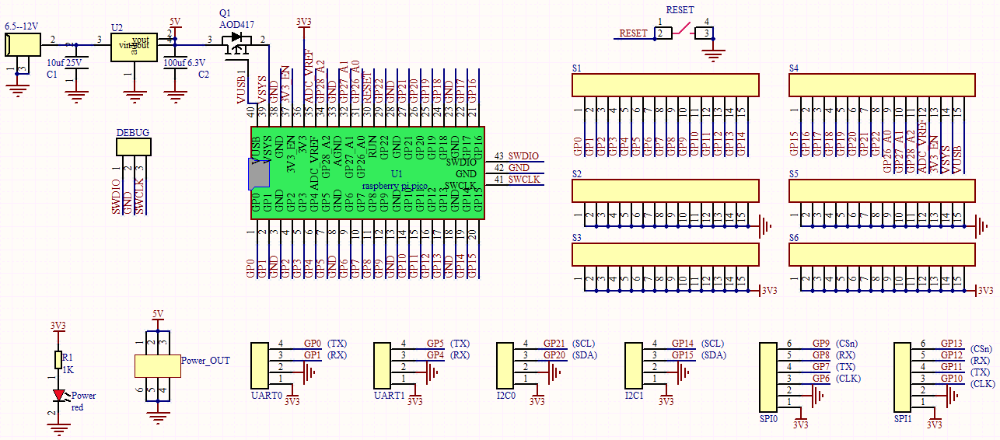

### **Pinout**


As shown below, stack the Raspberry Pi Pico board onto the Raspberry Pi Pico shield.


## 5. Projects

There are 24 sensors and modules in this kit. Next, we will analyze and introduce how they work step by step. Interface sensors with the Raspberry Pi Pico board and Pico shield, run test codes then observe experimental phenomenon.

**Note: please wire up components according to the given connection diagrams.**

### Project 1: Lighting up LED


#### **Overview**

In this project, we will make an experiment to light up the white LED module. The high and low levels can be controlled by programming, then the state of the LED can be controlled.

#### **Working Principle**

The two circuit diagrams are given. The left one is wrong wiring-up diagram. Why? Theoretically, when the S terminal outputs high levels, LED will receive the voltage and light up. 

Due to limitation of IO ports of Pico board, weak current can’t make LED brighten.

The right one is correct wiring-up diagram. GND and VCC are powered up. When the S terminal is a high level, the triode Q1 will be connected and LED will light up(note: current passes through LED and R3 to reach GND by VCC not IO ports). Conversely, when the S terminal is a low level, the triode Q1 will be disconnected and LED will go off.

The triode Q1 is equal to a switch and R1 and R3 stand for limited resistors which can curb the size of current to prevent from burning out components.


#### **Components**

|  |  |  |
| ------------------------------------------------------------ | ------------------------------------------------------------ | ------------------------------------------------------------ |
| Raspberry Pi Pico Board*1                                    | Raspberry Pi Pico Expansion Board*1                          | Keyestudio White LED Module*1                                |
|  |  |                                                              |
| 3P Dupont Wire*1                                             | Micro USB Cable*1                                            |                                                              |

#### **Wiring Diagram**


#### **Test Code**

**Code 1：**

```c
/*

\* Keyestudio 24 in 1 Starter Kit for Raspberry Pi Pico

\* lesson 1.1

\* LED

\* http://www.keyestudio.com

*/

void setup() {

pinMode(0, OUTPUT);//set GP0 to Output

digitalWrite(0, HIGH); //output high levels , light up

}

void loop() {

}
```

**Code 2：**

```c
/*

\* Keyestudio 24 in 1 Starter Kit for Raspberry Pi Pico

\* lesson 1.2

\* Blink

\* http://www.keyestudio.com

\*/

int ledPin = 0; //make the pin of LED connect to GP0

void setup() {

pinMode(ledPin, OUTPUT);//set mode to Output

}

void loop() {

digitalWrite(ledPin, HIGH); //output high levels，light up

delay(1000);//delay in 1000ms

digitalWrite(ledPin, LOW); //input low levels, go off

delay(1000);//delay in 1000ms

}
```

#### **Code Explanation**

**Code 1：**

**pinMode(pin,mode)**

pin stands for the pin of pico GPIO to set mode；mode: (Optional) input mode INPUT , OUTPUT or INPUT_PULLUP. We set pin0 to output.

**digitalWrite(pin, value)**

pin stands for the pin of GPIO.

We define GP0；value is the digital level to be output(HIGH/LOW).

When using pinMode(), need to set pin to OUTPUT and voltage to the corresponding value: 3.3V is HIGH，low level is 0V (grounded).

Not setting pinMode() to OUTPUT，when using digitalWrite (HIGH)，LED may get dim.

Hence digitalWrite() enables the pull-up resistor.

**Code 2：**

**Setup()**

run the code once, yet, the code in the function loop() loops

**delay(ms)**

delayed function. Data type: unsigned long（ 0\~ 4,294,967,295 (2\^32 - 1)）

Connect the signal end(GPO) of the module to ledpin, and set high level. Then LED will light up.

The second code, delay in 1000ms, means lighting up LED for 1s.

More details for Arduino: **https://www.arduino.cc/reference/en/**

#### **Test Result**

Code 1: upload the code and power on, the white LED lights up

Code 2: upload the code and power on, the white LED flashes with the interval of 1s.


### Project 2: Traffic Light Module


#### **Overview**

In this lesson, we will learn how to control multiple LED lights and simulate the operation of traffic lights.

Traffic lights are signal devices positioned at road intersections, pedestrian crossings, and other locations to control flows of traffic.

In this kit, we will use the traffic light module to simulate the traffic light.

#### **Working Principle**

In previous lesson, we already know how to control an LED. In this part, we only need to control three separated LEDs. Output high levels to the signal R(3.3V), then the red LED will be on.


#### **Components**

|  |  |  |
| ------------------------------------------------------------ | ------------------------------------------------------------ | ------------------------------------------------------------ |
| Raspberry Pi Pico Board*1                                    | Raspberry Pi Pico Shield*1                                   | Keyestudio DIY Traffic Lights Module*1                       |
|  | 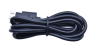 |                                                              |
| 5P Dupont Wire *1                                            | Micro USB Cable*1                                            |                                                              |

#### **Wiring Diagram**


#### **Test Code**

```c
/*

\* Keyestudio 24 in 1 Starter Kit for Raspberry Pi Pico

\* lesson 2

\* Traffic_Light

\* http://www.keyestudio.com

\*/

int greenPin = 12; //the green LED is connected to GP12

int yellowPin = 13; //the yellow LED is connected to GP13

int redPin = 14; //the red LED is linked with GP14

void setup() {

//set pins of the LED to OUTPUT

pinMode(greenPin, OUTPUT);

pinMode(yellowPin, OUTPUT);

pinMode(redPin, OUTPUT);

}

void loop() {

digitalWrite(greenPin, HIGH); //light up the green LED

delay(5000); //delay in 5s

digitalWrite(greenPin, LOW); //turn off the green LED

for (int i = 1; i \<= 3; i = i + 1) { //run three times

digitalWrite(yellowPin, HIGH); //light up the yellow LED

delay(500); //delay in 0.5s

digitalWrite(yellowPin, LOW); //turn off the yellow LED

delay(500); //delay in 0.5s

}

digitalWrite(redPin, HIGH); //light up the LED

delay(5000); //delay in 5s

digitalWrite(redPin, LOW); //turn off the red LED

}
```

#### **Code Explanation**

We use the function for(). for (int i = 1; i <= 3; i = i + 1) represents the variable i adds 1 fir each time from 1 to 3. 

The function for (int i = 255; i >= 0; i = i - 1) indicates that i reduces by 1 each time. When i<0, exit the for() loop and execute 256 times

#### **Test Result**

Upload the code, the green LED will be on for 5s then off, the yellow LED will flash for 3s then go off and the red one will be on 5s then off.


### Project 3: Button Sensor


#### **Overview**

In this kit, there is a Keyestudio single-channel button module, which mainly uses a tact switch and comes with a yellow button cap.

In previous lessons, we learned how to make the pins of our single-chip microcomputer output a high level or low level. In this experiment, we will read the high level (3.3V) and low level (0V).

We can determine whether the button on the sensor is pressed by reading the high and low level of the S terminal on the sensor.

#### **Working Principle**

The button module has four pins. The pin 1 is connected to the pin 3 and the pin 2 is linked with the pin 4. When the button is not pressed, they are disconnected. Yet, when the button is pressed, they are connected. If the button is released, the signal end is high level.


#### **Components**

|  |  | 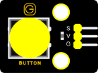 |
| ------------------------------------------------------------ | ------------------------------------------------------------ | -------------------------------------- |
| Raspberry Pi Pico Board*1                                    | Raspberry Pi Pico Shield*1                                   | Keyestudio Button Sensor*1             |
|  |  |                                        |
| 5P Dupont Wire *1                                            | Micro USB Cable*1                                            |                                        |

#### **Wiring Diagram**


#### **Test Code**

```c
/*

\* Keyestudio 24 in 1 Starter Kit for Raspberry Pi Pico

\* lesson 3

\* button

\* http://www.keyestudio.com

\*/

int val = 0; //used to save values of buttons

int button = 15; //the pin of the button is connected to GP15

void setup() {

Serial.begin(9600); //start the serial monitor and set baud rate to 9600

pinMode(button, INPUT); //set the pin of the button to INPUT

}

void loop() {

val = digitalRead(button); //read values of buttons and assign to the variable
val

Serial.print(val); //print on the serial port

if (val == 0) { //press the button to read low levels and print the relevant
information

Serial.print(" ");

Serial.println("Press the botton");

delay(100);

}

else { //print the pertinent information

Serial.print(" ");

Serial.println("Loosen the botton");

delay(100);

}

}
```

**Code Explanation**

1\. **pinMode(button, INPUT)**; set the pin of the button module to GP15 and INPUT.

Configure INPUT through pinMode(). INPUT must use the pull-up or pull-down resistor(ours module has the pull-up resistor RI).

2\. **Serial.begin(9600)**: Initialize serial communication and set the baud rate to 9600.

3\. **digitalRead(button)**: read the digital level of the button(HIGH or LOW). If this pin is not connected to pins, the digitalRead() will return HIGH or LOW.

4\. **if..else..**：if the logic behind () is true, execute the code of (); otherwise execute the code of **else**.

If the button is pressed, the signal end is low level, GP15 is low level and Val is 0. Then the monitor will show the corresponding value and characters; otherwise, the sensor is released, val is 1 and monitor will show 1 and other characters

#### **Test Result**

Upload the test code successfully. After powering on the USB cable, open the serial monitor and set the baud rate to 9600. The serial monitor will display the corresponding data and characters. When the button is pressed, val is 0, the monitor will show “Press the button”；when the button is released, val is 1, the monitor will show“Loosen the button”; as shown below


### Project 4: Obstacle Avoidance Sensor


#### **Overview**

In this kit, there is a Keyestudio obstacle avoidance sensor, which mainly uses an infrared emitting and a receiving tube. In the experiment, we will determine whether there is an obstacle by reading the high and low level of the S terminal on the sensor.

#### **Working Principle**

NE555 circuit provides IR signals with frequency to the emitter TX, then the IR signals will fade with the increase of transmission distance. If encountering the obstacle, it will be reflected back.

When the receiver RX meets the weak signals reflected back, the receiving pin will output high levels, which indicates the obstacle is far away. On the contrary, it the reflected signals are stronger, low levels will be output, which represents the obstacle is close. There are two potentiometers on the module, and one is for adjusting emission power, another one is for receiving frequency.


#### **Components**

|  |  |  |
| ------------------------------------------------------------ | ------------------------------------------------------------ | ------------------------------------------------------------ |
| Raspberry Pi Pico Board*1                                    | Raspberry Pi Pico Shield*1                                   | Keyestudio Obstacle Avoidance Sensor*1                       |
|  |                        |                                                              |
| 3P Dupont Wire*1                                             | Micro USB Cable*1                                            |                                                              |

#### **Wiring Diagram**


#### **Test Code**

```c
/*

\* Keyestudio 24 in 1 Starter Kit for Raspberry Pi Pico

\* lesson 4

\* obstacle avoidance sensor

\* http://www.keyestudio.com

\*/

int val = 0;

void setup() {

Serial.begin(9600);//set baud rate to 9600

pinMode(16, INPUT);//set GP16 to INPUT

}

void loop() {

val = digitalRead(16);//read digital levels

Serial.print(val);//print the read level signals

if (val == 0) {//check the obstacle

Serial.print(" ");

Serial.println("There are obstacles");

delay(100);

}

else {//the obstacle is not detected

Serial.print(" ");

Serial.println("All going well");

delay(100);

}

}
```

**Note:**

Upload the test code and wire up according to the connection diagram. After powering on, we start to adjust the two potentiometers to sense distance.

1.  Adjust the potentiometer transmitting power. Make the P LED at the critical point of ON and OFF states.

2. Adjust the potentiometer receiving frequency. Rotate it clockwise, the frequency will increase. Make the S LED at the critical point of ON and OFF states, then the 38KHz square wave can be produced.

#### **Test Result**

Upload the code power up by a USB cable, open the serial monitor and set baud rate to 9600. When the sensor detects the obstacle, the monitor will show“There are obstacles”; if the obstacle is not detected, “All going well” will be shown.


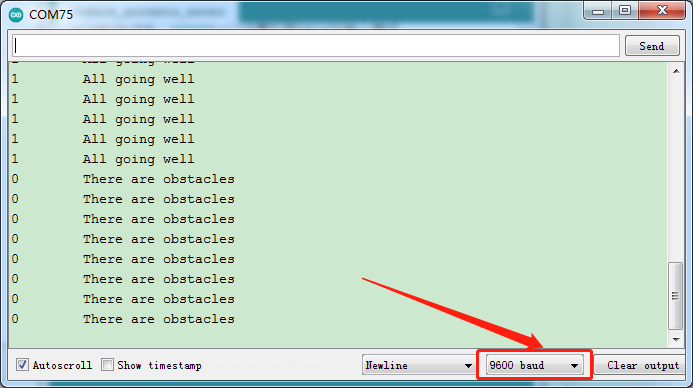

### Project 5: Tilt Module


#### **Overview**

In this kit, there is a Keyestudio tilt sensor. The tilt switch can output signals of different levels according to whether the module is tilted. There is a ball inside. When the switch is higher than the horizontal level, the switch is turned on, and when it is lower than the horizontal level, the switch is turned off. This tilt module can be used for tilt detection, alarm or other detection. 

#### **Working Principle**


The working principle is pretty simple. When pin 1 and 2 of the ball switch P1 are connected, the signal S is low level and the red LED will light up; when they are disconnected, the pin will be pulled up by the 4.7K R1 and make S a high level, then LED will be off.

#### **Components**

|  |  |  |
| ------------------------------------------------------------ | ------------------------------------------------------------ | ------------------------------------------------------------ |
| Raspberry Pi Pico Board*1                                    | Raspberry Pi Pico Shield*1                                   | Keyestudio Tilt Sensor*1                                     |
|  |                        |                                                              |
| 3P Dupont Wire*1                                             | Micro USB Cable*1                                            |                                                              |

#### **Wiring Diagram**

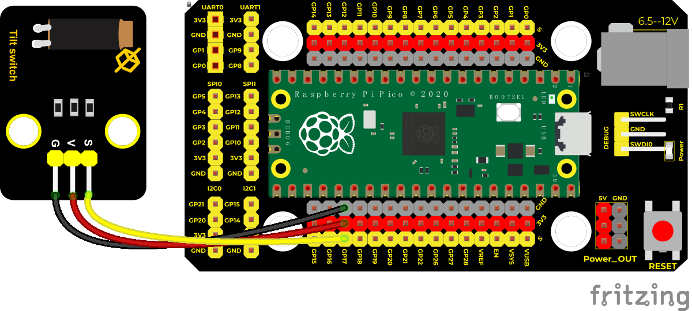

#### **Test Code**

```c
/*

\* Keyestudio 24 in 1 Starter Kit for Raspberry Pi Pico

\* lesson 5

\* Tilt switch

\* http://www.keyestudio.com

\*/

int val; //save the output level value of tilt sensor

void setup() {

Serial.begin(9600);

pinMode(17, INPUT); //Connect the tilt sensor pin to GP17, set GP17 to input

}

void loop() {

val = digitalRead(17); //read level signals of the module

Serial.println(val); //

delay(100); //delay in 100ms

}
```

#### **Test Result**

Upload the code power up by a USB cable, open the serial monitor and set baud rate to 9600.

Make the tilt module incline to one side, the red LED on the module will be off and the monitor will display“1”. In contrast, if you make it incline the other side, the red LED will light up and the monitor will display“0”.

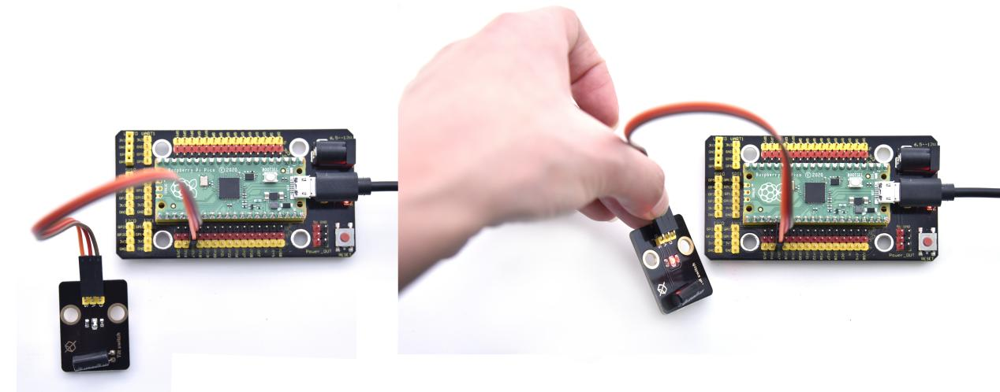


### Project 6: Reed Switch Module


#### **Overview**

In this kit, there is a Keyestudio reed switch module, which mainly uses a MKA10110 green reed component.

The reed switch is the abbreviation of the dry reed switch. It is a passive electronic switch element with contacts.

It has the advantages of simple structure, small size and easy control.

Its shell is a sealed glass tube with two iron elastic reed electric plates.

In the experiment, we will determine whether there is a magnetic field near the module by reading the high and low level of the S terminal on the module; and, we display the test result in the shell.


#### **Working Principle**

Reed switch is an abbreviation of the dry reed contacts a passive electronic switching elements, and has the advantages of simple structure, small size and ease of control, its shell is a sealed glass tube, the tubes are installed two iron elastic reed plate, but also filling called rhodium metal inert gas. 

In peacetime, the glass tube in the two reeds made of special materials are separated. When a magnetic substance close to the glass tube, in the role of the magnetic field lines, the pipe within the two reeds are magnetized to attract each other in contact, the reed will suck together, so that the junction point of the connected circuit communication. After the disappearance of the outer magnetic reed because of their flexibility and separate, the line is disconnected. 

Therefore, as a use of the magnetic field signals to control the line switching device, reed tube can be used as a sensor for counting the number, spacing, etc., and also are widely used in a variety of communication devices.

#### **Components**

|  |  |  |
| ------------------------------------------------------------ | ------------------------------------------------------------ | ------------------------------------------------------------ |
| Raspberry Pi Pico Board*1                                    | Raspberry Pi Pico Shield*1                                   | Keyestudio  Reed Switch Module*1                             |
|  |  |                                                              |
| 3P Dupont Wire*1                                             | Micro USB Cable*1                                            |                                                              |

#### **Wiring Diagram**


#### **Test Code**

```c
/*

\* Keyestudio 24 in 1 Starter Kit for Raspberry Pi Pico

\* lesson 6

\* Reed Switch

\* http://www.keyestudio.com

\*/

int val = 0;

int reedPin = 18; //the signal pin of reed switch module is GP18

void setup() {

Serial.begin(9600);//Set baud rate to 9600

pinMode(reedPin, INPUT);//set to INPUT

}

void loop() {

val = digitalRead(reedPin);//read digital levels

Serial.print(val);//

if (val == 0) {//magnetic field nearby

Serial.print(" ");

Serial.println("A magnetic field");

delay(100);

}

else {//no magnetic field

Serial.print(" ");

Serial.println("There is no magnetic field");

delay(100);

}

}
```

#### **Test Result**

Upload the code power up by a USB cable, open the serial monitor and set baud rate to 9600. When the sensor detects a magnetic field, val is 0 and the red LED of the module lights up, "A magnetic field" will be displayed; when no magnetic field is detected, val is 1, and the LED on the module goes out, "There is no magnetic field" will be shown, as shown below.


### Project 7: PIR Motion Sensor


#### **Overview**

In this kit, there is a Keyestudio PIR motion sensor, which mainly uses an RE200B-P sensor elements. It is a human body pyroelectric motion sensor based on pyroelectric effect, which can detect infrared rays emitted by humans or animals, and the Fresnel lens can make the sensor's detection range farther and wider.

In the experiment, we determine if there is someone moving nearby by reading the high and low levels of the S terminal on the module. The detected results will be displayed on the Shell.

#### **Working Principle**

The upper left part is voltage conversion(VCC to 3.3V). The working voltage of sensors we use is 3.3V, therefore we can’t use 5V directly. The voltage conversion circuit is needed.

When no person is detected or no infrared signal is received, and pin 1 of the sensor outputs low level. At this time, the LED on the module will light up and the MOS tube Q1 will be connected and the signal terminal S will detect Low levels. 

When one is detected or an infrared signal is received, and pin 1 of the sensor outputs a high level. Then LED on the module will go off, the MOS tube Q1 is disconnected and the signal terminal S will detect high levels.


#### **Components**

|  |  |  |
| ------------------------------------------------------------ | ------------------------------------------------------------ | ------------------------------------------------------------ |
| Raspberry Pi Pico Board*1                                    | Raspberry Pi Pico Shield*1                                   | Keyestudio PIR Motion Sensor*1                               |
|  |  |                                                              |
| 3P Dupont Wire*1                                             | Micro USB Cable*1                                            |                                                              |

#### **Wiring Diagram**


#### **Test Code**

```c
/*

\* Keyestudio 24 in 1 Starter Kit for Raspberry Pi Pico

\* lesson 7

\* PIR motion

\* http://www.keyestudio.com

\*/

int val = 0;

int pirPin = 19; //set the pin of PIR motion sensor to GP19

void setup() {

Serial.begin(9600); //Set baud rate to 9600

pinMode(pirPin, INPUT); //set the sensor to INPUT

}

void loop() {

val = digitalRead(pirPin); //read the value of the sensor

Serial.print(val);//print val

if (val == 1) {//if there are people nearby, high levels will output

Serial.print(" ");

Serial.println("Some body is in this area!");

delay(100);

}

else {//if not detecting people, low levels will output

Serial.print(" ");

Serial.println("No one!");

delay(100);

}

}
```

#### **Test Result**

Upload the code power up by a USB cable, open the serial monitor and set baud rate to 9600. When the sensor detects someone nearby, value is 1, the LED will go off and the monitor will show“Somebody is in this area!”. In contrast, the value is 0, the LED will go up and“0 No one!”will be shown.


### Project 8: Active Buzzer


#### **Overview**

In this kit, it contains an active buzzer module and a power amplifier module (the principle is equivalent to a passive buzzer). In this experiment, we control the active buzzer to emit sounds. Since it has its own oscillating circuit, the buzzer will automatically sound if given large voltage.

#### **Working Principle**


From the schematic diagram, the pin of buzzer is connected to a resistor R2 and another port is linked with a NPN triode Q1. So, if this triode Q1 is powered, the buzzer will sound.

If the base electrode of the triode connected to the R1 resistor is a high level, the triode Q1 will be connected. If the base electrode is pulled down by the resistor R3, the triode is disconnected.

When we output a high level from the IO port to the triode, the buzzer will emit sounds; if outputting low levels, the buzzer won’t emit sounds.

#### **Components**

|  |  |  |
| ------------------------------------------------------------ | ------------------------------------------------------------ | ------------------------------------------------------------ |
| Raspberry Pi Pico Board*1                                    | Raspberry Pi Pico Shield*1                                   | Keyestudio Active Buzzer*1                                   |
|  |  |                                                              |
| 3P Dupont Wire*1                                             | Micro USB Cable*1                                            |                                                              |

#### **Wiring Diagram**


#### **Test Code**

```c
/*

\* Keyestudio 24 in 1 Starter Kit for Raspberry Pi Pico

\* lesson 8

\* Active buzzer

\* http://www.keyestudio.com

\*/

int buzzer = 20; //set the pin of the active sensor to GP20

void setup() {

pinMode(buzzer, OUTPUT);//set OUTPUT

}

void loop() {

digitalWrite(buzzer, HIGH); //stop beeping

delay(1000);

digitalWrite(buzzer, LOW); //stop beeping

delay(1000);

}
```

#### **Code Explanation**

In the experiment, we set the pin number to 20. When setting to high, the active buzzer will beep; when setting to low, the active buzzer will stop emitting sounds

#### **Test Result**

Upload the code and power on. The active buzzer will emit sound for 1 second, and stop for 1 second.


### Project 9: 8002b Audio Power Amplifier


#### **Overview**

In this kit, there is a Keyestudio 8002b audio power amplifier. The main components of this module are an adjustable potentiometer, a speaker, and an audio amplifier chip;

The main function of this module is: it can amplify the output audio signal, with a magnification of 8.5 times, and play sound or music through the built-in low-power speaker, as an external amplifying device for some music playing equipment.

In the experiment, we used the 8002b power amplifier speaker module to emit sounds of various frequencies. 

#### **Working Principle**

In fact, it is similar to a passive buzzer. The active buzzer has its own oscillation source. Yet, the passive buzzer does not have internal oscillation. When controlling the circuit, we need to input square waves of different frequencies to the positive pole of the component and ground the negative pole to control the buzzer to chime sounds of different frequencies.


#### **Components**

|  |  |  |
| ------------------------------------------------------------ | ------------------------------------------------------------ | ------------------------------------------------------------ |
| Raspberry Pi Pico Board*1                                    | Raspberry Pi Pico Shield*1                                   | Keyestudio 8002b Audio Power Amplifier*1                     |
|  |  |                                                              |
| 3P Dupont Wire*1                                             | Micro USB Cable*1                                            |                                                              |

#### **Wiring Diagram**


#### **Test Code**

```c
/*

\* Keyestudio 24 in 1 Starter Kit for Raspberry Pi Pico

\* lesson 9

\* Passive buzzer

\* http://www.keyestudio.com

\*/

int beeppin = 21; //set the pin of the power amplifier to GP21

void setup() {

pinMode(beeppin, OUTPUT);//set the digital port of the power amplifier to
OUTPUT

}

void loop() {

tone(beeppin, 262);//emit DO for 1000ms

delay(1000);

tone(beeppin, 294);//emit Re for 750ms

delay(750);

tone(beeppin, 330);//emit Mi for 625ms

delay(625);

tone(beeppin, 349);//emit Fa for 500ms

delay(500);

tone(beeppin, 392);//emit So for 375ms

delay(375);

tone(beeppin, 440);//emit La for 250ms

delay(250);

tone(beeppin, 494);//emit Si for 125ms

delay(125);

noTone(beeppin);//stop playing for 100ms

delay(1000);

}
```

#### **Code Explanation**

In the experiment, we use the function tone(). We set pin to 21. Function tone generates waves of frequency.

#### **Test Result**

Upload the test code successfully and power on. The power amplifier module will emit the sound of the corresponding frequency corresponding to the beat:

Do for one beat, Re for 0.75 beat, Mi for 0.625, Fa for 1/2 beat, So for 0.375 beat, La for 1/4 beat and Si for 0.125 beat.


### Project 10: RGB Module

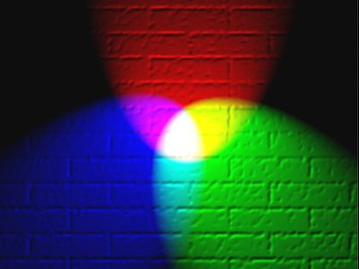

#### **Overview**

Among these modules is a RGB module. It adopts a F10-full color RGB foggy common cathode LED. We connect the RGB module to the PWM port of MCU and the other pin to GND(for common anode RGB, the rest pin will be connected to VCC). So what is PWM?

PWM is a means of controlling the analog output via digital means. Digital control is used to generate square waves with different duty cycles (a signal that constantly switches between high and low levels) to control the analog output.

In general, the input voltages of ports are 0V and 5V. What if the 3V is required? Or a switch among 1V, 3V and 3.5V? We cannot change resistors constantly. For this reason, we resort to PWM. 


For Arduino digital port voltage outputs, there are only LOW and HIGH levels, which correspond to the voltage outputs of 0V and 5V respectively. You can define LOW as “0” and HIGH as “1’, and let the Arduino output five hundred ‘0’ or “1” within 1 second. If output five hundred ‘1’, that is 5V; if all of which is‘0’,that is 0V; if output 250 01 pattern, that is 2.5V. 

This process can be likened to showing a movie. The movie we watch are not completely continuous. Actually, it generates 25 pictures per second, which cannot be told by human eyes. Therefore, we mistake it as a continuous process. PWM works in the same way. To output different voltages, we need to control the ratio of 0 and 1. The more‘0’or‘1’ output per unit time, the more accurate the control.

#### **Working Principle**

For our experiment, we will control the RGB module to display different colors through three PWM values.


#### **Components**

|  |  |  |
| ------------------------------------------------------------ | ------------------------------------------------------------ | ------------------------------------------------------------ |
| Raspberry Pi Pico Board*1                                    | Raspberry Pi Pico Shield*1                                   | Keyestudio Common Cathode RGB Module *1                      |
|  |  |                                                              |
| 4P Dupont Wire*1                                             | Micro USB Cable*1                                            |                                                              |

#### **Wiring Diagram**


#### **Test Code**

**Code 1：**

```c
/*

\* Keyestudio 24 in 1 Starter Kit for Raspberry Pi Pico

\* lesson 10.1

\* rgb_1

\* http://www.keyestudio.com

\*/

int redPin = 9; //the red LED is connected to GP9

int greenPin = 10; //the green LED is connected to GP10

int bluePin = 11; //the blue LED is connected to GP11

void setup(){

//

pinMode(redPin, OUTPUT);

pinMode(greenPin, OUTPUT);

pinMode(bluePin, OUTPUT);

}

void loop(){

//red color

digitalWrite(redPin,HIGH);

digitalWrite(greenPin,LOW);

digitalWrite(bluePin,LOW);

delay(1000);

//green color

digitalWrite(redPin,LOW);

digitalWrite(greenPin,HIGH);

digitalWrite(bluePin,LOW);

delay(1000);

//blue color

digitalWrite(redPin,LOW);

digitalWrite(greenPin,LOW);

digitalWrite(bluePin,HIGH);

delay(1000);

}
```

**Code 2：**

```c
/*

\* Keyestudio 24 in 1 Starter Kit for Raspberry Pi Pico

\* lesson 10.2

\* rgb_2

\* http://www.keyestudio.com

\*/

int redPin = 9; //the red LED is connected to GP9

int greenPin = 10; //the green LED is connected to GP10

int bluePin = 11; //the blue LED is connected to GP11

void setup() {

pinMode(redPin, OUTPUT);

pinMode(greenPin, OUTPUT);

pinMode(bluePin, OUTPUT);

}

void loop() {

//red(255, 0, 0)

analogWrite(9, 255);

analogWrite(10, 0);

analogWrite(11, 0);

delay(1000);

//orange(255, 97, 0)

analogWrite(9, 255);

analogWrite(10, 97);

analogWrite(11, 0);

delay(1000);

//yellow(255, 255, 0)

analogWrite(9, 255);

analogWrite(10, 255);

analogWrite(11, 0);

delay(1000);

//green(0, 255, 0)

analogWrite(9, 0);

analogWrite(10, 255);

analogWrite(11, 0);

delay(1000);

//blue(0, 0, 255)

analogWrite(9, 0);

analogWrite(10, 0);

analogWrite(11, 255);

delay(1000);

//cyan-blue(0, 255, 255)

analogWrite(9, 0);

analogWrite(10, 255);

analogWrite(11, 255);

delay(1000);

//purple(160, 32, 240)

analogWrite(9, 160);

analogWrite(10, 32);

analogWrite(11, 240);

delay(1000);

}
```

**Code Explanation**

**Code 1：**

For code 1, RGB stands for corresponding ports of red, green and blue.

According to the connection diagram, GP9,GP10 and GP11 are connected, then we set 9, 10 and 11 and HOGH and LOW. If setting to HIGH, the LED will light up.

RGB LED shows red color for 1s, green color for 1s, blue color for 1s

**Code 2：**

In code 2, we use PWM output. According to the wiring diagram, we connect GP9, GP10 and GP11 and set to 9 10 11.

(Note: The PWM output of pico is normally 0\~65535, and we use adjust it to 0\~255).

In the experiment, we adjust the ratio of red, green and blue colors on the RGB LED by setting the corresponding values, so as to control the RGB LED to display corresponding colors. So theoretically, there are 256\*256\*256 colors that can be set (for details, please refer to the common RGB color table below)

**RGB Color Chart**


#### **Test Result**

Upload the code 1, the RGB on the module will show red, green and blue color with an interval of 1s.

Upload the code 2, the RGB on the module will show red, orange, yellow, green, cyan-blue, blue, purple and white color with an interval of 1s.


### Project 11: Potentiometer


#### **Overview**

The following we will introduce is the Keyestudio rotary potentiometer which is an analog sensor.

The digital IO ports can read the voltage value between 0 and 3.3V and the module only outputs high levels. However, the analog sensor can read the voltage value through ADC analog ports(GP26\~GP28) on the pico board.

In the experiment, we will display the test results on the Shell.

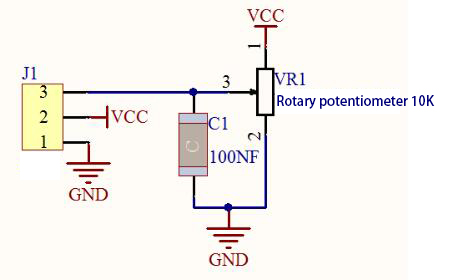

#### **Working Principle**

It uses a 10K adjustable resistor. We can change the resistance by rotating the potentiometer. The signal S can detect the voltage changes(0-3.3V) which are analog quantity

#### **Components**

|  |  |  |
| ------------------------------------------------------------ | ------------------------------------------------------------ | ------------------------------------------------------------ |
| Raspberry Pi Pico Board*1                                    | Raspberry Pi Pico Shield*1                                   | Keyestudio Rotary Potentiometer*1                            |
|  |  |                                                              |
| 3P Dupont Wire*1                                             | Micro USB Cable*1                                            |                                                              |

#### **Wiring Diagram**


#### **Test Code**

```c
/*

\* Keyestudio 24 in 1 Starter Kit for Raspberry Pi Pico

\* lesson 11

\* Rotary potentiometer

\* http://www.keyestudio.com

\*/

int analogVal = 0;

int resPin = 26; //the potentiometer is connected to ADC0

void setup() {

Serial.begin(9600);//Set baud rate to 9600

}

void loop() {

analogVal = analogRead(resPin);//read the value of the potentiometer

Serial.println(analogVal);//print analog value

delay(100);//delay in 100ms

}
```

#### **Code Explanation**

**analogVal** means analog value. The rotary potentiometer outputs analog values(0\~4095), therefore, we set pins to analog ports. For example, we connect to ADC0(GP26)

**analogRead(pin)**: read the value of the specified analog pin. The pico board contains a multi-channel, 12-bit converter. This means that it will map the input voltage between 0 and the working voltage (5V or 3.3V ) to an integer value between 0 and 4095. For example, this will produce a resolution among readings: 3.3V/4096 stands for 0.0008V per unit.

**Pin**: the name of analog input pin. GP26 is connected to GP28, GP29 measures VSYS voltage and ADC4 measures the internal temperature.

#### **Test Result**

Upload the code power up by a USB cable, open the serial monitor and set baud rate to 9600.

In the experiment, rotate the potentiometer clockwise, the analog value increases, and turn the potentiometer counterclockwise, the analog value decreases(0-4095), as shown in the figure below.


### Project 12: Sound Sensor


#### **Overview**

In this kit, there is a sound sensor. In the experiment, we test the analog value corresponding to the sound level in the current environment with it. The louder the sound, the larger the analog value;

#### **Working Principle**


It uses a high-sensitive microphone component and an LM386 chip.

We build the circuit with the LM386 chip and amplify the sound through the high-sensitive microphone. In addition, we can adjust the sound volume by the potentiometer. Rotate it clockwise, the sound will get louder.

#### **Components**

|  |  |  |
| ------------------------------------------------------------ | ------------------------------------------------------------ | ------------------------------------------------------------ |
| Raspberry Pi Pico Board*1                                    | Raspberry Pi Pico Shield*1                                   | Keyestudio Sound Sensor*1                                    |
|  |  |                                                              |
| 3P Dupont Wire*1                                             | Micro USB Cable*1                                            |                                                              |

#### **Wiring Diagram**


#### **Test Code**

```c
/*

\* Keyestudio 24 in 1 Starter Kit for Raspberry Pi Pico

\* lesson 12

\* MicroPhone

\* http://www.keyestudio.com

\*/

int val = 0;

int Microphone = 27; //microphone is connected to ADC1

void setup() {

Serial.begin(9600);//Set baud rate to 9600

}

void loop() {

val = analogRead(Microphone); //read the value of the sensor and assign to the
variable val

Serial.println(val); //print the analog value

delay(100); //delay in 100MS

}
```

#### **Test Result**

Upload the code power up by a USB cable, open the serial monitor and set baud rate to 9600. Rotate clockwise the potentiometer and speak at the MIC. Then you can see the analog value get larger, as shown below


### Project 13: Photoresistor


#### **Description**

In this kit, there is a photoresistor which consists of photosensitive resistance elements. Its resistance changes with the light intensity. Also, it converts the resistance change into a voltage change through the characteristic of the photosensitive resistive element. When wiring it up, we interface its signal terminal (S terminal) with the analog port of pico, so as to sense the change of the analog value, and display the corresponding analog value in the shell.

#### **Working Principle**

If there is no light, the resistance is 0.2MΩ and the detected voltage at the terminal 2 is close to 0. When the light intensity increases, the resistance of photoresistor and detected voltage will diminish. 

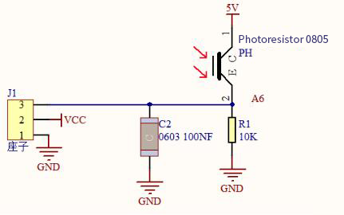

#### **Components**

|  |  |  |
| ------------------------------------------------------------ | ------------------------------------------------------------ | ------------------------------------------------------------ |
| Raspberry Pi Pico Board*1                                    | Raspberry Pi Pico Shield*1                                   | Keyestudio Photoresistor*1                                   |
|  |  |                                                              |
| 3P Dupont Wire*1                                             | Micro USB Cable*1                                            |                                                              |

#### **Wiring Diagram**


#### **Test Code**

```c
/*

\* Keyestudio 24 in 1 Starter Kit for Raspberry Pi Pico

\* lesson 13

\* Photoresistance

\* http://www.keyestudio.com

\*/

int val = 0;

int photoPin = 28; //analog port ADC2 of photoresistor

void setup() {

Serial.begin(9600);//set baud rate to 9600

}

void loop() {

val = analogRead(photoPin);//read the value of the sensor

Serial.println(val);//print values

delay(100);//delay in 100MS

}
```

#### **Test Result**

Upload the code power up by a USB cable, open the serial monitor and set baud rate to 9600. When the light intensity gets stronger, the analog value will get larger, as shown below;


### Project 14: NTC-MF52AT Thermistor


#### **Overview**

In the experiment, there is a NTC-MF52AT analog thermistor. We connect its signal terminal to the analog port of the Raspberry Pi Pico Board and read the corresponding analog value. 

We can use analog values to calculate the temperature of the current environment through specific formulas. Since the temperature calculation formula is more complicated, we only read the corresponding analog value. 

#### **Working Principle**


This module mainly uses NTC-MF52AT thermistor elements. The NTC-MF52AT thermistor element can sense the changes of the surrounding environment temperature. Resistance changes with the temperature, causing the voltage of the signal terminal S to change. 

This sensor uses the characteristics of NTC-MF52AT thermistor element to  convert resistance changes into voltage changes. 

#### **Components**

|  |  | 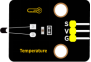 |
| ------------------------------------------------------------ | ------------------------------------------------------------ | ------------------------------------------------------------ |
| Raspberry Pi Pico Board*1                                    | Raspberry Pi Pico Shield*1                                   | Keyestudio NTC-MF52AT Thermistor*1                           |
|  |  |                                                              |
| 3P Dupont Wire*1                                             | Micro USB Cable*1                                            |                                                              |

#### **Wiring Diagram**


#### **Test Code**

```c
/*

\* Keyestudio 24 in 1 Starter Kit for Raspberry Pi Pico

\* lesson 14

\* Temperature sensor

\* http://www.keyestudio.com

\*/

int val;

int ntcPin = 26; //NTC-MF52AT analog thermistor is connected to ADC0

void setup() {

Serial.begin(9600);//Set baud rate to 9600

}

void loop() {

val = analogRead(ntcPin); //read the analog temperature value

Serial.println(val); //read and print the analog vale of photoresistor

delay(100);//delay in 100ms

}
```

#### **Test Result**

Upload the code power up by a USB cable, open the serial monitor and set baud rate to 9600. The higher the temperature, the larger the analog value.


### Project 15: Thin-film Pressure Sensor


#### **Overview**

In this kit, there is a Keyestudio thin-film pressure sensor. The thin-film pressure sensor composed of a new type of nano pressure-sensitive material and a comfortable ultra-thin film substrate, has waterproof and pressure-sensitive functions.

In the experiment, we determine the pressure by collecting the analog signal on the S end of the module. The smaller the analog value, the greater the pressure; and the displayed results will shown on the Shell.

#### **Working Principle**

When the sensor is pressed by external forces, the resistance value of sensor will vary. We convert the pressure signals detected by the sensor into the electric signals through a circuit. Then we can obtain the pressure changes by detecting voltage signal changes.


#### **Components**

|  |  |  |
| ------------------------------------------------------------ | ------------------------------------------------------------ | ------------------------------------------------------------ |
| Raspberry Pi Pico Board*1                                    | Raspberry Pi Pico Shield*1                                   | Keyestudio  Thin-film Pressure Sensor*1                      |
|  |  |                                                              |
| 3P Dupont Wire*1                                             | Micro USB Cable*1                                            |                                                              |

#### **Wiring Diagram**


#### **Test Code**

```c
/*

\* Keyestudio 24 in 1 Starter Kit for Raspberry Pi Pico

\* lesson 15

\* Film pressure sensor

\* http://www.keyestudio.com

\*/

int val = 0;

int Film = 27; //the thin-film pressure sensor is connected ADC1

void setup() {

Serial.begin(9600);//Set baud rate to 9600

}

void loop() {

val = analogRead(Film);//read the analog value

Serial.println(val);//print the analog value

delay(100);//delay in 1000ms

}
```

#### **Test Result**

Upload the code power up by a USB cable, open the serial monitor and set baud rate to 9600. when the thin-film is pressed by fingers, the analog value will decrease, as shown below;


### Project 16: Joystick Module


#### **Overview**

Game handle controllers are ubiquitous.

It mainly uses PS2 joysticks. When controlling it, we need to connect the X and Y ports of the module to the analog port of the single-chip microcomputer, port B to the digital port of the single-chip microcomputer, VCC to the power output port(3.3-5V), and GND to the GND of the MCU. We can read the high and low levels of two analog values and one digital port) to determine the working status of the joystick on the module.

In the experiment, two analog values(x axis and y axis) will be shown on Shell.

#### **Working Principle**


In fact, its working principle is very simple. Its inside structure is equivalent to two adjustable potentiometers and a button. When this button is not pressed and the module is pulled down by R1, low levels will be output ; on the contrary, when the button is pressed, VCC will be connected (high levels), When we move the joystick, the internal potentiometer will adjust to output different voltages, and we can read the analog value.

#### **Components**

|  |  |  |
| ------------------------------------------------------------ | ------------------------------------------------------------ | ------------------------------------------------------------ |
| Raspberry Pi Pico Board*1                                    | Raspberry Pi Pico Shield*1                                   | Keyestudio Joystick Module*1                                 |
|  |  |                                                              |
| 5P Dupont Wire*1                                             | Micro USB Cable*1                                            |                                                              |

#### **Wiring Diagram**

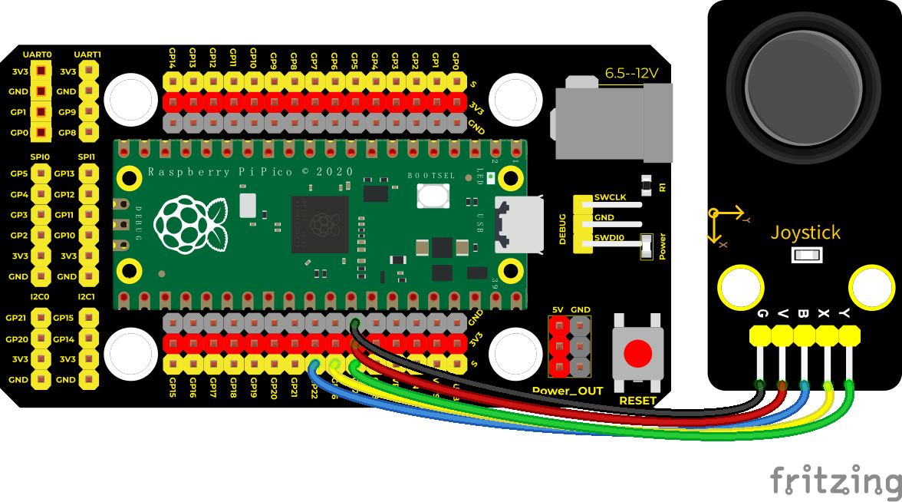

#### **Test Code**

```c
/*

\* Keyestudio 24 in 1 Starter Kit for Raspberry Pi Pico

\* lesson 16

\* Joystick

\* http://www.keyestudio.com

\*/

int X = 0;

int Y = 0;

int Button = 0;

void setup() {

Serial.begin(9600);

pinMode(22, INPUT); //set the pin of the button to GP22

}

void loop() {

X = analogRead(26); //the pin of the x axis is connected to ADC0

Y = analogRead(27); //the pin of Y axis is connected to ADC1

Button = digitalRead(22); //read the status of the button and print

Serial.write("X:");

Serial.print(X);

Serial.write(" Y:");

Serial.print(Y);

Serial.write(" B:");

Serial.println(Button);

delay(100);

}
```

#### **Code Explanation**

In the experiment, according to the wiring diagram, the x pin is set to GP26, the y pin is set to GP27 and the pin of the joystick is set to GP22. Teen the serial monitor displays the test data.

#### **Test Result**

Upload the code power up by a USB cable, open the serial monitor and set baud rate to 9600.

The serial monitor will show the corresponding value. Move the joystick, the analog value of X axis and Y axis will change. Press the button, the digital value is 1, on the contrary is 0. as shown below;


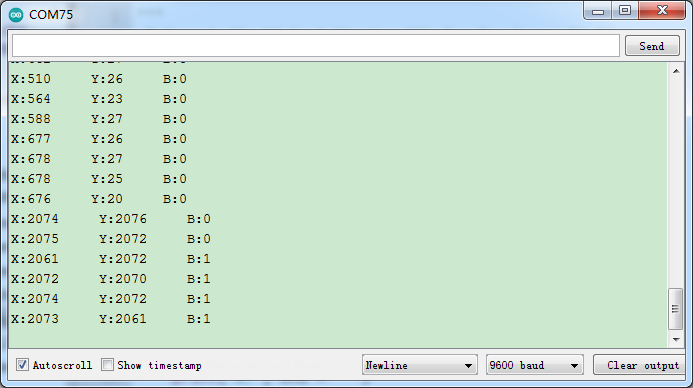

### Project 17: SK6812 RGB Module


#### **Overview**

In previous lessons, we learned about the plug-in RGB module and used PWM signals to color the three pins of the module. 

There is a Keyestudio 6812 RGB module whose the driving principle is different from the plug-in RGB module. It can only control with one pin. This is a set. It is an intelligent externally controlled LED light source with the control circuit and the light-emitting circuit. Each LED element is the same as a 5050 LED lamp bead, and each component is a pixel. There are four lamp beads on the module, which indicates four pixels

In the experiment, we make different lights show different colors. 

#### **Working Principle**

From the schematic diagram, we can see that these four pixel lighting beads are all connected in series. In fact, no matter how many they are, we can use a pin to control a light and let it display any color. The pixel point contains a data latch signal shaping amplifier drive circuit, a high-precision internal oscillator and a 12V high-voltage programmable constant current control part, which effectively ensures the color of the pixel point light is highly consistent.

The data protocol adopts a single-wire zero-code communication method. After the pixel is powered up and reset, the S terminal receives the data transmitted from the controller. The first 24bit data sent is extracted by the first pixel and sent to the data latch of the pixel.


#### **Components**

|  |  |  |
| ------------------------------------------------------------ | ------------------------------------------------------------ | ------------------------------------------------------------ |
| Raspberry Pi Pico Board*1                                    | Raspberry Pi Pico Shield*1                                   | Keyestudio 6812 RGB Module*1                                 |
|  |  |                                                              |
| 3P Dupont Wire*1                                             | Micro USB Cable*1                                            |                                                              |

#### **Wiring Diagram**


#### **Test Code**

```c
/*

\* Keyestudio 24 in 1 Starter Kit for Raspberry Pi Pico

\* lesson 17

\* 6812 RGB LED

\* http://www.keyestudio.com

\*/

\#include"rgb.h"

RGB rgb(16,4); //rgb(pin, num); num = 0-100

///////////////////////////////////////////////////////////////////////////////////

void setup() {

rgb.setBrightness(100); //rgb.setBrightness(0-255);

delay(10);

rgb.clear(); //Turn off all leds

delay(10);

}

///////////////////////////////////////////////////////////////////////////////////

void loop() {

while(1){

rgb.setPixelColor(0,255,0,0); //rgb.setPixelColor(num,r,g,b); num = 0-100

rgb.setPixelColor(1,0,255,0); //rgb.setPixelColor(num,r,g,b); num = 0-100

rgb.setPixelColor(2,0,0,255); //rgb.setPixelColor(num,r,g,b); num = 0-100

rgb.setPixelColor(3,255,255,255); //rgb.setPixelColor(num,r,g,b); num =
0-100

rgb.show();

delay(1000);

}

}
```

#### **Code Explanation**

We use the library function. You can refer to project **Add libraries.**

Interfaces and functions：

**RGB rgb(16,4); used to initialize** 6812RGB，16 is the pin number，4 means the number of light beads

**rgb.setBrightness(100);** used to set the brightness(0-255) of the 6812RGB module. The larger the brightness value, the brighter light beads. 255 means the brightest.

**rgb.clear(); used to clear up the screen**

**rgb.setPixelColor(uint16_t n, uint8_t r, uint8_t g, uint8_t b);** this function is used to set locations of light beads of the 6812RGB module.

**rgb.show();** used to display 6812RGB，necessary, if without this sentence, light beads can’t refresh.

#### **Test Result**

Upload the test code, wire up and power up. Then we can the module display red, green, blue and white color.

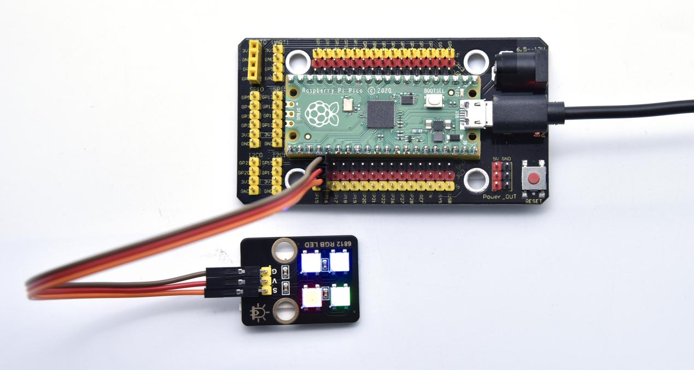

### Project 18: Rotary Encoder


#### **Overview**

In this kit, there is a Keyestudio rotary encoder, dubbed as switch encoder. It is applied to automotive electronics, multimedia audio, instrumentation, household appliances, smart home, medical equipment and so on.

In the experiment, it it used for counting. When we rotate the rotary encoder clockwise, the set data falls by 1; if you rotate it anticlockwise, the set data is up 1; and when the middle button is pressed, the value will be show on Shell.

#### **Working Principle**


The incremental encoder converts the displacement into a periodic electric signal, and then converts this signal into a counting pulse, and the number of pulses indicates the size of the displacement.

This module mainly uses 20-pulse rotary encoder components. It can calculate the number of pulses output during clockwise and reverse rotation. There is no limit to count rotation. It resets to the initial state, that is, starts counting from 0.    

#### **Components**

|  |  |  |
| ------------------------------------------------------------ | ------------------------------------------------------------ | ------------------------------------------------------------ |
| Raspberry Pi Pico Board*1                                    | Raspberry Pi Pico Shield*1                                   | Keyestudio  Rotary Encoder*1                                 |
|  |  |                                                              |
| 5P Dupont Wire*1                                             | Micro USB Cable*1                                            |                                                              |

#### **Wiring Diagram**

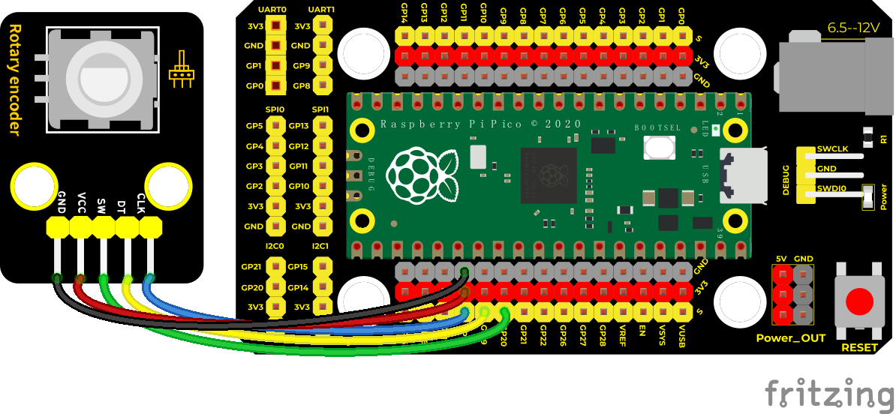

#### **Test Code**

```c
/*

Keyestudio 24 in 1 Starter Kit for Raspberry Pi Pico

lesson 18

Encoder

http://www.keyestudio.com

\*/

//Interfacing Rotary Encoder with Arduino

//Encoder Switch -\> pin 20

//Encoder DT -\> pin 19

//Encoder CLK -\> pin 18

int Encoder_DT = 19;

int Encoder_CLK = 18;

int Encoder_Switch = 20;

int Previous_Output;

int Encoder_Count;

void setup() {

Serial.begin(9600);

//pin Mode declaration

pinMode (Encoder_DT, INPUT);

pinMode (Encoder_CLK, INPUT);

pinMode (Encoder_Switch, INPUT);

Previous_Output = digitalRead(Encoder_DT); //Read the inital value of Output
A

}

void loop() {

//aVal = digitalRead(pinA);

if (digitalRead(Encoder_DT) != Previous_Output)

{

if (digitalRead(Encoder_CLK) != Previous_Output)

{

Encoder_Count ++;

Serial.println(Encoder_Count);

}

else

{

Encoder_Count--;

Serial.println(Encoder_Count);

}

}

Previous_Output = digitalRead(Encoder_DT);

if (digitalRead(Encoder_Switch) == 0)

{

delay(5);

if (digitalRead(Encoder_Switch) == 0) {

Serial.println("Switch pressed");

while (digitalRead(Encoder_Switch) == 0);

}

}

}
```

#### **Code Explanation**

Set CLK to GP18 and DAT to GP19

This code is set well in the library file. When CLK descends, read the voltage of DAT, when DAT is a HIGH level, the value of the  rotary encoder is added by 1; when DAT is a LOW level, the value of the rotary encoder is cut down 1.

Set the pin of the button(GP20) to LOW ans print.

#### **Test Result**

Upload the code power up by a USB cable, open the serial monitor and set baud rate to 9600. Rotate the knob on the rotary encoder clockwise, the displayed data will decrease; on the contrary, in anticlockwise way, the data will rise. Equally, press the button on the rotary encoder,“Switch pressed”will be shown.

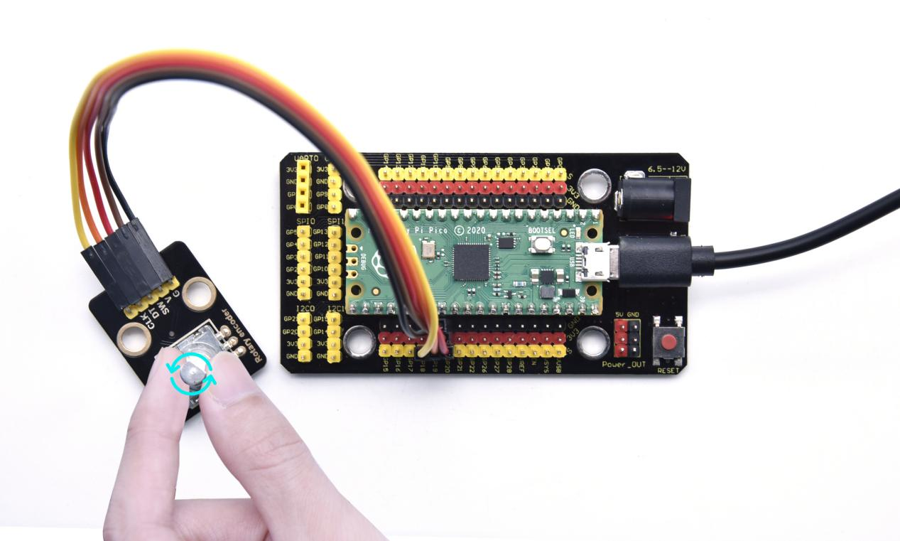


### Project 19: Servo Control


#### **Overview**

Servo motor is a position control rotary actuator. It mainly consists of a housing, a circuit board, a core-less motor, a gear and a position sensor. Its working principle is that the servo receives the signal sent by MCU or receiver and produces a reference signal with a period of 20ms and width of 1.5ms, then compares the acquired DC bias voltage to the voltage of the potentiometer and obtain the voltage difference output.

In general, servo has three lines in brown, red and orange. The brown wire is grounded, the red one is a positive pole line and the orange one is a signal line.


#### **Working Principle**

When the motor speed is constant, the potentiometer is driven to rotate through the cascade reduction gear, which leads that the voltage difference is 0, and the motor stops rotating. Generally, the angle range of servo rotation is 0° --180 °

The rotation angle of servo motor is controlled by regulating the duty cycle of PWM (Pulse-Width Modulation) signal. The standard cycle of PWM signal is 20ms (50Hz). Theoretically, the width is distributed between 1ms-2ms, but in fact, it's between 0.5ms-2.5ms. The width corresponds the rotation angle from 0° to 180°. But note that for different brand motors, the same signal may have different rotation angles.  


#### **Components**

|  | 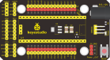 |  |  |
| ------------------------------------------------------------ | ------------------------------------------------------------ | ------------------------------------------------------------ | ------------------------------------------------------------ |
| Raspberry Pi Pico Board*1                                    | Raspberry Pi Pico Shield*1                                   | Servo*1                                                      | MicroUSB Cable*1                                             |

#### **Wiring Diagram**


#### **Test Code**

**Code 1：**

```c
/*

Keyestudio 24 in 1 Starter Kit for Raspberry Pi Pico

lesson 19.1

servo_1

http://www.keyestudio.com

\*/

int servoPin = 0;//Pins of the servo

void setup() {

pinMode(servoPin, OUTPUT);//set pins of the servo to OUTPUT

}

void loop() {

servopulse(servoPin, 0);//rotate to 0°

delay(1000);//delay in 1s

servopulse(servoPin, 90);///rotate to 90°

delay(1000);

servopulse(servoPin, 180);//rotate to 180°

delay(1000);

}

void servopulse(int pin, int myangle) { //Impulse function

int pulsewidth = map(myangle, 0, 180, 500, 2500); //map angles to pulse width

for (int i = 0; i \< 10; i++) { //output several pulse

digitalWrite(pin, HIGH);//pull up the pin of the servo

delayMicroseconds(pulsewidth);//extend the delayed time of pulse width

digitalWrite(pin, LOW);//pull down the pin of the servo

delay(20 - pulsewidth / 1000);

}

}
```

**Code 2：**

```c
/*

Keyestudio 24 in 1 Starter Kit for Raspberry Pi Pico

lesson 19.2

servo_2

http://www.keyestudio.com

\*/

\#include \<Servo.h\> //servo library

Servo myservo;

void setup() {

myservo.attach(0);//the servo is connected to GP0

}

void loop() {

for (int pos = 0; pos \< 180; pos++) {

myservo.write(pos); //rotate to pos

delay(15); //

}

for (int pos = 180; pos \> 0; pos--) {

myservo.write(pos);

delay(15);

}

delay(2000);//wait for 2s

}
```

#### **Code Explanation**

**Code 1：**

map(value, fromLow, fromHigh, toLow, toHigh)；

Value is the value we map. fromLow, fromHigh is the maximum and minimum value；

toLow, toHigh are the upper limit and lower limit we map. For example, map(myangle, 0, 180, 500, 2500) means that an angle value myangle (0°-180°）the mapping range is from 500us to 2500us.

We use the function servopulse() to make the servo move. We also make the servo rotate 0°, 90°and 180°cyclically.

**Code 2：**

The library of the servohas been downloaded，click the following two:


Find the path: 

Then you can get the library of the servo.


**myservo.write(pos):** angle values of the servo. 

**myservo.read():** read angle values of the servo.

#### **Test Result**

Upload the code1 and power up，the servo will rotate 0°，90° and 180°.

Upload the code 2 and power up, the servo will rotate from 0° to 180° by moving 1° for each 15ms.

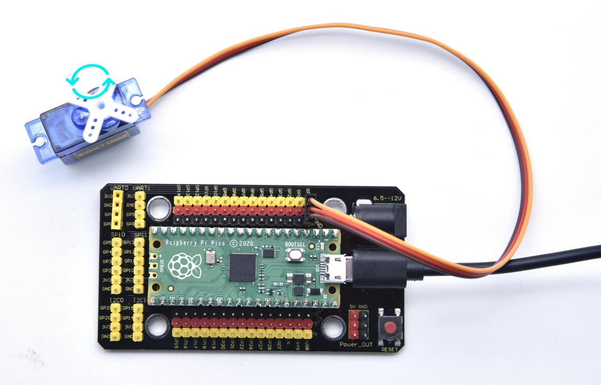

### Project 20: Ultrasonic Sensor

#### **Overview**

In this kit, there is a keyes HC-SR04 ultrasonic sensor, which can detect obstacles in front and the detailed distance between the sensor and the obstacle. Its principle is the same as that of bat flying. It can emit the ultrasonic signals that cannot be heard by humans. When these signals hit an obstacle and come back immediately. The distance between the sensor and the obstacle can be calculated by the time gap of emitting signals and receiving signals.

In the experiment, we use the sensor to detect the distance between the sensor and the obstacle, and print the test result.
Ultrasonic detector module can provide 2cm-450cm non-contact sensing distance, and its ranging accuracy is up to 3mm, very good to meet the normal requirements. The module includes an ultrasonic transmitter and receiver as well as the corresponding control circuit.

#### **Working Principle**

The most common ultrasonic ranging method is the echo detection. As shown below; when the ultrasonic emitter emits the ultrasonic waves towards certain direction, the counter will count. The ultrasonic waves travel and reflect back once encountering the obstacle. Then the counter will stop counting when the receiver receives the ultrasonic waves coming back.

The ultrasonic wave is also sound wave, and its speed of sound V is related to temperature. Generally, it travels 340m/s in the air. According to time t, we can calculate the distance s from the emitting spot to the obstacle. 
$$
s=340t/2
$$
The HC-SR04 ultrasonic ranging module can provide a non-contact distance sensing function of 2cm-400cm, and the ranging accuracy can reach as high as 3mm; the module includes an ultrasonic transmitter, receiver and control circuit. Basic working principle:

1. First pull down the TRIG, and then trigger it with at least 10us high level signal;

2. After triggering, the module will automatically transmit eight 40KHZ square waves, and automatically detect whether there is a signal to return.

3. If there is a signal returned back, through the ECHO to output a high level, the duration time of high level is actually the time from emission to reception of ultrasonic.

$$
Test Distance = High Level Duration * 340m/s * 0.5
$$


#### **Components**

|  |  |  |
| ------------------------------------------------------------ | ------------------------------------------------------------ | ------------------------------------------------------------ |
| Raspberry Pi Pico Board*1                                    | Raspberry Pi Pico Shield*1                                   | keyestudio SR01 Ultrasonic Sensor*1                          |
|  |  |                                                              |
| 4P Dupont Wire*1                                             | Micro USB Cable*1                                            |                                                              |

#### **Wiring Diagram**

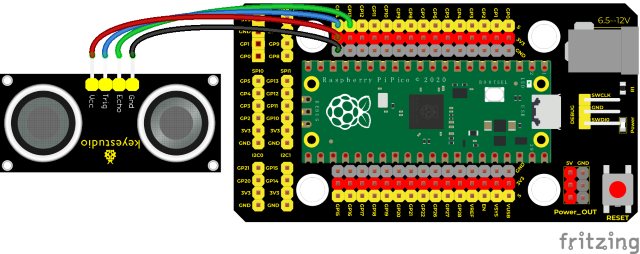

#### **Test Code**

```c
/*

Keyestudio 24 in 1 Starter Kit for Raspberry Pi Pico

lesson 20

Ultrasonic

http://www.keyestudio.com

\*/

int distance = 0; //Define a variable to receive the distance

int EchoPin = 13; //Echo is connected to GP13

int TrigPin = 14; //Trig is connected to GP14

float checkdistance() { //obtain the distance

// give a short low level so as to ensure a clear high pulse

digitalWrite(TrigPin, LOW);

delayMicroseconds(2);

// trigger 10ms or above high pulse to the sensor

digitalWrite(TrigPin, HIGH);

delayMicroseconds(10);

digitalWrite(TrigPin, LOW);

// read a signal from the sensor; a high level pulse，

//the duration time is calculated from sending ping command to receiving the
echo of the object.。

float distance = pulseIn(EchoPin, HIGH) / 58.00; //calculate distance

delay(10);

return distance;

}

void setup() {

Serial.begin(9600);//Set baud rate to 9600

pinMode(TrigPin, OUTPUT);//set Trig to OUTPUT

pinMode(EchoPin, INPUT); //set Echo to INPUT

}

void loop() {

distance = checkdistance();

if (distance \< 2 \|\| distance \>= 400) { //print "-1"

Serial.println("-1");

delay(100);

}

else { //print distance

Serial.print("distance:");

Serial.print(distance);

Serial.println("cm");

delay(100);

}

}
```

#### **Code Explanation**

The maximum test distance of HC-SR04 ultrasonic sensor is 3-4m, and the minimum test distance is 2cm. Setting code When the detection distance is less than 2cm or greater than or equal to 400cm, the serial monitor will display -1. We display the distance between the sensor and the obstacle on the serial monitor.

#### **Test Result**

Upload the code power up by a USB cable, open the serial monitor and set baud rate to 9600. 

If the obstacle is beyond the detection range, the monitor will show “-1”; on the contrary, the monitor will display the distance away from the obstacle.


### Project 21: IR Receiver Module


#### **Overview**

There is no doubt that infrared remote control is ubiquitous in daily life. It is used to control various household appliances, such as TVs, stereos, video recorders and satellite signal receivers. Infrared remote control is composed of infrared transmitting and infrared receiving systems, that is, an infrared remote control and infrared receiving module and a single-chip microcomputer capable of decoding.   

In this experiment, we need to know how to use the infrared receiving sensor. The infrared receiving sensor mainly uses the VS1838B infrared receiving sensor element. It integrates receiving, amplifying, and demodulating. The internal IC has already completed the demodulation, and the output is a digital signal. It can receive 38KHz modulated remote control signal. In the experiment, we use the IR receiver to receive the infrared signal emitted by the external infrared transmitting device, and display the received signal in the shell.

#### **Working Principle**


The main part of the IR remote control system is modulation, transmission and reception. The modulated carrier frequency is generally between 30khz and 60khz, and most of them use a square wave of 38kHz and a duty ratio of 1/3. A 4.7K pull-up resistor R3 is added to the signal end of the infrared receiver. 


#### **Components**

|  |  |  |
| ------------------------------------------------------------ | ------------------------------------------------------------ | ------------------------------------------------------------ |
| Raspberry Pi Pico Board*1                                    | Raspberry Pi Pico Shield*1                                   | Keyestudio DIYIR Receiver *1                                 |
|  |  |  |
| 3P Dupont Wire*1                                             | MicroUSB Cable*1                                             | Remote Control*1                                             |

#### **Wiring Diagram**


#### **Test Code**

```c
/*

Keyestudio 24 in 1 Starter Kit for Raspberry Pi Pico

lesson 21

IR Receiver

http://www.keyestudio.com

\*/

\#include"ir.h"

IR IRreceive(16);

////////////////////

void setup() {

Serial.begin(9600);

delay(1000);

}

////////////////////

void loop() {

Serial.println("IR receive");

while(1){

int key = IRreceive.getKey();

if(key != -1)

Serial.println(key);

}

}
```

**Code Explanation**

We need to import the library.

Key values are shown below:


#### **Test Result**

Wire up, upload the code, power up and open serial monitor. Point at the IR receiver and press keys on the IR remote control. Then the lED on the IR receiver will flash, as shown below;


### Project 22: DS1307 Clock Module


#### **Overview**

The DS1307 serial real-time clock (RTC) is a low-power, full binary-coded decimal (BCD) clock/calendar plus 56 bytes of NV SRAM.  Address and data are transferred serially through an I2C,  bidirectional bus. 

The clock/calendar provides seconds, minutes, hours, day, date, month,  and year information. The end of the month date is automatically  adjusted for months with fewer than 31 days, including corrections for leap year. The clock operates in either the 24-hour or 12-hour format with AM/PM indicator. The DS1307 has a built-in power-sense circuit that detects power failures and automatically switches to the backup supply. 

Timekeeping operation continues while the part operates from the backup supply.

#### **Working Principle**


**Detailed address and data:**

Serial real-time clock records year, month, day, hour, minute, second and week; AM and PM indicate morning and afternoon respectively; 56 bytes of NVRAM store data; 2-wire serial port; programmable square wave output; power failure detection and automatic switching circuit; battery current is less than 500nA.

Pins description：X1, 32.768kHz crystal terminal ;

VBAT:X2：+3V input;

SDA：serial data;

SCL：serial clock;

SQW/OUT：square waves/output drivers


#### **Components**

|  |  |  |
| ------------------------------------------------------------ | ------------------------------------------------------------ | ------------------------------------------------------------ |
| Raspberry Pi Pico Board*1                                    | Raspberry Pi Pico Shield*1                                   | Keyestudio DS1307 Clock Module*1                             |
|  |  |                                                              |
| 4P Dupont Wire*1                                             | Micro USB Cable*1                                            |                                                              |

#### **Wiring Diagram**


VUSB is 5V, so our power supply is connected to VUSB.

#### **Test Code**

```c
/*

Keyestudio 24 in 1 Starter Kit for Raspberry Pi Pico

lesson 22

DS1307 Real Time Clock

http://www.keyestudio.com

\*/

\#include \<Wire.h\>

\#include "RtcDS1307.h" //the library of DS1307 clock module

RtcDS1307\<TwoWire\> Rtc(Wire);//i2c port

void setup(){

Serial.begin(57600);//set baud rate to 57600

Rtc.Begin();

Rtc.SetIsRunning(true);

Rtc.SetDateTime(RtcDateTime(DATE, \__TIME__));

}

void loop(){

//print year/month/day/hour/minute/second/week

Serial.print(Rtc.GetDateTime().Year());

Serial.print("/");

Serial.print(Rtc.GetDateTime().Month());

Serial.print("/");

Serial.print(Rtc.GetDateTime().Day());

Serial.print(" ");

Serial.print(Rtc.GetDateTime().Hour());

Serial.print(":");

Serial.print(Rtc.GetDateTime().Minute());

Serial.print(":");

Serial.print(Rtc.GetDateTime().Second());

Serial.print(" ");

Serial.println(Rtc.GetDateTime().DayOfWeek());

delay(1000);//delay in 1s

}
```

#### **Code Explanation**

We need to import the library of the clock module.

Rtc.GetDateTime(): the obtained current time and date.

**Rtc.Begin();**enable DS1307 real-time clock

**Rtc.SetIsRunning(true);** run the DS1307 real-time clock, if true changes into false, time will stop

**Rtc.SetDateTime()；**set time

**Rtc.GetDateTime().Year()** return year

**Rtc.GetDateTime().Month()** return month

**Rtc.GetDateTime().Day()**return data

**Rtc.GetDateTime().Hour()**return hour

**Rtc.GetDateTime().Minute()**return minute

**Rtc.GetDateTime().Second()**return second

**Rtc.GetDateTime().DayOfWeek() return week**

#### **Test Result**

Upload the code power up by a USB cable, open the serial monitor and set baud rate to 9600.

We can see the displayed year, month, day, hour, minute, second and week on the shell, as shown below;


### Project 23: TM1650 4-Digit Tube Display


#### **Overview**

This module is mainly composed of a 0.36 inch red common anode 4-digit digital tube, and its driver chip is TM1650. When using it, we only need two signal lines to make the single-chip microcomputer control a 4-bitdigit tube, which greatly saves the IO port resources of the control board.

TM1650 is a special circuit for LED (light emitting diode display) drive control. It integrates MCU input and output control digital interface, data latch, LED drivers, keyboard scanning, brightness adjustment and other circuits.

TM1650 has stable performance, reliable quality and strong anti-interference ability. 

It can be applied to the application of long-term continuous working for 24 hours. 

TM1650 uses 2-wire serial transmission protocol for communication (note that this data transmission protocol is not a standard I2C protocol). The chip can drive the digital tube and save MCU pin resources through two pins and MCU communication.

#### **Working Principle**

TM1650 adopts IIC treaty and SDA and SCL wire

Data command setting is 0x48. This means that lighting up the tube display not perform its button scanning function.


**Data command setting**: 0x48 means that we light up the digital tube, instead of enable the function of key scanning


**Command display setting:**

bit[6:4]：set the brightness of tube display, and 000 is brightest

bit[3]：set to show decimal points

bit[0]：start the display of the tube display

#### **Components**

|  |  |    |
| ------------------------------------------------------------ | ------------------------------------------------------------ | ---------------------------------------- |
| Raspberry Pi Pico Board*1                                    | Raspberry Pi Pico Shield*1                                   | Keyestudio TM1650 4-Digit Tube Display*1 |
|  |  |                                          |
| 4P Dupont Wire*1                                             | Micro USB Cable*1                                            |                                          |

#### **Wiring Diagram**

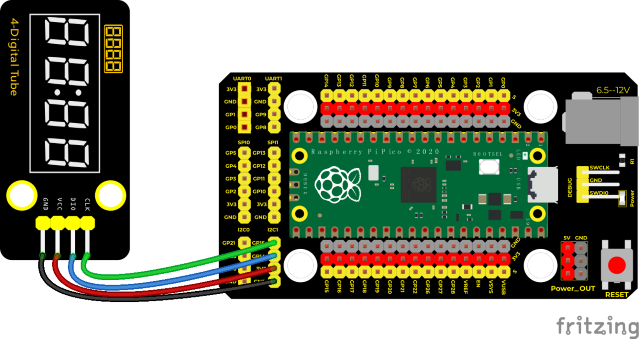

#### **Test Code**

```c
/*

Keyestudio 24 in 1 Starter Kit for Raspberry Pi Pico

lesson 23

TM1650 Four digital tube

http://www.keyestudio.com

*/

#include "KETM1650.h" //import the library file of TM1650

int item = 0; //display value

//pins are GP14 and GP15

#define DIO 15

#define CLK 14

KETM1650 tm_4display(CLK, DIO);

void setup() {

tm_4display.init(); //initialize

tm_4display.setBrightness(3); //set brightness to 3，in the range of 1\~8

}

void loop() {

tm_4display.displayString(item);//the 4-digit tube display will show item value

item = item + 1; //add 1

if (item > 9999) { //when adding to 9999, clear up

item = 0;

}

delay(100); //delay in 100ms

}
```

#### **Code Explanation**

Similarly, we need to import the library file of the TM1650 module first. Here are some commonly used function interfaces:

**.init(); Initialize** TM1650

**.clear();**clear up the tube display

**.displayString(char \*aString);**Display character string，

**.displayString(String sString);** Display string ，sString is character string

**.displayString(float value);Display decimal, the content is float type**

**.displayString(double value);Display decimal, the content is double type**

**.displayString(int value); Display integer, the content is int type**

**.displayOn();**open the tube display

**.displayOff();** turn off the tube display，in comparison with .clear，once turning off, the function .displayOn() must be used;

**.setDot(unsigned int aPos, bool aState);** display decimal point, aPos is the location of decimal point (0\~3) corresponds to (1\~4)，aState is the display status:1（true）lights up，2（false）goes off.

**.setBrightness(unsigned int iBrightness);** set the brightness of the tube display

iBrightness: the brightness value（1\~8, type is unsigned int，

#### **Test Result**

Run the test code, wire up and power on. 4-digit tube display will show integer from 0 to 99999, add 1 for each 10ms. Increase to 9999 then start from 0


### Project 24: HT16K33_8X8 Dot Matrix Module


#### **Overview**

What is the dot matrix display?

The 8X8 dot matrix is composed of 64 light-emitting diodes, and each light-emitting diode is placed at the intersection of the row line and the column line. When the corresponding row is set to 1 level, and a certain column is set to 0 level, the corresponding diode  will light up.

#### **Working Principle**

As the schematic diagram shown, to light up the LED at the first row and column, we only need to set C1 to high level and R1 to low level. To turn on LEDs at the first row, we set R1 to low level and C1-C8 to high level.

16 IO ports are needed, which will highly waste the MCU resources.

Therefore, we designed this module, using the HT16K33 chip to drive an 8*8 dot matrix, which greatly saves the resources of the single-chip microcomputer.

There are three DIP switches on the module, all of which are set to I2C communication address. The setting method is shown below.

A0，A1and A2 are grounded, that is, the address is 0x70


#### **Components**

|  | 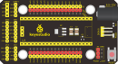 |  |
| ------------------------------------------------------------ | ------------------------------------------------------------ | ------------------------------------------------------------ |
| Raspberry Pi Pico Board*1                                    | Raspberry Pi Pico Shield*1                                   | Keyestudio HT16K33_8X8 Dot Matrix*1                          |
|  |  |                                                              |
| 4P Dupont Wire*1                                             | Micro USB Cable*1                                            |                                                              |

#### **Wiring Diagram**


#### **Test Code**

```c
/*

Keyestudio 24 in 1 Starter Kit for Raspberry Pi Pico

lesson 24

HT16K33 8\*8 dot matrix

http://www.keyestudio.com

\*/

#include <Matrix.h>//the library of the dot matrix

Matrix myMatrix(20, 21);

uint8_t LEDArray[8];

const uint8_t LedArray1[8] PROGMEM = {0x00, 0x18, 0x3c, 0x7e, 0xff, 0xff, 0x66, 0x00};//heart beat pattern

void setup() {

myMatrix.begin(0x70);//iic address

myMatrix.clear();//clear up

myMatrix.setBrightness(5);//brightness is 5, in the range of 0~15

}

void loop() {

memcpy_P(&LEDArray, &LedArray1, 8);

for (int i = 0; i < 8; i++)

{

for (int j = 0; j < 8; j++)

{

if ((LEDArray[i] & 0x01))

myMatrix.drawPixel(j, i, 1);

else

myMatrix.drawPixel(j, i, 0);

LEDArray[i] = LEDArray[i] >> 1;

}

}

myMatrix.write(); //display

}
```

**Code Explanation**

First we need to import the library file.

The pattern in our code is an array of byte data type, which is shown in the table below. We convert {0x00, 0x18, 0x3c, 0x7e, 0xff, 0xff, 0x66, 0x00} into binary, and fill in the 8\*8 form below to make it clear. 1 means on, 0 means off,

Then we can see that it is a heart shape.


#### **Test Result**

Burn the test code and wire up according to the wiring diagram; after powering on, the dot matrix will display a heart beat pattern.


## 6. Comprehensive Experiments

The previous projects are related to single sensor or module. In the following part, we will combine various sensors and modules to create some comprehensive experiments to perform special functions.

### Project 25: Breathing LED


#### **Overview**

A“breathing LED”is a phenomenon where an LED's brightness smoothly changes from dark to bright and back to dark, continuing to do so and giving the illusion of an LED“breathing. This phenomenon is similar to a lung breathing in and out. So how to control LED’s brightness? We need to take advantage of PWM.

#### **Components**

|  |  | 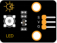 |
| ------------------------------------------------------------ | ------------------------------------------------------------ | ------------------------------------------------------------ |
| Raspberry Pi Pico Board*1                                    | Raspberry Pi Pico Shield*1                                   | Keyestudio White LED Module*1                                |
|  |  |                                                              |
| 3P Dupont Wire*1                                             | Micro USB Cable*1                                            |                                                              |

#### **Wiring Diagram**


#### **Test Code**

```c
/*

\* Keyestudio 24 in 1 Starter Kit for Raspberry Pi Pico

\* lesson 25

\* Breath

\* http://www.keyestudio.com

\*/

int LED = 15; //the pin of LED is connected to GP15

void setup() {

pinMode(LED, OUTPUT); //set the pin of LED to OUTPUT

}

void loop() {

for (int i = 0; i <= 255; i++) { //from 0 to 255，increase 1 for each time

analogWrite(LED, i);

delay(10);//delay in 10ms

}

for (int i = 255; i >= 0; i--) { //from 255 to 0，reduce 1 for each time

analogWrite(LED, i);

delay(10);//delay in 10ms

}

}
```

#### **Code Explanation**

The function for (int i = 0; i \<= 255; i = i + 1)；indicate the variable 1 adds by 1 from 0 to 255, until it doesn’t meet with **i \<= 255.** It will execute the code for 256 times.

Equally, **for (int i = 255; i \>= 0; i = i - 1)** means reducing by 1 for each time.

When not meeting with i\>= 0，jump out the for() loop，execute the code for 256 times

In the code, we control the brightness of the LED on the module by setting the PWM value. In the experiment, we connect the module signal to the pin GPIO15. The smaller the PWM value, the darker the LED on the module; on the contrary, the larger the value, the brighter the LED on the module, the range is 0-255. 

**analogWrite (pin, value)**: pin is the PWM port, value is the PWM value to be output (0~255). 

Set the PWM output value of GP15 to i. At the beginning, i increased from 0 to 255, and up by 1 each time. Each time delaying in 10ms, the LED on the module gradually will brighten. When PWM is 255, i begins to decrease from 255 to 0, down by 1 for each time. 

Each time delaying in 10ms, the LED on the module will gradually get dim. Then it will become brighter, cyclically alternating, just like human breathe. 

We can change the delayed time in the code. There are two ways: 

Change the step length or reduce the delayed time.

The step length is supposed to divided by 255, like 3 and 5. 3 means increasing by 3, -3 means reducing by 3.

#### **Test Result**

Run the test code, the LED on the module gradually gets dimmer then brighter, cyclically, like human breathe.


### Project 26: Button-controlled LED


#### **Overview**

In this lesson, we will make an extension experiment with a button and an LED. When the button is pressed and low levels are output, the LED will light up; when the button is released, the LED will go off. Then we can control a module with another module.

#### **Components**

|  |  |  |
| ------------------------------------------------------------ | ------------------------------------------------------------ | ------------------------------------------------------------ |
| Raspberry Pi Pico Board*1                                    | Raspberry Pi Pico Shield*1                                   | Keyestudio White LED Module*1                                |
|  |  |  |
| Keyestudio DIY  Button Module*1                              | 3P Dupont Wire*2                                             | Micro USB Cable*1                                            |

#### **Wiring Diagram**


#### **Test Code**

```c
/*

\* Keyestudio 24 in 1 Starter Kit for Raspberry Pi Pico

\* lesson 26

\* button control LED

\* http://www.keyestudio.com

\*/

int button = 16;//the digital pin of the button is 16

int led = 15;//the pin of LED is connected to GP15

bool led_flag;

void setup() {

pinMode(button, INPUT); //set the pin of the button to INPUT

pinMode(led, OUTPUT); //set the pin of the LED to OUTPUT

attachInterrupt(digitalPinToInterrupt(button), toggle_handle, FALLING); //external interrupt is 0, trailing edge triggers

}

void loop() {

digitalWrite(led, led_flag);//press the button to light up LED or turn off LED

delay(100);

}

void toggle_handle(){//switch the state of LED

led_flag = !led_flag;

}
```

#### **Code Explanation**

Set IO ports according to connection diagram and configure pins mode

**attachInterrupt(digitalPinToInterrupt(button), toggle_handle, FALLING)**

The trigger mode is when a high level becomes a low level. When the trigger interrupts, the interrupt function will be activated.

**toggle_handle**: when entering the interrupt mode, the on and off of the LED can be controlled.

#### **Test Result**

Upload the code wire up and power up with a USB cable. When the button is pressed, the LED will light up; when pressed again, the LED will go off


### Project 27: Alarm Experiment


#### **Overview**

In the previous experiment, we control an output module though an input module. In this lesson, we will make an experiment that the active buzzer will emit sounds once an obstacle appears.

#### **Components**

|  |  |  |
| ------------------------------------------------------------ | ------------------------------------------------------------ | ------------------------------------------------------------ |
| Raspberry Pi Pico Board*1                                    | Raspberry Pi Pico Shield*1                                   | Keyestudio Obstacle Avoidance Sensor*1                       |
|  |  |  |
| Keyestudio Active Buzzer*1                                   | 3P Dupont Wire*2                                             | Micro USB Cable*1                                            |

#### **Wiring Diagram**


#### **Test Code**

```c
/*

\* Keyestudio 24 in 1 Starter Kit for Raspberry Pi Pico

\* lesson 27

\* Avoiding alarm

\* http://www.keyestudio.com

\*/

int item = 0;

void setup() {

pinMode(15, INPUT); //the obstacle avoidance sensor is interfaced with GP15 and set to INPUT

pinMode(16, OUTPUT); //the obstacle avoidance sensor is interfaced with GP16and set to OUTPUT

}

void loop() {

item = digitalRead(15);//read the level values of the obstacle avoidance sensor

if (item == 0) {//the obstacle is detected

digitalWrite(16, HIGH);//the buzzer beeps

} else {//the obstacle is not detected

digitalWrite(16, LOW);//the buzzer doesn’t beep

}

delay(100);//delay in 1000ms

}
```

#### **Code Explanation**

Set IO ports according to connection diagram then configure pins mode

The value is 0 when pressing the button, So, we can determine the key value(0）through **if (item == 0) and make the buzzer beep.**

#### **Test Result**

Upload the test code, if the obstacle is detected, the active buzzer will chime; if not, it won’t beep


### Project 28: PIR Motion Sensor


#### **Introduction**

In this experiment, we will control an active buzzer and an on-board LED through a PIR motion sensor.

#### **Components**

|  |  |  |
| ------------------------------------------------------------ | ------------------------------------------------------------ | ------------------------------------------------------------ |
| Raspberry Pi Pico Board*1                                    | Raspberry Pi Pico Shield*1                                   | Keyestudio PIR Motion Sensor*1                               |
|  |  |  |
| Keyestudio Active Buzzer*1                                   | 3P Dupont Wire*2                                             | MicroUSBCable*1                                              |

#### **Connection Diagram**


#### **Test Code**

```c
/*

\* Keyestudio 24 in 1 Starter Kit for Raspberry Pi Pico

\* lesson 28

\* PIR alarm

\* http://www.keyestudio.com

\*/

int item = 0;

void setup() {

pinMode(15, INPUT); //the PIR motion sensor is connected to GP15 and set it to INPUT

pinMode(16, OUTPUT);//the active buzzer is connected to GP16 and set it to output

}

void loop() {

item = digitalRead(15);//Read the digital level signal output by the PIR motion sensor

if (item == 1) { //detect someone moving

digitalWrite(16, HIGH); //turn on the buzzer

} else { //not detected

digitalWrite(16, LOW); //turn off the buzzer

}

}
```

#### **Test Result**

Upload the test code wire up and power on. if the sensor detects people moving, the external active buzzer will chime; if not, it won’t beep.


### Project 29: Speaker Module


#### **Introduction**

We learned about controlling the speaker module to make sounds, play beats and adjust its volume. In fact, each song is a combination of specific beats and tones (frequencies). In this experiment, we use this speaker module to play a song.

The frequency of each tone is shown below.

Bass:

| Key Note | 1\# | 2\# | 3\# | 4\# | 5\# | 6\# | 7\# |
|----------|-----|-----|-----|-----|-----|-----|-----|
| A        | 221 | 248 | 278 | 294 | 330 | 371 | 416 |
| B        | 248 | 278 | 294 | 330 | 371 | 416 | 467 |
| C        | 131 | 147 | 165 | 175 | 196 | 221 | 248 |
| D        | 147 | 165 | 175 | 196 | 221 | 248 | 278 |
| E        | 165 | 175 | 196 | 221 | 248 | 278 | 312 |
| F        | 175 | 196 | 221 | 234 | 262 | 294 | 330 |
| G        | 196 | 221 | 234 | 262 | 294 | 330 | 371 |

Midrange :

| Key Note | 1    | 2    | 3    | 4    | 5    | 6    | 7    |
| -------- | ---- | ---- | ---- | ---- | ---- | ---- | ---- |
| A        | 441  | 495  | 556  | 589  | 661  | 724  | 833  |
| B        | 495  | 556  | 624  | 661  | 724  | 833  | 935  |
| C        | 262  | 294  | 330  | 350  | 393  | 441  | 495  |
| D        | 294  | 330  | 350  | 393  | 441  | 495  | 556  |
| E        | 330  | 350  | 393  | 441  | 495  | 556  | 624  |
| F        | 350  | 393  | 441  | 495  | 556  | 624  | 661  |
| G        | 393  | 441  | 495  | 556  | 624  | 661  | 724  |

Treble:

| Key Note | 1\# | 2\#  | 3\#  | 4\#  | 5\#  | 6\#  | 7\#  |
|----------|-----|------|------|------|------|------|------|
| A        | 882 | 990  | 1112 | 1178 | 1322 | 1484 | 1665 |
| B        | 990 | 1112 | 1178 | 1322 | 1484 | 1665 | 1869 |
| C        | 525 | 589  | 661  | 700  | 786  | 882  | 990  |
| D        | 589 | 661  | 700  | 786  | 882  | 990  | 1112 |
| E        | 661 | 700  | 786  | 882  | 990  | 1112 | 1248 |
| F        | 700 | 786  | 882  | 935  | 1049 | 1178 | 1322 |
| G        | 786 | 882  | 990  | 1049 | 1178 | 1322 | 1484 |

Beats are the time delay for each note. The larger the number, the longer the delay time. A note without a line in the spectrum is a beat, with a delay of 1s. while a beat with an underline is 1/2 of a beat without a line, with a delay of 0.5s, and a beat with two underlines is 1/4 of a beat without a line, with a delay of 0.25s. The 1/8 of a beat is with a delay of 0.125s.

We will take *Happy Birthday Song* as an example.

#### **Components**

|  |  |  |
| ------------------------------------------------------------ | ------------------------------------------------------------ | ------------------------------------------------------------ |
| Raspberry Pi Pico Board*1                                    | Raspberry Pi Pico Shield*1                                   | Keyestudio Speaker Module*1                                  |
|  |  |                                                              |
| 3P Dupont Wire*1                                             | Micro USB Cable*1                                            |                                                              |

#### **Connection Diagram**

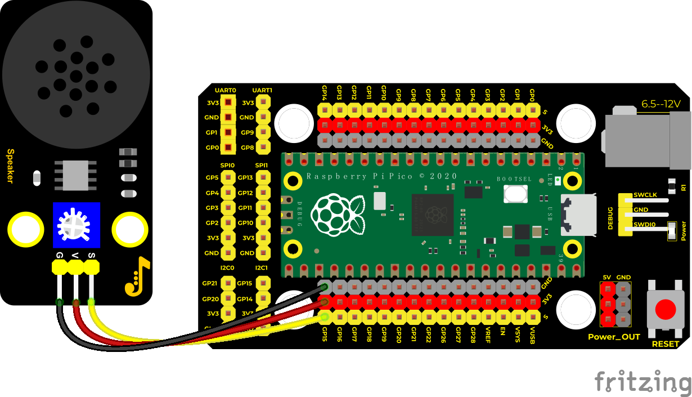

#### **Test Code**

```c
/*

\* Keyestudio 24 in 1 Starter Kit for Raspberry Pi Pico

\* lesson 29

\* play music

\* http://www.keyestudio.com

*/

#define D0 -1

#define D1 262

#define D2 293

#define D3 329

#define D4 349

#define D5 392

#define D6 440

#define D7 494

#define M1 523

#define M2 586

#define M3 658

#define M4 697

#define M5 783

#define M6 879

#define M7 987

#define H1 1045

#define H2 1171

#define H3 1316

#define H4 1393

#define H5 1563

#define H6 1755

#define H7 1971

//List all the frequencies of the D key

#define WHOLE 1

#define HALF 0.5

#define QUARTER 0.25

#define EIGHTH 0.25

#define SIXTEENTH 0.625

//list all beats

int tune[] = //List the frequencies according to the numbered musical notation

{

D5, D5, D6, D5, M1, D7,

D5, D5, D6, D5, M2, M1,

D5, D5, M5, M3, M1, D7, D6,

M4, M4, M3, M1, M2, M1

};

float durt[] = //List the beats according to the numbered musical notation

{

0.5, 0.5, 1, 1, 1, 1 + 1,

0.5, 0.5, 1, 1, 1, 1 + 1,

0.5, 0.5, 1, 1, 1, 1, 1,

0.5, 0.5, 1, 1, 1, 1 + 1

};

int beeppin = 15; //power amplifier is connected to GP15

int length;

void setup() {

pinMode(beeppin, OUTPUT); //set the buzzer to OUTPUT

length = sizeof(tune) / sizeof(tune[0]); //Calculated length

}

void loop() {

for (int x = 0; x < length; x++)

{

tone(beeppin, tune[x]);

delay(500 * durt[x]); //500 means delayed time.

noTone(beeppin);

}

delay(2000);

}
```

#### **Test Result**

Connect the components according to the connection diagram and run the test code, the audio power amplifier module will play a birthday song.


### Project 30: Rotary Encoder


#### **Introduction**

In this lesson, we will control the LED on the RGB module to show different colors through a rotary encoder. When designing the code, we need to divide the obtained values by 3 to get the remainders. The remainder is 0 and the LED will become red. The remainder is 1, the LED will become green. The remainder is 2, the LED will turn blue.

#### **Components**

|  |  |  |  |
| ------------------------------------------------------------ | ------------------------------------------------------------ | ------------------------------------------------------------ | ------------------------------------------------------------ |
| Raspberry Pi Pico Board*1                                    | Raspberry Pi Pico Shield*1                                   | Common Cathode RGB Module*1                                  | Rotary Encoder Module*1                                      |
|  |  |  |                                                              |
| 5P Dupont Wire*1                                             | 4P Dupont Wire*1                                             | Micro USB Cable*1                                            |                                                              |

#### **Connection Diagram**


#### **Test Code**

```c
/*
   Keyestudio 24 in 1 Starter Kit for Raspberry Pi Pico
   lesson 30
   Encoder control RGB
   http://www.keyestudio.com
*/
//Interfacing Rotary Encoder with Arduino
//Encoder Switch -> pin 20
//Encoder DT -> pin 19
//Encoder CLK -> pin 18
int Encoder_DT  = 19;
int Encoder_CLK  = 18;
int Encoder_Switch = 20;

int Previous_Output;
int Encoder_Count;
int redPin = 9; //the red LED is connected to D9
int greenPin = 10; //the green LED is connected to D10
int bluePin = 11; //the blue LED is connected to D11
int val;
void setup() {
  Serial.begin(9600);

  //pin Mode declaration
  pinMode (Encoder_DT, INPUT);
  pinMode (Encoder_CLK, INPUT);
  pinMode (Encoder_Switch, INPUT);

  Previous_Output = digitalRead(Encoder_DT); //Read the initial value of Output A
  pinMode(redPin, OUTPUT);
  pinMode(greenPin, OUTPUT);
  pinMode(bluePin, OUTPUT);
}

void loop() {
  //aVal = digitalRead(pinA);

  if (digitalRead(Encoder_DT) != Previous_Output)
  {
    if (digitalRead(Encoder_CLK) != Previous_Output)
    {
      Encoder_Count ++;
      Serial.print(Encoder_Count);
      Serial.print("  ");
      val = Encoder_Count % 3;
      Serial.println(val);
    }
    else
    {
      Encoder_Count--;
      Serial.print(Encoder_Count);
      Serial.print("  ");
      val = Encoder_Count % 3;
      Serial.println(val);
    }
  }

  Previous_Output = digitalRead(Encoder_DT);

  if (digitalRead(Encoder_Switch) == 0)
  {
    delay(5);
    if (digitalRead(Encoder_Switch) == 0) {
      Serial.println("Switch pressed");
      while (digitalRead(Encoder_Switch) == 0);
    }
  }
  if (val == 0) {
    //red(255, 0, 0)
    analogWrite(9, 255);
    analogWrite(10, 0);
    analogWrite(11, 0);
  } else if (val == 1) {
    //green(255, 0, 0)
    analogWrite(9, 0);
    analogWrite(10, 255);
    analogWrite(11, 0);
  } else {
    /blue(255, 0, 0)
    analogWrite(9, 0);
    analogWrite(10, 0);
    analogWrite(11, 255);
  }
}
```

#### **Code Explanation**

In the experiment, we set the val to the remainder of Encoder_Count divided by 3\. Encoder_Count is the value of the encoder. Then we can set pin 9(red), 10(green) and 11(blue) according to remainders.

Colors of LED can be controlled by remainders.

#### **Test Result**

Wire up, run the code and open the serial monitor. Rotate the knob of the rotary encoder to display the reminders,which can control colors of LED.


### Project 31: Rotary Potentiometer


#### **Introduction**

In the previous courses, we did experiments of breathing light and controlling LED with button. In this course, we do these two experiments by controlling the brightness of LED through an adjustable potentiometer. The brightness of LED is controlled by PWM values, and the range of analog values is the same as the PWM’s, from 0 to 65535.

After the code is set successfully, we can control the brightness of the LED on the module by rotating the potentiometer.

#### **Components**

|  |  |  |
| ------------------------------------------------------------ | ------------------------------------------------------------ | ------------------------------------------------------------ |
| Raspberry Pi Pico Board*1                                    | Raspberry Pi Pico Shield*1                                   | Keyestudio White LED Module*1                                |
|  |  |  |
| Keyestudio Rotary Potentiometer*1                            | 3P Dupont Wire*2                                             | Micro USB Cable*1                                            |

#### **Connection Diagram**


#### **Test Code**

```c
/*
   Keyestudio 24 in 1 Starter Kit for Raspberry Pi Pico
   lesson 31
   adjust the light
   http://www.keyestudio.com
*/
int val1 = 0;//used to save analog values
int val2 = 0;//used to save the PWM value to be output
void setup() {
  Serial.begin(9600);//Set baud rate to 9600
}

void loop() {
  val1 = analogRead(26);//read the analog value of the potentiometer
  Serial.print(val1);//print analog value
  Serial.print("  ");
  val2 = map(val1, 0, 4095, 0, 255);//map analog values to the range of PWM value
  Serial.println(val2);//
  analogWrite(15, val2);//the pin 15 outputs PWM value
  delay(100);//delay in 1000ms
}
```

#### **Code Explanation**

Map the val1 from 0-4095 to 0-255 and assign the value to val2.

#### **Test Result**

Run the code and power up, rotate the knob of the potentiometer to adjust the brightness of the LED.


### Project 32: Sound Activated Light


#### **Introduction**

In this lesson, we will make a smart sound activated light using a sound sensor and an LED module. When we make a sound, the light will automatically turn on; when there is no sound, the lights will automatically turn off. How it works? Because the sound-controlled light is equipped with a sound sensor, and this sensor converts the intensity of external sound into a corresponding value. Then set a threshold, when the threshold is exceeded, the light will turn on, and when it is not exceeded, the light will go out.

#### **Components**

|  |  |  |
| ------------------------------------------------------------ | ------------------------------------------------------------ | ------------------------------------------------------------ |
| Raspberry Pi Pico Board*1                                    | Raspberry Pi Pico Shield*1                                   | Keyestudio Sound Sensor*1                                    |
|  |  |  |
| Keyestudio White LED Module*1                                | 3P Dupont Wire*2                                             | Micro USB Cable*1                                            |

#### **Connection Diagram**


#### **Test Code**

```c
 /*
   Keyestudio 24 in 1 Starter Kit for Raspberry Pi Pico
   lesson 32
   sound-controlled lights
   http://www.keyestudio.com
*/
int ledPin = 15;//LED is connected to GP15
int microPin = 26;//the sound sensor is connected to ADC0（GP26）
void setup() {
  Serial.begin(9600);//Set baud rate to 9600
  pinMode(ledPin, OUTPUT);//LED is set to OUTPUT
}

void loop() {
  int val = analogRead(microPin);//read analog values
  Serial.print(val);//serial prints
  if(val > 200){//more than threshold 200
    digitalWrite(ledPin, HIGH);//light up LED3s and print the pertinent information
    Serial.println("  led on");
    delay(3000);
  }else{//otherwise
    digitalWrite(ledPin, LOW);//turn off LED and print the pertinent information
    Serial.println("  led off");
  }
  delay(100);
}
```

#### **Code Explanation**

We set the analog threshold value to 200. If more than 200, LED will be on 3s, on the contrary, it will be off.

#### **Test Result**

Run the test code, the monitor displays the corresponding volume value. When the analog value of sound is greater than 200, the LED on the LED module will light up, otherwise it will go off.


### Project 33: 6812 RGB Module


#### **Introduction**

We learned how to use the 6812 RGB module, we knew that this module can light up each LED through a pin. In this experiment, we will control the RGB module to display different colors. (Note: do not look directly at the LEDs for a long time to avoid damage to our eyes.)

#### **Components**

|  |  | 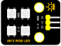 |
| ------------------------------------------------------------ | ------------------------------------------------------------ | ------------------------------------------------------------ |
| Raspberry Pi Pico Board*1                                    | Raspberry Pi Pico Shield*1                                   | Keyestudio 6812 RGB Module*1                                 |
|  |  |                                                              |
| 3P Dupont Wire*1                                             | Micro USB Cable*1                                            |                                                              |

#### **Connection Diagram**

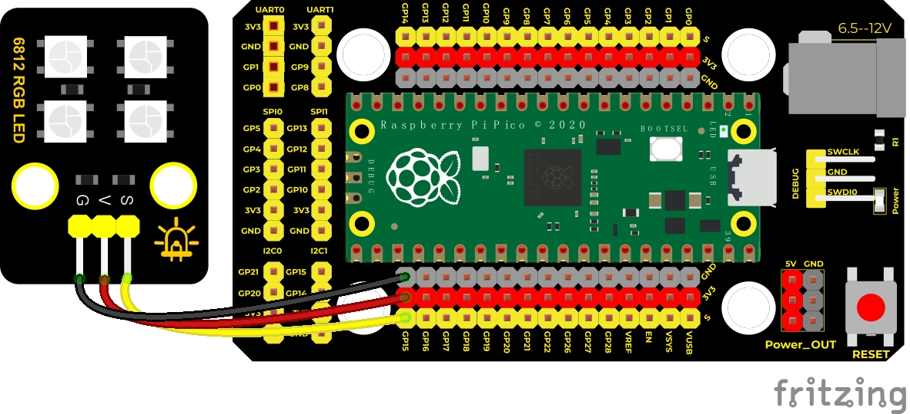

#### **Test Code**

```c
/*
   Keyestudio 24 in 1 Starter Kit for Raspberry Pi Pico
   lesson 33
   SK6812 RGB
   http://www.keyestudio.com
*/
#include"rgb.h"
RGB rgb(16, 4); //rgb(pin, num);  num = 0-100
//used to save the variable of RGB
int R = 0;
int G = 0;
int B = 0;
int num = 0;
void setup() {
  rgb.setBrightness(100); //rgb.setBrightness(0-255);
  delay(10);
  rgb.clear(); //Turn off all leds
  delay(10);
}

void loop() {
  num++;
  if (num > 3) {  //num is in the range of 0~3
    //Select a random integer between 0 and 255 
    R = random(0, 255);
    G = random(0, 255);
    B = random(0, 255);
    num = 0;
  }
  rgb.setPixelColor(num, R, G, B); //set the color of num-1 light
  rgb.show();//display
  delay(100);//
}
```

#### **Code Explanation**

**random(0, 255)**: Select a random integer between 0 and 255

**.setPixelColor(num - 1, R, G, B)**：set the light beads at num-1 to display red, green and blue color

**.show()**：display，if without this function , the function we set can’t work.

#### **Test Result**

Wire up the components and run the code. We will see LEDs on the 6812RGB module shows different colors.


### Project 34: Ultrasonic Sensor


#### **Introduction**


We know that bats use echoes to determine the direction and the location of their preys. In real life, sonar is used to detect sounds in the water. Since the attenuation rate of electromagnetic waves in water is very high, it cannot be used to detect signals, however, the attenuation rate of sound waves in the water is much smaller, so sound waves are most commonly used underwater for observation and measurement.

In this experiment, we will use a speaker module, an RGB module and a 4-digit tube display to make a device for detection through ultrasonic.


#### **Components**

|  |  |  |
| ------------------------------------------------------------ | ------------------------------------------------------------ | ------------------------------------------------------------ |
| Raspberry Pi Pico Board*1                                    | Raspberry Pi Pico Shield*1                                   | keyes brick HC-SR04 Ultrasonic Sensor*1                      |
|  |  |  |
| Keyestudio Speaker Module*1                                  | Keyestudio Common Cathode RGB Module*1                       | Keyestudio TM1650 4-Digit Tube Display*1                     |
|  |  |  |
| 4P Dupont Wire*3                                             | 3P Dupont Wire*1                                             | Micro USB Cable*1                                            |

#### **Connection Diagram**


#### **Test Code**

```c
/*
   Keyestudio 24 in 1 Starter Kit for Raspberry Pi Pico
   lesson 34
   Ultrasonic radar
   http://www.keyestudio.com
*/
#include "KETM1650.h"//the library file of the 4-digit tube display
KETM1650 tm_4display(15, 14);

int beeppin = 16; //define GP16
int EchoPin = 19; //Echo is connected to GP19
int TrigPin = 20; //Trig is connected to GP20
int distance;//distance detected by the ultrasonic sensor

int redPin = 9; //make the red LED connect to GP9
int greenPin = 10; //make the green LED connect to GP10
int bluePin = 11; //make the blue LED connect to GP11

float checkdistance() { //obtain the distance
  // give a short low level so as to ensure a clear high pulse
  digitalWrite(TrigPin, LOW);
  delayMicroseconds(2);
  // trigger 10ms or above high pulse to the sensor  digitalWrite(TrigPin, HIGH);
  delayMicroseconds(10);
  digitalWrite(TrigPin, LOW);
  // read a signal from the sensor; a high level pulse
  //the duration time is calculated from sending ping command to receiving the echo of the object.
  float distance = pulseIn(EchoPin, HIGH) / 58.00;  //calculate distance
  delay(10);
  return distance;
}

void setup() {
  tm_4display.init(); //initialize the tube display
  pinMode(TrigPin, OUTPUT);//Trig is OUTPUT
  pinMode(EchoPin, INPUT);  //Echo is INPUT
  pinMode(beeppin, OUTPUT);//set the audio power amplifier to OUTPUT
  pinMode(redPin, OUTPUT);
  pinMode(greenPin, OUTPUT);
  pinMode(bluePin, OUTPUT);
}

void loop() {
  distance = checkdistance(); //ultrasonic ranging
  tm_4display.displayString(distance);  //the tube display shows the distance
  if (distance <= 10) {
    tone(beeppin, 880);
    delay(100);
    noTone(beeppin);
    analogWrite(9, 255);//red(255, 0, 0)
    analogWrite(10, 0);
    analogWrite(11, 0);

  } else if (distance > 10 && distance <= 20) {
    tone(beeppin, 532);
    delay(200);
    noTone(beeppin);
    analogWrite(9, 0);//blue(255, 0, 0)
    analogWrite(10, 0);
    analogWrite(11, 255);
  } else {
    analogWrite(9, 0);//green(255, 0, 0)
    analogWrite(10, 255);
    analogWrite(11, 0);
  }

}
```

#### **Code Explanation**

We set sound frequency and light color by adjusting different distance range.

We can adjust the distance range in the code.

#### **Test Result**

Wire up according to the connection diagram upload the run the code and power up. When the ultrasonic sensor detects different distances, the buzzer will produce different frequencies of sound, the RGB will show different colors, and the measured distances are displayed on the 4-digit tube display.


### Project 35: IR Remote Control


#### **Introduction**

In the previous experiments, we learned to turn on or turn off the LED, adjust the brightness of a light through PWM, and how to use the infrared receiver module. So in this experiment, we use an infrared remote control to control an LED module.

When we receive a value, we set the PWM value by the corresponding button value, thus you can adjust the brightness. Control the LED to turn on or turn off is in the same way. If we want to use the same button to control the LED to turn on or turn off, we can achieve it through the code.

#### **Components**

|  |  |  | 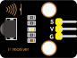 |
| ------------------------------------------------------------ | ------------------------------------------------------------ | ------------------------------------------------------------ | ------------------------------------------------------------ |
| Raspberry Pi Pico Board*1                                    | Raspberry Pi PicoShield*1                                    | Keyestudio White LED Module*1                                | KeyestudioIR Receiver*1                                      |
|  |  |  |                                                              |
| MicroUSB Cable*1                                             | Remote Control*1                                             | 3P Dupont Wire*2                                             |                                                              |

#### **Connection Diagram**

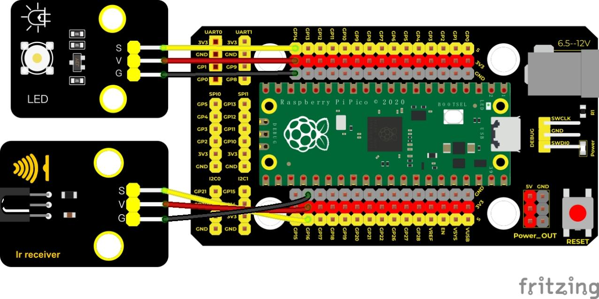

#### **Test Code**

```c
/*
   Keyestudio 24 in 1 Starter Kit for Raspberry Pi Pico
   lesson 35
   IR control LED
   http://www.keyestudio.com
*/
#include"ir.h"
IR IRreceive(16);//IR receiver is conencteGP16
int led = 14;//LED is connected to GP14
boolean flag = true;//LED flag bit
void setup() {
  Serial.begin(9600);
  pinMode(led, OUTPUT);
  delay(1000);
}
////////////////////
void loop() {
  Serial.println("IR receive");
  while (1) {
    int key = IRreceive.getKey();
    if (key != -1) {
      Serial.print(key);
      if (key == 64) { //press OK
        if (flag == true) {//flag is true
          digitalWrite(led, HIGH);//open LED
          Serial.println("  led on");
          flag = false;//flag is false
        } else { //flag is false
          digitalWrite(led, LOW);//turn off LED
          Serial.println("  led off");
          flag = true;//flag is true
        }
      }
    }
  }
}
```

#### **Code Explanation**

1. We define a Boolean variable, the value of the Boolean variable is true or false , boolean flag = true.

2. When we press the OK button, the value of IR receiver is 64. At this time, we need to set a Boolean variable flag. When flag is true, the LED will light up, and when it is false, the LED will go off. Light up the LED, we set it to false, so that when the OK button is pressed next time, the LED will be off.

#### **Test Result**

Upload the code, power up by a USB cable, open the serial monitor and set baud rate to 9600.

Press the buttons on the IR remote control, the monitor will show the value of the key. Press“OK”to turn on the LED, press it again to turn off the LED.


### Project 36: Comprehensive Experiment


#### **Introduction**

We did a lot of experiments, and for each one we needed to re-upload the code, so can we achieve different functions through an experiment? In this experiment, we will use an external button module to achieve different functions.

#### **Components**

|     |        |         |        | 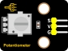            |
| ------------------------- | ---------------------------- | ----------------------------- | ---------------------------- | --------------------------------- |
| Raspberry Pi Pico Board*1 | Raspberry Pi Pico Shield*1   | Keyestudio White LED Module*1 | Keyestudio Button Module*1   | Keyestudio Rotary Potentiometer*1 |
|     |        |         |        |            |
| Keyestudio IR Receiver*1  | Keyestudio Joystick Module*1 | HC-SR04 Ultrasoic Sensor*1    | Keyestudio 6812 RGB Module*1 | MicroUSB Cable*1                  |
|    |       |        |       |                                   |
| 3P Dupont Wire*5          | 4P Dupont Wire*1             | 5P Dupont Wire*1              | Remote Control*1             |                                   |

#### **Connection Diagram**

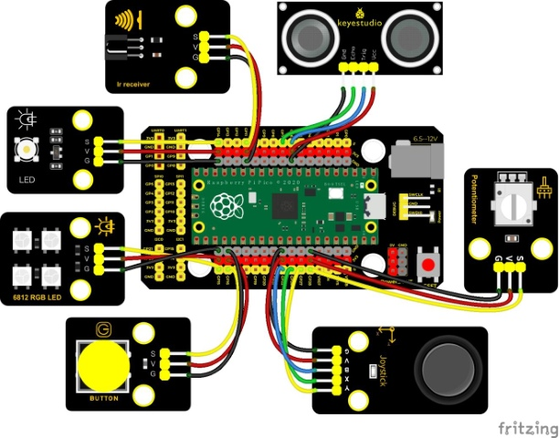

#### **Test Code**

```c
/*
   Keyestudio 24 in 1 Starter Kit for Raspberry Pi Pico
   lesson 36
   Comprehensive experiment
   http://www.keyestudio.com
*/
#include"rgb.h"//the library of 6812
#include"ir.h"//the library of IR receiver

//rgb6812 is connected to GP15
RGB rgb(15,4);  //rgb(pin, num);  num = 0-100

//IR receiver is connected to GP11
IR IRreceive(11);

// pins of the joystick module
int X = 26;
int Y = 27;
int KEY = 22;

//analog port 28 of the potentiometer
int resPin = 28;

//LED is linked with GP14
int LED = 14;

//the pin of the ultrasonic sensor
int Trig = 6;
int Echo = 7;

//the pin of the button module
int button = 16;

int PushCounter = 0;//save the number of pressing the button
int State = 1;//the status of the button
int LastState = 1;//for last state, press or release
int PushCounter1 = 0;//

void setup() {
  Serial.begin(9600);//set baud rate to 9600
  rgb.setBrightness(80);   //rgb.setBrightness(0-255);
  rgb.clear();   //Turn off all leds  
  delay(10);
  pinMode(KEY, INPUT);//the button of the joystick module
  pinMode(button, INPUT);//button module

  pinMode(Trig, OUTPUT);//ultrasonic sensor
  pinMode(Echo, INPUT);
  delay(1000);
}

void loop() {
  State = digitalRead(button);//read the state of the button
  if (LastState != State) { //the status of the button changes    if (State == 0) { //press the button
      PushCounter = PushCounter + 1;  //add 1 by accumulated of numbers of being pressed
    }
  }
  LastState = State;//refresh the last state
  PushCounter1 = PushCounter % 5; //press five time to restart
  if (PushCounter1 == 0) {  //remainder is 0
    yushu_0();  //6812 display
  } else if (PushCounter1 == 1) {  //remainder is 1
    yushu_1();  //display the signal of IR remote control
  } else if (PushCounter1 == 2) {  //remainder is 2
    yushu_2();  //display the value of joystick
  } else if (PushCounter1 == 3) {  //remainder is 3
    yushu_3();  //potentiometer controls LED
  } else if (PushCounter1 == 4) {  //remainder is 4
    yushu_4();  //show the distance detected by the ultrasonic sensor
  }
}

//6812
void yushu_0() {
  int R = random(0, 255);
  int G = random(0, 255);
  int B = random(0, 255);
  for(int i=0; i<4; i++){
    rgb.setPixelColor(i, R, G, B);
    rgb.show();
  }
  delay(300);
}

//IR receiver
void yushu_1() {
  bool flag = 1;
  while(flag){
    int key = IRreceive.getKey();
    if(key != -1){
      Serial.println(key); 
      if(key == 74){
        PushCounter = 2;
        Serial.print(PushCounter);
        flag = 0;
      }
    } 
  }
}


void yushu_2() {
  int x = analogRead(X);
  int y = analogRead(Y);
  int key = digitalRead(KEY);
  Serial.print("X:");
  Serial.print(x);
  Serial.print("    Y:");
  Serial.print(y);
  Serial.print("    KEY:");
  Serial.println(key);
  delay(100);
}

void yushu_3() {
  int RES = analogRead(resPin);
  int res = map(RES, 0, 4095, 0, 255);
  Serial.println(res);
  analogWrite(LED, res);
  delay(100);
}

void yushu_4() {
  float distance = checkdistance();
  Serial.print("distance:");
  Serial.print(distance);
  Serial.println("cm");
  delay(100);
}

float checkdistance() {
  digitalWrite(Trig, LOW);
  delayMicroseconds(2);
  digitalWrite(Trig, HIGH);
  delayMicroseconds(10);
  digitalWrite(Trig, LOW);
  float distance = pulseIn(Echo, HIGH) / 58.00;
  delay(10);
  return distance;
}
```

Calculate how many times the button is pressed, divide it by 5, and get the remainder which is 0, 1 2, 3 or 4. According to different remainders, construct five unique functions to control the experiment and realize different functions.


#### **Test Result**

Upload the test code, wire up and power on with a USB cable.

At the beginning, the number of the button is 0 and remainder is 0.

Four beads on the 6812RGB module flash random colors. Open the serial monitor and set baud rate to 9600. Press the button for a while, 6812 stops flashing, press once, the remainder is 1. If we point at IR receiver with the infrared remote control and press the button,the serial monitor will display as follows.


**Note: press a button, the times of the button is pressed is 1 and open the serial monitor, the program will reset.**

Then the times of the button is pressed will be 0**,** you need to select times of the button pressed.

Press **\#** to exit. Press a button twice, the remainder is 2. Read analog values of X ,Y and KEY axis of the joystick module. As shown below;


Press a button again. The button is pressed for three times and the remainder is 3.

The potentiometer adjust the PWM value of GP14 port to control the light brightness of the white LED module


Press a button again. The button is pressed for four times and the remainder is 4.

The ultrasonic sensor can detect the distance and show it on the monitor.


Press a button again. The button is pressed for five times and the remainder is 5.

The 6812RGB module will flash. Hold down buttons , remainders will change, too.


## 7. Resources:

**Download test code:**

**https://fs.keyestudio.com/KS3021**

